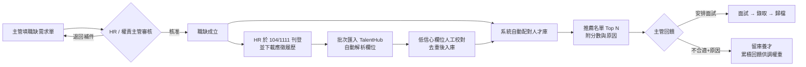

# 01. 專案規劃書

**專案名稱**：TalentHub — 企業人才庫與智慧媒合系統
**文件版本**：v1.0（2026-07-13）
**目標讀者**：專案發起人、HR 主管、開發團隊

> 文件定位：保留立項時的目標、範圍與 KPI 基準，不用來判斷目前完成度；最新完成度與發布閘門以 [07-開發時程與里程碑](07-開發時程與里程碑.md) 為準，未完成工作以 [12-後續工作與延伸建議](12-後續工作與延伸建議.md) 為準。

---

## 1. 背景與痛點

| 現況 | 造成的問題 |
|---|---|
| 履歷散落在 104 / 1111 企業後台、Email、紙本 | 找過的人才無法累積；同一人重複花費開履歷點數 |
| HR 人工逐份閱讀履歷、用 Excel 記錄 | 建檔耗時、欄位格式不一、幾乎無法搜尋 |
| 主管用口頭 / Email / 通訊軟體描述用人需求 | 需求不完整、來回確認多次、進度無法追蹤 |
| 人選配對靠 HR 記憶與經驗 | 耗時且容易漏掉庫內既有的合適人選 |

## 2. 專案目標與效益指標

### 2.1 目標

1. **建立公司自有人才資料庫**：所有接觸過的求職者集中管理，可搜尋、可標籤、可追蹤狀態。
2. **履歷匯入自動化**：104 / 1111 下載的履歷檔自動解析欄位入庫，免人工重複輸入。
3. **職缺需求數位化**：主管線上填寫需求單，簽核與招募進度全程可追蹤。
4. **智慧配對**：職缺成立即自動從人才庫產生推薦名單，並持續累積主管回饋。

### 2.2 效益指標（KPI）

| 指標 | 現況（估） | 目標 |
|---|---|---|
| 單份履歷建檔時間 | 10–15 分鐘/份 | < 30 秒/份（自動解析 + 快速校對） |
| 開缺到取得首批候選名單 | 3–7 天 | < 1 小時（人才庫即時配對） |
| 人才庫累積筆數 | 0（分散各處） | 上線第一年 ≥ 5,000 筆 |
| 庫內人才再聯繫比例 | — | ≥ 15%（省下重新開履歷費用） |
| 主管需求單線上化率 | 0% | 100%（需求單為開缺唯一入口） |

> KPI 基準值請於 Phase 0 與 HR 實測校正（抽 10 份履歷計時）。

## 3. 使用者角色

| 角色 | 人數（估） | 主要操作 |
|---|---|---|
| HR / 招募專員 | 2–5 | 匯入履歷、校對、維護人才庫、審核需求單、執行配對、聯繫追蹤、報表 |
| 部門主管 | 10–30 | 提出職缺需求單、檢視推薦人選、給回饋（安排面試 / 不合適+原因） |
| 系統管理員 | 1–2 | 帳號/角色/部門管理、技能字典維護、系統參數、稽核查詢 |
| 面試官（Phase 2） | — | 面試評語回填 |

## 4. 專案範圍

### 4.1 本期範圍（In Scope）

- 人才資料庫：建檔、複合搜尋、標籤、狀態機、聯繫紀錄、附件管理
- 履歷匯入：104 / 1111 下載檔（PDF）、Word、一般 PDF；批次上傳 + 監控資料夾
- 解析校對介面：低信心欄位人工確認後入庫；重複人才自動偵測與合併
- 職缺需求單（主管端）＋ 簽核流（HR / 權責主管）＋ 職缺看板
- 配對引擎：硬條件過濾 + 加權計分、推薦名單、主管回饋回寫
- 角色權限（RBAC）、聯絡資訊欄位遮罩、稽核日誌
- 基礎報表：招募漏斗、時效（time-to-fill）、來源成效、人才庫組成
- 通知：站內通知 + Email（需求單狀態、解析完成、待校對、保存期限將至）

### 4.2 本期不做（Out of Scope）

- ❌ **自動登入 104 / 1111 爬取履歷**——違反平台會員條款、帳號有被停權風險，且以個資法角度屬高風險蒐集方式。替代方案：企業帳號合法下載 → 監控資料夾自動匯入（見 docs/04）
- ❌ 面試排程 / 行事曆整合（Phase 2）
- ❌ Offer / 薪資核定流程（Phase 2）
- ❌ 與現有 eHR / 薪資系統介接（Phase 2）
- ❌ 求職者自助入口（對外官網徵才頁）

## 5. 核心使用情境（User Stories）

| # | 身分 | 情境 | 驗收條件 |
|---|---|---|---|
| US-01 | HR | 把今天從 104 下載的 30 份履歷 PDF 拖進系統 | 3 分鐘內全部解析完成；每份顯示信心分數；重複人才自動標示 |
| US-02 | HR | 用「Python + 3 年以上 + 台北/桃園 + 期望薪資 ≤ 70K」搜尋 | 2 秒內回傳；條件可儲存為常用搜尋 |
| US-03 | 主管 | 要找一名資深後端工程師，線上填需求單 | 精靈式表單 5 分鐘內完成；送出後 HR 即刻收到通知 |
| US-04 | HR | 需求單核准後要候選名單 | 系統自動列出 Top 20 推薦，附總分與各面向得分原因 |
| US-05 | 主管 | 對推薦人選逐一標記「安排面試 / 不合適（原因）」 | 回饋即時回寫，HR 看板同步更新 |
| US-06 | HR | 人才資料留存超過保存期限 | 後台可先 dry-run 覆核；核准後由排程完整清除人才、關聯資料與檔案並留下不含個資的稽核紀錄 |
| US-07 | Admin | 新進 HR 到職 | 可建帳號、指派角色，權限即刻生效並留有稽核紀錄 |
| US-08 | HR | 收到同一人第二次投遞的新版履歷 | 系統以 Email/電話比對出同一人，提示「更新既有檔案」而非新建 |

## 6. 端到端流程

## 7. 階段規劃摘要（詳見 docs/07）

| 階段 | 內容 | 產出 |
|---|---|---|
| Phase 0（1 週） | 需求確認、履歷樣本蒐集、環境盤點 | 欄位清單定稿、樣本庫、部署決策 |
| Phase 1（2 週） | Repo/CI、Docker Compose、Auth + RBAC、使用者/部門 | 可登入的系統骨架 |
| Phase 2（3 週） | 人才庫核心：CRUD、搜尋、標籤、聯繫紀錄 | **M1**：人才庫可手動運作 |
| Phase 3（4 週） | 104/1111 解析器、批次匯入、校對介面、去重 | **M2**：MVP 試營運 |
| Phase 4（2 週） | 需求單、簽核流、職缺看板 | **M3** |
| Phase 5（3 週） | 配對引擎、推薦名單、主管回饋 | **M4** |
| Phase 6（2 週） | 報表、通知完善、資安強化、效能 | 全功能完成 |
| Phase 7（2 週） | UAT、真實資料試跑、教育訓練、上線 | **M5**：正式上線 |

## 8. 風險與因應

| 風險 | 等級 | 因應 |
|---|---|---|
| 104/1111 履歷版型改版導致解析失敗 | 高 | 解析器版本化 + 樣本回歸測試；解析失敗或低信心自動轉人工校對佇列，**資料不會漏** |
| 個資法遵循（蒐集/利用/保存/當事人權利） | 高 | 見 docs/08：告知同意管理、保存期限自動化、RBAC + 欄位遮罩 + 全量稽核 |
| 主管不使用系統、繞過流程 | 中 | 精靈式表單 5 分鐘完成；制度面將需求單定為開缺唯一入口 |
| 人才資料重複 / 過期 | 中 | 去重引擎（Email/電話/姓名+出生年）+ 到期匿名化 + 年度清理 |
| 開發資源有限、時程壓力 | 中 | MVP 分階段：第 10 週先上線「人才庫 + 自動匯入」即開始產生價值 |
| 解析準確率不如預期 | 中 | 104/1111 為固定版型，規則解析可達高準確率；保底機制是人工校對介面（仍遠快於全手打） |

## 9. 未來擴充藍圖（Phase 2+）

- **語意配對**：pgvector + embedding，JD 與履歷全文語意相似度，補足關鍵字比對盲區
- **回饋學習**：以主管「不合適原因」統計自動建議權重調整
- 面試排程與行事曆整合、Offer 管理
- 官方 API 介接（若採購 104 企業方案含 API 服務）
- 人才池經營：定期 EDM、關懷追蹤、同意續存流程自動化
- eHR 整合：錄取後一鍵轉入員工主檔
