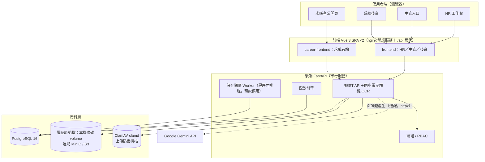
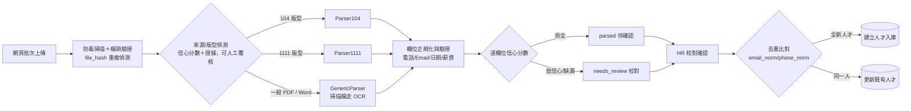

# 02. 系統架構設計

**文件版本**：v1.2（2026-08-27）

> 文件定位：保留架構原則與技術決策。實際已存在的元件、資料表與啟動／部署方式，以 [10-系統元件與資料庫使用手冊](10-系統元件與資料庫使用手冊.md) 及目前程式碼為準。

---

## 1. 架構總覽



> 現況：Redis／Celery 佇列與 SMTP 通知未使用（Redis 已自 docker-compose 移除）；解析於 API 程序內同步執行，通知功能尚未建置。

## 2. 技術選型與理由

| 層 | 建議選擇 | 理由 | 替代方案 |
|---|---|---|---|
| 前端 | Vue 3 + TypeScript + Vite（自建元件與 CSS） | 目前套件精簡，畫面、權限提示與無障礙行為可直接依內部流程調整 | Vue 元件庫；React + Ant Design（團隊偏 React 時） |
| 後端 | Python 3.12 + FastAPI + SQLAlchemy 2 | 與履歷解析（pypdf／PyMuPDF＋Tesseract OCR）、配對演算法同一語言；型別檢核 + OpenAPI 文件自動生成 | NestJS（團隊偏 TypeScript 時） |
| 背景任務 | FastAPI 程序內執行（解析同步、保存期限 worker 用 asyncio 排程） | 目前量級無需獨立佇列，維運面積最小；批次解析以 threadpool 分擔 | Celery / RQ + Redis（吞吐不足時再引入） |
| 資料庫 | PostgreSQL 16（開發／E2E 亦支援 SQLite） | JSON 保存解析原始結果；日後可加 pg_trgm／pgvector 做模糊與語意配對 | MySQL 8 |
| 全文/模糊搜尋 | `ILIKE` 複合查詢 + 正規化技能字典（含程式內建同義詞表） | 10 萬筆量級足夠，少維運一套系統 | pg_trgm、PGroonga、Elasticsearch（量級成長再評估） |
| 檔案儲存 | 本機磁碟（Docker volume，預設）；選配 MinIO（S3 相容，`compose.storage.yml`） | 檔案一律經 API 權限檢核串流存取，易備份與搬遷 | 公司 NAS 目錄 |
| 上傳防護 | ClamAV（clamd instream 掃描） | 正式環境 fail-closed：掃描器不可用即拒收上傳 | 商用防毒 API |
| AI 產題 | Google Gemini（httpx 直呼，預設關閉）＋規則式 fallback | 面試題個人化；輸入採去識別工作證據白名單，token 用量入庫稽核 | 純規則式 |
| 部署 | Docker Compose（內網 Linux VM） | 一鍵起落、環境一致、易還原 | Windows Server 原生排程工作（見 §6.2，目前實際運行方式） |

**選型原則**：單一後端語言（Python 同時吃 API、解析、演算法）、單一資料庫（Postgres 兼任 FTS 與 JSON 儲存），把維運面積壓到最小——這是內部系統成敗關鍵。

## 3. 後端模組切分（對應 `backend/app/`）

| 模組 | 職責 |
|---|---|
| `auth` | 登入（帳密）、JWT 發放/更新、refresh token 撤銷、RBAC 檢核、連續失敗鎖定（TOTP／AD/LDAP 仍為選配，未實作） |
| `candidates` | 人才 CRUD、複合搜尋、狀態、聯繫紀錄、大頭照、去重比對 |
| `resumes` | 上傳接收（防毒掃描＋檔頭驗證）、同步解析與 OCR、來源判定覆核、校對確認、原始檔下載／預覽（經權限檢核串流並稽核） |
| `parsers` | Parser104 / Parser1111 / GenericParser——策略模式，各自版本化（見 docs/04） |
| `requisitions` | 需求單 CRUD、簽核流、狀態機、職缺看板、盲評與綜合評分權重設定 |
| `matching` | 硬條件過濾 + 加權計分、名單產生與快照、主管回饋、成效評估與小樣本基準 |
| `applications`／`interview_records` | 應徵流程、HR／主管兩階段結構化面試、版本化面試題組（Gemini／規則式）、綜合評分 |
| `consent`／`public` | 版本化告知同意、求職者公開投遞端點（career-frontend 使用） |
| `talent_retention` | 保存期限政策、dry-run 預覽、到期清理 worker 與檔案刪除 outbox |
| `reports` | 招募漏斗、time-to-fill、來源成效、人才庫組成 |
| `admin` | 使用者/角色/部門、技能字典與標籤、系統參數、稽核查詢、系統問題追蹤 |
| `audit` | 稽核日誌（`write_audit`）——含原始履歷下載／預覽等個資讀取事件 |

> 原規劃的 `notifications`（站內通知＋Email）尚未實作。

## 4. 履歷解析管線（細節見 docs/04）



> 現況：解析在 API 程序內同步執行（無 Redis 佇列）；監控資料夾自動匯入尚未實作；所有履歷一律經 HR 確認後才入庫，沒有「高信心自動入庫」路徑。

## 5. 配對引擎設計

### 5.1 兩階段計算

**階段一：硬條件過濾（Gate，不符者不計分）**

- 工作地點不在可接受通勤範圍（期望地點 ∩ 職缺縣市／鄰近城市 = 空——地點比對已放寬為接受**鄰近城市**）
- 年資低於需求下限、學歷低於門檻
- 缺少必備技能（可用 `required_skill_ratio` **軟化門檻**：達必備技能命中比例即通過，而非全有全無；語言能力目前僅記錄於需求單，尚未納入 gate）
- 狀態排除：黑名單、已刪除、已撤回同意，及 `hired / declined / archived / withdrawn` 狀態
- 各 gate 可逐張需求單以 `require_skills / require_years / require_education / require_location` 開關停用

> Gate 現況：門檻不再是純二元。僅些微未達門檻者不直接淘汰，改標記 `near_miss` 旗標保留於名單，供 HR 判讀是否放行。

**階段二：加權計分（0–100 分）**

| 面向 | 預設權重 | 計分方式 |
|---|---|---|
| 技能符合度 | 40% | 加權比對：必備技能權重 2 倍、加分技能 1 倍；除技能字典別名正規化外，另比對**同義詞表**並採**保守模糊比對**（僅高相似度才算命中，避免誤配） |
| 職務/產業相關性 | 20% | 最近職稱與職缺職稱以**雙語 role-token 比對**（中英職稱詞元對應，無詞元時退回字串相似度）；同產業加成尚未實作 |
| 年資契合 | 15% | 達最低年資 = 滿分，不足按比例遞減；未提供年資給中性分 0.5（目前僅比對下限，over-qualified 遞減尚未實作） |
| 期望薪資重疊 | 10% | 期望區間與職缺區間的重疊比例；未填寫給中性分 0.5 |
| 學歷 | 10% | 達門檻 = 滿分；學歷不明給中性分 0.5，不足按比例（高於門檻不另加成） |
| 地點通勤 | 5% | 同縣市滿分、鄰近縣市 0.6、其餘 0.2；未填期望地點給中性分 0.5 |

- `總分 = Σ (權重 i × 面向得分 i) × 100`，每筆推薦保留 `score_breakdown` JSON（含逐面向證據、`near_miss` 旗標與資料完整度信心），前端可展開「為什麼是這個分數」。
- 預設權重為程式常數，**每張需求單可個別覆寫**（`match_weights`，HR／該部門主管透過 matching-weights API 調整，變更入稽核並即時重算）；原規劃的 Admin 全域系統參數未實作。
- 面試階段另有**綜合評分**（履歷媒合分＋兩階段面試分數，依需求單 `composite_score_weights` 加權），存於應徵紀錄，詳見 docs/03 §7 與 docs/13。
- 回饋學習（Phase 2）：統計主管「不合適原因」分佈，產出權重調整建議。

### 5.2 觸發時機

| 時機 | 行為 |
|---|---|
| HR／主管手動觸發（rematch） | 對全庫（未刪除人才）重算該職缺，重排名次 |
| 媒合條件或權重變更 | 儲存後自動全量重算該職缺，並寫入稽核 |
| 綜合評分權重變更／重新媒合 | 連動重算該職缺所有應徵的綜合評分，維持同一量尺 |

> 重算一律保留人工操作過的名單狀態不覆蓋。原規劃的「需求單核准自動計算」「新履歷入庫增量計算＋通知」「每日夜間排程」尚未實作，目前以上表的手動／事件觸發為準。

### 5.3 媒合評估（調權重前的量測）

調整權重或門檻前，先以 `match_results` 累積的**人工標記回饋**（主管採用／拒絕、拒絕理由）量測現行引擎表現，避免僅憑感覺調參：

| 指標 | 意義 |
|---|---|
| Precision@K / Recall@K | 前 K 名推薦被主管採用的比例，以及實際合適者被推進前 K 名的涵蓋率 |
| Gate 誤殺率 | 遭 Gate 排除、事後卻判定合適（含 `near_miss`）的比例 |
| 分數校準 | 分數高低是否與實際採用率單調對應（高分段採用率應明顯較高） |
| 排名有效性 | 名單排序與主管實際偏好的一致程度 |

評估結果作為 §5.1 權重／門檻調整與回饋學習（Phase 2）的量化依據。

## 6. 部署方案

### 6.1 建議：內網 Linux VM + Docker Compose

```
services: frontend（nginx：HR/主管 SPA 靜態 + /api 反代）｜ career-frontend（nginx：求職者站）
          backend（FastAPI×uvicorn，僅綁 127.0.0.1）｜ migrate（alembic upgrade head，一次性）｜ postgres
選配（compose.storage.yml）： minio ｜ clamav
volumes:  postgres_data、resume_data、candidate_photo_data（納入每日備份；選配 minio_data、clamav_data）
```

（Redis 服務已移除——程式從未使用；Celery worker／beat 未納入，背景工作於 backend 程序內執行。）

主機規格建議：**4 vCPU / 8 GB RAM / 200 GB SSD**（10 萬份履歷 PDF 約需 50–100 GB）。

### 6.2 Windows Server（目前實際運行的內網 LAN 部署）

實作於 `deploy/windows-lan/`：以四個 `SYSTEM` 排程工作啟動並守護服務——`TalentHub-LAN-ClamAV`（可攜版 clamd，預設 `C:\Users\Administrator\clamav`，127.0.0.1:3310，先於後端啟動）、`TalentHub-LAN-Backend`（alembic 升級後以 uvicorn 綁 127.0.0.1:8010）、`TalentHub-LAN-HR`（5173）與 `TalentHub-LAN-Career`（5174，兩者以 `vite preview` 服務正式 build 並反代 `/api`）。每個工作帶「開機」與「每 5 分鐘 watchdog」雙觸發：watchdog 先探測服務埠（clamd 用 PING/PONG），健康即退出，可承受外部終止而自動復活。防火牆僅對內網開 5173/5174，8010 維持 loopback。LAN 環境以 `APP_ENV=production` 執行：`/docs` 停用、上傳掃描 fail-closed。

- 替代：於 Windows Server 啟用 WSL2 / Hyper-V 跑 Linux VM（回到 6.1）

### 6.3 環境規劃

`dev`（工程師本機）→ `staging`（UAT，用去識別化資料）→ `prod`（正式）。
所有設定走 `.env` 環境變數，機密（DB 密碼、JWT secret）不進版控。
`APP_ENV` 非 `development` 時自動停用 FastAPI `/docs`、`/redoc` 與 `/openapi.json`；掃描政策等安全預設亦依環境切換（正式環境防毒 fail-closed）。

## 7. 非功能需求

| 項目 | 目標 |
|---|---|
| 搜尋效能 | 人才庫 10 萬筆規模，複合條件查詢 < 2 秒 |
| 解析吞吐 | 批次匯入 ≥ 10 份/分鐘（目前於 API 程序內同步解析；不足時再引入獨立 worker 水平擴充） |
| 可用性 | 上班時間 99.5%；每日備份，RPO ≤ 24h、RTO ≤ 4h（LAN 部署另有 5 分鐘 watchdog 自動復活） |
| 安全 | 全站 TLS（目標；LAN 試行仍為內網 HTTP）、scrypt 密碼雜湊、JWT 短效（15 分）+ refresh（7 天，登出撤銷）、連續失敗登入鎖定、上傳檔 ClamAV 防毒掃描（正式環境 fail-closed） |
| 稽核 | 個資讀取/修改/匯出全量記錄（見 docs/08） |
| 瀏覽器支援 | Chrome / Edge 最新兩個版本 |
