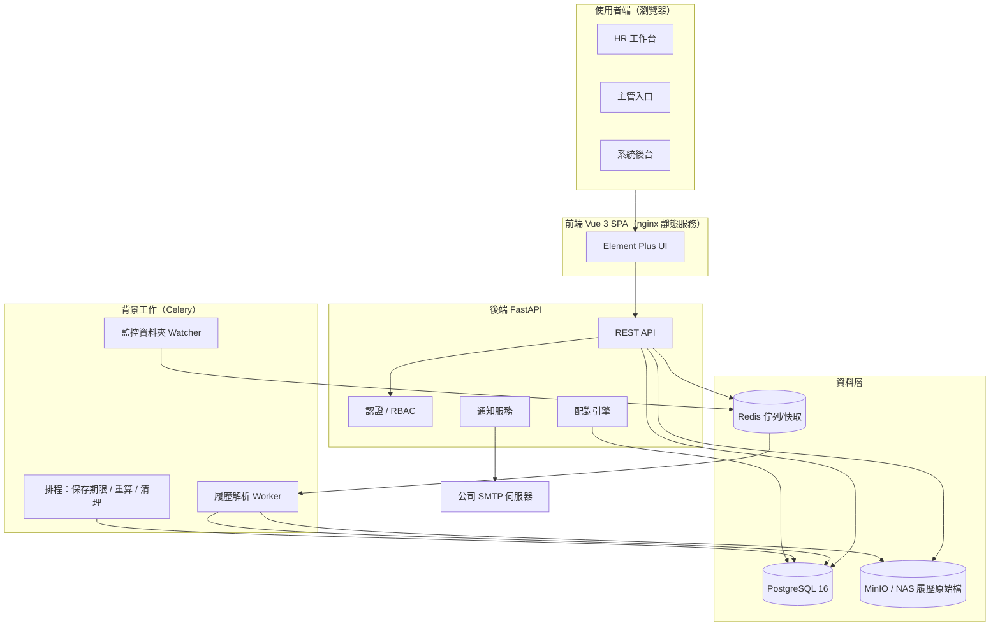
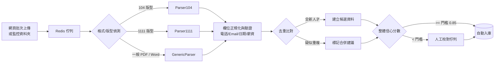

# 02. 系統架構設計

**文件版本**：v1.0（2026-07-13）

---

## 1. 架構總覽



## 2. 技術選型與理由

| 層 | 建議選擇 | 理由 | 替代方案 |
|---|---|---|---|
| 前端 | Vue 3 + TypeScript + Vite + Element Plus | 表格/表單/上傳元件齊全、中文文件生態成熟、內部系統開發速度快 | React + Ant Design（團隊偏 React 時） |
| 後端 | Python 3.12 + FastAPI + SQLAlchemy 2 | 與履歷解析（pdfplumber）、配對演算法同一語言；型別檢核 + OpenAPI 文件自動生成 | NestJS（團隊偏 TypeScript 時） |
| 背景任務 | Celery + Redis | 解析屬耗時任務，不可卡住 API；內建重試、排程（beat） | RQ / Dramatiq |
| 資料庫 | PostgreSQL 16 | JSONB 保存解析原始結果、pg_trgm 支援中文模糊搜尋、日後可加 pgvector 做語意配對 | MySQL 8 |
| 全文/模糊搜尋 | pg_trgm + 正規化技能字典 | 10 萬筆量級足夠，少維運一套系統 | PGroonga、Elasticsearch（> 50 萬筆再評估） |
| 檔案儲存 | MinIO（S3 相容） | 預簽名網址、易備份與搬遷 | 公司 NAS 目錄（最簡） |
| 部署 | Docker Compose（內網 Linux VM） | 一鍵起落、環境一致、易還原 | Windows Server 原生安裝（見 §6.2） |

**選型原則**：單一後端語言（Python 同時吃 API、解析、演算法）、單一資料庫（Postgres 兼任 FTS 與 JSON 儲存），把維運面積壓到最小——這是內部系統成敗關鍵。

## 3. 後端模組切分（對應 `backend/app/`）

| 模組 | 職責 |
|---|---|
| `auth` | 登入（帳密；TOTP 選配）、JWT 發放/更新、RBAC 檢核；（可選）AD/LDAP 整合 |
| `candidates` | 人才 CRUD、複合搜尋、標籤、狀態機、聯繫紀錄、合併去重 |
| `resumes` | 上傳接收、解析任務派發、校對確認、原始檔存取（預簽名網址） |
| `parsers` | Parser104 / Parser1111 / GenericParser——策略模式，各自版本化（見 docs/04） |
| `requisitions` | 需求單 CRUD、簽核流、狀態機、職缺看板 |
| `matching` | 硬條件過濾 + 加權計分、名單產生與快照、主管回饋 |
| `notifications` | 站內通知 + Email 樣板（Jinja2） |
| `reports` | 招募漏斗、time-to-fill、來源成效、人才庫組成 |
| `admin` | 使用者/角色/部門、技能字典（含別名合併）、系統參數 |
| `audit` | 稽核日誌——含「讀取個資」事件（誰看過誰的履歷） |

## 4. 履歷解析管線（細節見 docs/04）



## 5. 配對引擎設計

### 5.1 兩階段計算

**階段一：硬條件過濾（Gate，不符者不計分）**

- 工作地點不在可接受通勤範圍（期望地點 ∩ 職缺縣市 = 空）
- 年資低於需求下限、學歷低於門檻
- 缺少任一「必備技能」、語言能力低於門檻
- 狀態排除：黑名單、已錄取在職、已明確婉拒本公司

**階段二：加權計分（0–100 分）**

| 面向 | 預設權重 | 計分方式 |
|---|---|---|
| 技能符合度 | 40% | 加權比對：必備技能權重 2 倍、加分技能 1 倍；經技能字典別名正規化後計算 |
| 職務/產業相關性 | 20% | 近兩份工作職稱與職缺職稱之 trigram 相似度；同產業經歷加成 |
| 年資契合 | 15% | 落在需求區間 = 滿分；超出上限過多遞減（避免 over-qualified） |
| 期望薪資重疊 | 10% | 期望區間與職缺區間的重疊比例；未填寫給中性分 0.5 |
| 學歷 | 10% | 達門檻 = 滿分；高於門檻小幅加成（上限 +10%） |
| 地點通勤 | 5% | 同縣市滿分、鄰近縣市 0.6、其餘 0.2 |

- `總分 = Σ (權重 i × 面向得分 i) × 100`，每筆推薦保留 `score_breakdown` JSON，前端可展開「為什麼是這個分數」。
- 權重存於系統參數（Admin 可改全域預設），**每張需求單可個別覆寫**。
- 回饋學習（Phase 2）：統計主管「不合適原因」分佈，產出權重調整建議。

### 5.2 觸發時機

| 時機 | 行為 |
|---|---|
| 需求單核准 | 對全庫計算一次，產生初始推薦名單 |
| 新履歷確認入庫 | 對所有「招募中」職缺增量計算，達門檻即補進名單並通知 HR |
| 每日夜間排程 | 對招募中職缺全量重算（吸收資料修改）；名單保留人工狀態不覆蓋 |

## 6. 部署方案

### 6.1 建議：內網 Linux VM + Docker Compose

```
services: nginx（前端靜態 + API 反代）｜ api（FastAPI×uvicorn）｜ worker（Celery）
          beat（排程）｜ postgres ｜ redis ｜ minio
volumes:  pgdata、minio-data（納入每日備份）
```

主機規格建議：**4 vCPU / 8 GB RAM / 200 GB SSD**（10 萬份履歷 PDF 約需 50–100 GB）。

### 6.2 若公司只有 Windows Server

- PostgreSQL Windows 版 + Memurai（Redis 相容）+ `uvicorn` / `celery` 以 NSSM 註冊為 Windows 服務 + IIS/nginx 反向代理
- 或於 Windows Server 啟用 WSL2 / Hyper-V 跑 Linux VM（回到 6.1，較建議）

### 6.3 環境規劃

`dev`（工程師本機 Compose）→ `staging`（UAT，用去識別化資料）→ `prod`（正式）。
所有設定走 `.env` 環境變數，機密（DB 密碼、JWT secret）不進版控。

## 7. 非功能需求

| 項目 | 目標 |
|---|---|
| 搜尋效能 | 人才庫 10 萬筆規模，複合條件查詢 < 2 秒 |
| 解析吞吐 | 單一 worker ≥ 10 份/分鐘；worker 可水平擴充 |
| 可用性 | 上班時間 99.5%；每日備份，RPO ≤ 24h、RTO ≤ 4h |
| 安全 | 全站 TLS、argon2id 密碼雜湊、JWT 短效 + refresh、登入速率限制、上傳檔防毒掃描 |
| 稽核 | 個資讀取/修改/匯出全量記錄（見 docs/08） |
| 瀏覽器支援 | Chrome / Edge 最新兩個版本 |
