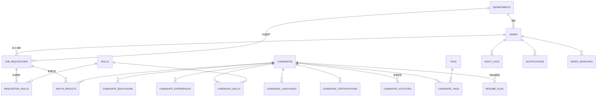

# 03. 資料庫設計

**文件版本**：v1.0（2026-07-13）｜**資料庫**：PostgreSQL 16
**需啟用擴充**：`CREATE EXTENSION pg_trgm;`（中文模糊搜尋）；Phase 2 語意配對時加 `pgvector`

---

## 1. ER 總覽



## 2. 人才主檔 `candidates`

| 欄位 | 型別 | 說明 |
|---|---|---|
| id | BIGSERIAL PK | |
| code | varchar(20) UNIQUE | 人才編號（顯示用，如 `T2026-00001`） |
| name | varchar(100) NOT NULL | 姓名 |
| gender | char(1) | M / F / N，可空 |
| birth_year | smallint | 出生年（履歷常只有年齡→匯入時換算）|
| birth_date | date | 完整生日（若履歷提供） |
| email | varchar(255) | 原始值 |
| email_norm | varchar(255) | 正規化（lower/trim），去重與索引用 |
| phone | varchar(50) | 原始值 |
| phone_norm | varchar(20) | 正規化（`09xxxxxxxx`），去重與索引用 |
| city | varchar(50) | 居住縣市 |
| address | varchar(255) | 詳細地址（選填，預設不匯入） |
| highest_education | varchar(20) | `high_school / associate / bachelor / master / phd / other` |
| total_years | numeric(4,1) | 總年資 |
| current_title | varchar(100) | 最近職稱 |
| current_company | varchar(100) | 最近公司 |
| expected_title | varchar(100) | 期望職稱 |
| expected_job_categories | varchar[] | 期望職務類別 |
| expected_cities | varchar[] | 期望工作地點 |
| expected_salary_min / _max | integer | 期望薪資區間 |
| salary_type | varchar(10) | `monthly / annual / hourly / negotiable` |
| availability | varchar(20) | `immediately / two_weeks / one_month / negotiable` |
| job_type | varchar(20) | `full_time / part_time / contract / intern` |
| source | varchar(20) | `p104 / p1111 / referral / walk_in / other` |
| source_note | varchar(200) | 例：內推人姓名 |
| status | varchar(20) | 見 §2.1 狀態機，預設 `new` |
| owner_id | bigint FK→users | 主責 HR |
| summary | text | 自傳/摘要 |
| consent_status | varchar(20) | `platform / notified / consented / withdrawn`（見 docs/08） |
| consent_at | timestamptz | |
| retention_until | date | 保存期限（預設 2 年；明確同意時以 `consent_at` 起算，否則以建檔日；可依公司政策或單筆設定 1–20 年） |
| is_blacklisted | boolean | 黑名單（連動 gate 排除） |
| blacklist_reason | varchar(200) | |
| dedup_hash | varchar(64) | sha256(姓名+出生年)，輔助去重 |
| created_by / created_at / updated_at / deleted_at | | `deleted_at` = 軟刪除 |

### 2.1 人才狀態機 `status`

```
new → reviewing → contacted → interviewing → offered → hired
                     │             │            │
                     └──────┬──────┴────────────┘
                            ▼
              talent_pool（留庫養才）/ rejected（婉拒）/ archived（匿名化歸檔）
任一狀態 → blacklisted（黑名單，需填原因）
```

### 2.2 索引

```sql
CREATE INDEX idx_cand_name_trgm    ON candidates USING gin (name gin_trgm_ops);
CREATE INDEX idx_cand_title_trgm   ON candidates USING gin (current_title gin_trgm_ops);
CREATE INDEX idx_cand_summary_trgm ON candidates USING gin (summary gin_trgm_ops);
CREATE INDEX idx_cand_email_norm   ON candidates (email_norm) WHERE deleted_at IS NULL;
CREATE INDEX idx_cand_phone_norm   ON candidates (phone_norm) WHERE deleted_at IS NULL;
CREATE INDEX idx_cand_status       ON candidates (status);
CREATE INDEX idx_cand_city         ON candidates (city);
CREATE INDEX idx_cand_retention    ON candidates (retention_until);
```

> 去重採「應用層比對 + 索引加速」，不設 UNIQUE 硬約束——同一人二次投遞是合法情境，應走「合併/更新」而非報錯。

## 3. 人才子表

### `candidate_educations`（學歷，一對多）
`id、candidate_id FK、school、major、degree（同 highest_education 枚舉）、start_ym varchar(7)、end_ym、is_graduated bool、sort_order`

### `candidate_experiences`（工作經歷，一對多）
`id、candidate_id FK、company、title、industry、start_ym、end_ym（NULL=至今）、years numeric(4,1)、description text、sort_order`

### `skills`（技能字典，全域正規化）
`id、name UNIQUE、category（語言/框架/工具/證照/軟技能…）、aliases text[]（如 ["JS","Javascript"]→JavaScript）、is_active`

> 技能字典是配對品質的地基：解析出的技能字串一律先過別名正規化再入庫；Admin 後台可合併重複技能。初始資料以 104 職務分類 + 常見工具清單匯入。

### `candidate_skills`
`candidate_id FK、skill_id FK、level（basic/intermediate/advanced/expert，可空）、years numeric、source（parsed/manual）`，PK = (candidate_id, skill_id)

### `candidate_languages`
`candidate_id、language、listening/speaking/reading/writing（略懂/中等/精通）`，PK = (candidate_id, language)

### `candidate_certifications`
`id、candidate_id、name、issuer、acquired_ym`

### `tags` / `candidate_tags`
`tags: id、name UNIQUE、color`；`candidate_tags: candidate_id、tag_id`（PK 複合）。用途：如「2026 校園徵才」「主管推薦」「碩士儲備」。

### `candidate_activities`（聯繫與異動紀錄）
`id、candidate_id FK、user_id FK、type（note/call/email/interview/status_change/system）、content text、happened_at、created_at`

## 4. 履歷檔案 `resume_files`

| 欄位 | 型別 | 說明 |
|---|---|---|
| id | BIGSERIAL PK | |
| candidate_id | bigint FK NULL | 校對確認前可為空 |
| storage_key | varchar(500) | MinIO/NAS 路徑 |
| original_filename | varchar(255) | |
| file_hash | varchar(64) UNIQUE | sha256——同一檔案重複上傳直接跳過 |
| file_size / mime | | |
| source_platform | varchar(20) | `p104 / p1111 / generic` |
| platform_code | varchar(50) | 平台履歷代碼（104 代碼等，輔助去重） |
| parse_status | varchar(20) | `pending / processing / needs_review / confirmed / failed / duplicated` |
| parsed_payload | jsonb | 解析出的完整結構化結果（原始，供校對與回溯） |
| field_confidence | jsonb | 逐欄位信心分數 `{"name":0.99,"email":0.62,...}` |
| overall_confidence | numeric(3,2) | 整體信心 |
| parser_version | varchar(20) | 如 `p104-v1.3`——版型改版時追蹤用 |
| error_message | text | 解析失敗原因 |
| uploaded_by / uploaded_at / confirmed_by / confirmed_at | | |

## 5. 職缺需求 `job_requisitions`

| 欄位 | 型別 | 說明 |
|---|---|---|
| id | BIGSERIAL PK | |
| req_no | varchar(20) UNIQUE | 需求單號 `R2026-0001` |
| title | varchar(100) | 職缺名稱 |
| department_id | bigint FK | |
| requested_by | bigint FK→users | 提出主管 |
| headcount | smallint | 需求人數，預設 1 |
| employment_type | varchar(20) | `full_time / part_time / contract / intern` |
| work_city / work_address | | 工作地點 |
| salary_min / salary_max / salary_type | | 核定薪資區間（對主管以外遮罩可設定） |
| min_years | numeric(4,1) | 最低年資 |
| education_req | varchar(20) | 學歷門檻 |
| language_req | varchar(100) | 語言需求 |
| jd | text | 工作內容與職責 |
| urgency | varchar(10) | `low / normal / high / critical` |
| needed_by | date | 期望到職日 |
| status | varchar(20) | 見 §5.1 |
| return_reason | varchar(500) | 退回原因 |
| match_weights | jsonb NULL | 覆寫全域配對權重（可空=用預設） |
| approved_by / approved_at / filled_at / closed_at | | |
| created_at / updated_at | | |

### 5.1 需求單狀態機

```
draft → submitted → approved → sourcing → interviewing → filled → closed
          │  ▲
          ▼  │（修改後重送）
        returned            任一階段 → cancelled（需填原因）
```

### `requisition_skills`
`requisition_id FK、skill_id FK、requirement（required/preferred）、weight numeric 預設 1`，PK 複合。

## 6. 配對結果 `match_results`

| 欄位 | 型別 | 說明 |
|---|---|---|
| id | BIGSERIAL PK | |
| requisition_id / candidate_id | FK，UNIQUE 複合 | 一缺一人一筆 |
| gate_passed | boolean | 硬條件是否通過 |
| total_score | numeric(5,2) | 0–100 |
| score_breakdown | jsonb | `{"skill":{"score":0.8,"hit":["Python","FastAPI"],"miss":["K8s"]},"years":...}` |
| rank | integer | 名單內排名 |
| status | varchar(30) | `recommended / shortlisted / contacted / interview / offered / hired / rejected_by_manager / withdrawn` |
| feedback_reason | varchar(200) | 主管不合適原因（下拉+自由填） |
| feedback_by / feedback_at | | |
| computed_at | timestamptz | 最後計算時間 |

> 夜間重算只更新 `total_score / breakdown / rank`，**不覆蓋**人工操作過的 `status`。

## 7. 系統與管理表

### `users`
`id、username UNIQUE、password_hash（argon2id）、name、email、department_id FK、role（admin/hr/manager）、is_active、last_login_at、created_at`
> MVP 用單一角色欄位；若日後需一人多角，再擴充 `user_roles` 中介表。

### `departments`
`id、name、parent_id NULL（樹狀）、manager_user_id NULL`

### `saved_searches`
`id、user_id FK、name、query jsonb`（儲存人才庫複合搜尋條件）

### `notifications`
`id、user_id FK、type、title、body、link、is_read、created_at`

### `audit_logs`
`id、user_id、action（login/view_candidate/update/delete/export/approve/setting_change…）、entity_type、entity_id、detail jsonb、ip、user_agent、created_at`
> 「檢視人才詳情」也要記錄（個資讀取軌跡）。量大時按月分區。

### `system_settings`
`key varchar PK、value jsonb、description、updated_by、updated_at`
初始鍵值：

| key | 預設值 | 說明 |
|---|---|---|
| `match.default_weights` | `{"skill":0.4,"relevance":0.2,"years":0.15,"salary":0.1,"education":0.1,"location":0.05}` | 配對權重 |
| `match.top_n` | `20` | 推薦名單長度 |
| `parse.confidence_threshold` | `0.85` | 低於此值進人工校對 |
| `retention.months` | `24` | 個資保存月數 |
| `retention.notify_days` | `30` | 到期前提醒天數 |
| `mask.manager_contact` | `true` | 主管檢視時遮罩聯絡資訊 |

## 8. 資料生命週期

1. **入庫**：解析確認 → `candidates` + 子表 + `resume_files.confirmed`
2. **活動**：每次聯繫/狀態變更寫 `candidate_activities`，並順延 `retention_until`
3. **到期**：排程掃描 `retention_until`，前 30 天通知 owner → 逾期執行**匿名化**：
   `name→'已匿名'、email/phone/address/birth_* 清空、summary 清空、刪除 MinIO 原始檔`，保留技能/年資/狀態等統計欄位，狀態改 `archived`
4. **刪除請求**（當事人行使權利）：HR 於後台對單筆執行匿名化，稽核留紀錄
