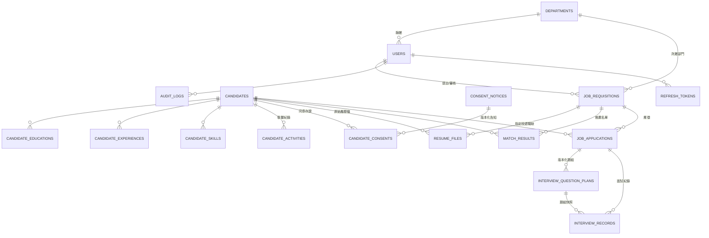

# 03. 資料庫設計

**文件版本**：v1.2（2026-08-27）｜**資料庫**：PostgreSQL 16（開發／E2E 亦支援 SQLite）
**需啟用擴充**：目前無必要擴充——模糊搜尋以 `ILIKE` 實作；`pg_trgm`（模糊搜尋加速）與 `pgvector`（語意配對）為後續選項

> 本文件保存概念資料模型與核心欄位。實際已部署結構以 `backend/app/models/`、Alembic migrations 為準；目前完整資料表清單與維運方式見 [10-系統元件與資料庫使用手冊](10-系統元件與資料庫使用手冊.md)。

---

## 1. ER 總覽



> `skill_catalog`（技能字典）與 `tags`（標籤字典）為獨立字典表，目前未以 FK 關聯人才（見 §3）。原規劃的 `candidate_languages`、`candidate_certifications`、`candidate_tags`、`requisition_skills`、`saved_searches`、`notifications` 尚未建表（見各節註記）。

## 2. 人才主檔 `candidates`

| 欄位 | 型別 | 說明 |
|---|---|---|
| id | BIGSERIAL PK | |
| code | varchar(20) UNIQUE | 人才編號（顯示用，如 `T2026-00001`） |
| name | varchar(100) NOT NULL | 姓名 |
| gender | char(1) | M / F / N，可空 |
| birth_year | smallint | 出生年（履歷常只有年齡→匯入時換算）|
| birth_date | date | 完整生日（若履歷提供） |
| email | varchar(255) | 原始值 |
| email_norm | varchar(255) | 正規化（lower/trim），去重與索引用 |
| phone | varchar(50) | 原始值 |
| phone_norm | varchar(20) | 正規化（`09xxxxxxxx`），去重與索引用 |
| city | varchar(50) | 居住縣市 |
| address | varchar(255) | 詳細地址（選填，預設不匯入） |
| highest_education | varchar(20) | 中文學歷標籤：`國中 / 高中 / 高職 / 專科 / 學士 / 大學 / 碩士 / 研究所 / 博士`（配對引擎依此排序比較） |
| total_years | numeric(4,1) | 總年資 |
| current_title | varchar(100) | 最近職稱 |
| current_company | varchar(100) | 最近公司 |
| expected_title | varchar(100) | 期望職稱 |
| expected_job_categories | json | 期望職務類別（字串清單） |
| expected_cities | json | 期望工作地點（字串清單） |
| expected_salary_min / _max | integer | 期望薪資區間 |
| salary_type | varchar(10) | `monthly / annual / hourly / negotiable` |
| availability | varchar(20) | `immediately / two_weeks / one_month / negotiable` |
| job_type | varchar(20) | `full_time / part_time / contract / intern` |
| source | varchar(20) | `manual / hr_upload / manager_upload / career_site（公開投遞）/ demo` |
| source_note | varchar(200) | 例：內推人姓名 |
| photo_path / photo_content_type / photo_updated_at | | 大頭照檔案位置與格式（照片不作為任何評分特徵） |
| status | varchar(20) | 見 §2.1 狀態機，預設 `new` |
| owner_id | bigint FK→users | 主責 HR |
| summary | text | 自傳/摘要 |
| consent_status | varchar(20) | 常用值 `consented / withdrawn`；內部樣本另以 `internal_sample / synthetic_benchmark` 標示（見 docs/08） |
| consent_at | timestamptz | |
| retention_years_override | smallint | 單筆覆寫保存年限（1–20；空＝公司預設） |
| retention_until | date | 保存期限（預設 2 年；明確同意時以 `consent_at` 起算，否則以建檔日；可依公司政策或單筆設定 1–20 年） |
| is_blacklisted | boolean | 黑名單（連動 gate 排除） |
| blacklist_reason | varchar(200) | |
| dedup_hash | varchar(64) | sha256(姓名+出生年)，輔助去重 |
| created_at / updated_at / deleted_at | | `deleted_at` = 軟刪除；建立／刪除者由稽核日誌追溯 |

### 2.1 人才狀態機 `status`

```
new → contacted → interviewing → hired
         │             │
         └──────┬──────┘
                ▼
  declined（婉拒）/ withdrawn（撤回）/ archived（歸檔）
priority（重點人才）可於任一階段標記為狀態
```

> 黑名單不是狀態：以 `is_blacklisted` 旗標標記（需填 `blacklist_reason`），任一狀態皆可設定並連動配對 gate 排除。留庫養才以「人才庫（talent_pool）」視角呈現於媒合來源篩選，不是獨立狀態值。

### 2.2 索引

```sql
CREATE INDEX ix_candidates_email_norm      ON candidates (email_norm);
CREATE INDEX ix_candidates_phone_norm      ON candidates (phone_norm);
CREATE INDEX ix_candidates_status          ON candidates (status);
CREATE INDEX ix_candidates_city            ON candidates (city);
CREATE INDEX ix_candidates_retention_until ON candidates (retention_until);
CREATE INDEX ix_candidates_dedup_hash      ON candidates (dedup_hash);
```

> 姓名／職稱／編號／Email 的模糊搜尋目前以 `ILIKE` 複合查詢實作；資料量成長後再評估 `pg_trgm` GIN 索引。

> 去重採「應用層比對 + 索引加速」，不設 UNIQUE 硬約束——同一人二次投遞是合法情境，應走「合併/更新」而非報錯。

## 3. 人才子表

### `candidate_educations`（學歷，一對多）
`id、candidate_id FK、school、major、degree（同 highest_education 枚舉）、start_ym varchar(7)、end_ym、is_graduated bool、sort_order`

### `candidate_experiences`（工作經歷，一對多）
`id、candidate_id FK、company、title、industry、start_ym、end_ym（NULL=至今）、years numeric(4,1)、description text、sort_order`

### `skill_catalog`（技能字典，全域正規化）
`id、name、name_norm UNIQUE（casefold 正規化）、is_active`

> 技能字典是配對品質的地基：初始資料由種子程式匯入，Admin 後台可維護。別名／中英同義詞正規化（如 JS→JavaScript、機器學習↔machine learning）目前由配對引擎內建對照表處理，不存於字典欄位。

### `candidate_skills`
`id PK、candidate_id FK、skill（原始字串）、skill_norm（正規化）`，UNIQUE (candidate_id, skill_norm)。正式可搜尋／可配對的技能以此表為準；解析器輸出僅是 `resume_files.parsed_payload` 的匯入快照。等級（level）、年資、來源欄位未實作。

### `candidate_languages`／`candidate_certifications`（規劃保留，尚未建表）
語言能力與證照目前只存在 `resume_files.parsed_payload` 解析快照與 `candidates.summary`，尚無正規化子表；配對引擎也尚未使用語言條件。

### `tags`
`id、name、category（預設 candidate）、is_active`，UNIQUE (name, category)。用途：如「2026 校園徵才」「主管推薦」「碩士儲備」。原規劃的 `color` 欄位與 `candidate_tags` 關聯表尚未實作——標籤目前是 Admin 維護的字典，尚未落到單一人才身上。

### `candidate_activities`（聯繫與異動紀錄）
`id、candidate_id FK、user_id FK、type（note/call/email/interview/status_change/system）、content text、happened_at、created_at`

## 4. 履歷檔案 `resume_files`

| 欄位 | 型別 | 說明 |
|---|---|---|
| id | BIGSERIAL PK | |
| candidate_id | bigint FK NULL | 校對確認前可為空 |
| target_requisition_id | bigint FK NULL | 指定投遞／指定招募的職缺（主管上傳與公開投遞用，並限定主管可見範圍） |
| storage_key | varchar(500) | 儲存鍵——預設本機磁碟（volume），選配 S3/MinIO |
| original_filename | varchar(255) | |
| file_hash | varchar(64) UNIQUE | sha256——同一檔案重複上傳以既有紀錄回應（`duplicate` 旗標），不建新列 |
| file_size / mime | | |
| source_platform | varchar(20) | `direct（預設）/ p104 / p1111 / generic` |
| requested_source_platform / source_confidence / source_evidence / source_review_required / source_reviewed_by / source_reviewed_at | | 來源自動判定（信心分數＋證據 JSON）與人工覆核欄位 |
| platform_code | varchar(50) | 平台履歷代碼（104 代碼等，輔助去重） |
| parse_status | varchar(20) | `pending / parsed / needs_review / confirmed / failed` |
| parsed_payload | jsonb | 解析出的完整結構化結果（原始，供校對與回溯） |
| field_confidence | jsonb | 逐欄位信心分數 `{"name":0.99,"email":0.62,...}` |
| overall_confidence | numeric(3,2) | 整體信心 |
| parser_version | varchar(20) | 如 `p104-v1.3`——版型改版時追蹤用 |
| error_message | text | 解析失敗原因 |
| resume_text / resume_url | | 抽取全文（含 OCR 結果，供校對與檢索）／外部履歷連結 |
| uploaded_by / uploaded_at / updated_at / confirmed_at | | 確認人未另設欄位，以稽核日誌追溯 |

## 5. 職缺需求 `job_requisitions`

| 欄位 | 型別 | 說明 |
|---|---|---|
| id | BIGSERIAL PK | |
| req_no | varchar(20) UNIQUE | 需求單號 `R2026-0001` |
| title | varchar(100) | 職缺名稱 |
| department_id | bigint FK | |
| requested_by | bigint FK→users | 提出主管 |
| headcount | smallint | 需求人數，預設 1 |
| employment_type | varchar(20) | `full_time / part_time / contract / intern` |
| work_city / work_address | | 工作地點 |
| salary_min / salary_max / salary_type | | 核定薪資區間 |
| min_years | numeric(4,1) | 最低年資 |
| education_req | varchar(20) | 學歷門檻 |
| language_req | varchar(100) | 語言需求（目前僅記錄，配對引擎未使用） |
| jd | text | 工作內容與職責 |
| summary | varchar(500) | 職缺摘要（公開頁與名單顯示用） |
| skills | json | 必備／加分技能清單快照（詳細條件見 `match_weights`） |
| urgency | varchar(10) | `low / normal / high / critical` |
| needed_by | date | 期望到職日 |
| status | varchar(20) | 見 §5.1 |
| return_reason | varchar(500) | 退回原因 |
| match_weights | jsonb NULL | 覆寫配對權重與 gate 設定（`required_skills / preferred_skills / required_skill_ratio / require_*` 開關；可空=用預設） |
| composite_score_weights | jsonb NULL | 綜合評分權重覆寫（履歷媒合／HR 逐題／HR 總分／主管逐題／主管總分；可空=用預設，讀取時正規化為總和 1）。僅 HR 可透過 PATCH 修改，改動即重算該職缺所有應徵的 `composite_score` 並寫入稽核 |
| blind_review_enabled | boolean | 盲評開關（預設開；該職缺任一面試正式提交後即鎖定不可再改） |
| approved_by / approved_at / published_at / filled_at / closed_at | | |
| created_at / updated_at | | |

### 5.1 需求單狀態機

```
draft → submitted → approved → sourcing ⇄ interviewing → filled → closed
          │  ▲
          ▼  │（修改後重送）
        returned            任一狀態 → closed（結案；無獨立 cancelled 狀態）
```

> 合法轉換由後端統一檢核（`ALLOWED_REQUISITION_TRANSITIONS`）；`draft`／`returned` 亦允許直接核准，簡化小規模流程。

### 技能條件的儲存方式
原規劃的 `requisition_skills` 關聯表未實作：必備／加分技能存於 `job_requisitions.skills`（JSON 清單）與 `match_weights.required_skills / preferred_skills`（另有 `required_skill_ratio` 軟性門檻）；單一技能的個別權重尚未支援。

## 6. 配對結果 `match_results`

| 欄位 | 型別 | 說明 |
|---|---|---|
| id | BIGSERIAL PK | |
| requisition_id / candidate_id | FK，UNIQUE 複合 | 一缺一人一筆 |
| gate_passed | boolean | 硬條件是否通過 |
| total_score | numeric(5,2) | 0–100 |
| score_breakdown | jsonb | `{"skill":{"score":0.8,"hit":["Python","FastAPI"],"miss":["K8s"]},"years":...}` |
| rank | integer | 名單內排名（僅通過 gate 者） |
| status | varchar(30) | `ineligible / recommended / shortlisted / contacted / interview / offered / hired / rejected_by_manager / withdrawn` |
| stage_updated_by / stage_updated_at | | 人工階段異動者與時間——區分人為決策與自動計算 |
| manual_override_category / _note / _by / _at | | 人工覆核標記（例：gate 誤殺放行）與追溯 |
| feedback_category / feedback_note / feedback_reason | | 主管不合適原因（分類 + 自由填） |
| feedback_by / feedback_at | | |
| computed_at | timestamptz | 最後計算時間 |

> 重算（HR／主管手動觸發，或媒合條件、權重變更時自動執行）只更新 `gate_passed / total_score / breakdown / rank`，**不覆蓋**人工操作過的 `status`，並同步重算該職缺所有應徵的 `composite_score`（見 §7）。原規劃的夜間全量排程尚未實作。

## 7. 應徵與結構化面試

### `job_applications`

連結人才與職缺，保存應徵來源、使用履歷、流程狀態及 HR／主管兩階段的排程摘要。同一人才對同一職缺不可重複建立應徵紀錄。

另保存綜合評分快照：`composite_score`（numeric(5,2)，0–100）與 `composite_score_breakdown`（各分項分數、實際套用權重與缺項原因）。綜合評分由履歷媒合分、HR／主管逐題平均與兩位面試官自評總分共五項，依需求單 `composite_score_weights` 加權而得；兩階段都正式提交後才寫入。HR 調整權重與重新媒合都會重算整張職缺的綜合評分；綜合評分不回寫應徵 `status`。

### `interview_question_plans`

| 欄位群 | 說明 |
|---|---|
| `application_id`、`stage`、`version` | 同一應徵、同一階段的題組版本；三欄組合唯一 |
| `context_hash` | 去識別、職務相關的產題輸入雜湊，用來判斷題組是否仍符合目前履歷／職缺脈絡 |
| `questions`、`personalization_basis` | 題目、目的、追問、來源及產題依據的 JSON 快照；每題 `source`（出題依據）上限 200 字元，超長於產生時截斷（既有資料由 migration `a9e3d51c7b82` 補截） |
| `generation_mode`、`provider`、`model_name`、`generation_warning` | Gemini／規則式產生模式、供應者中繼資料與降級警示 |
| token 欄位、`generated_by_*`、時間欄位 | 用量、產生者與稽核資訊 |

重新產生整組或單題都建立新版本，不覆蓋舊題組。

### `interview_records`

| 欄位群 | 說明 |
|---|---|
| `application_id`、`stage` | 所屬應徵與 HR／主管階段 |
| `question_plan_id`、`question_plan_version` | 建立時綁定的題組與版本快照；後續不可透過 PATCH 換綁 |
| `questions` | 每題的 `question`、`response`、`rating`、`not_asked_reason`、`notes` 與題目脈絡 JSON |
| `summary`、`recommendation`、`overall_rating`、`overall_score` | 整體總評（1–5 評等＋面試官自評 0–100 總分）；只有完整正式提交可進入 `completed` |
| `private_notes` | HR 私人備註，不因雙方完成而對主管釋出 |
| `submitted_at`、`submitted_by_*`、`revision_number` | 最近正式提交時間、提交者快照與修訂編號 |
| `last_reopen_reason` | 最近一次授權重開原因；不得放候選人敏感個資或完整回答 |
| `interviewer_*`、`updated_by_*`、時間欄位 | 建立／更新責任與歷史歸屬 |

逐題評分、完成鎖定、重開與盲評規則詳見 [13-結構化面試評分與盲評操作規格](13-結構化面試評分與盲評操作規格.md)。盲評遮罩由 API 權限層執行；資料庫仍保存完整評估，因此備份、資料庫瀏覽器與管理權限必須同樣受控。

## 8. 系統與管理表

### `users`
`id、username UNIQUE、password_hash（scrypt）、display_name、email UNIQUE、department_id FK、role（admin/it/hr/manager）、is_active、登入鎖定／token 失效／強制改密碼欄位、created_at`
> MVP 用單一角色欄位；若日後需一人多角，再擴充 `user_roles` 中介表。另有 `refresh_tokens` 表保存 refresh token 的 jti 雜湊與撤銷時間（登出即撤銷）。

### `departments`
`id、name UNIQUE、parent_id NULL（樹狀）、is_active`
> 原規劃的 `manager_user_id` 未實作：部門主管以 `users.department_id` ＋ `role='manager'` 對應。

### `saved_searches`／`notifications`（規劃保留，尚未建表）
儲存常用搜尋條件與站內通知的兩張表均未建置；系統目前沒有站內通知／Email 通知機制。

### `audit_logs`
`id、actor_user_id、action（login/create/update/delete/approve/resume.download/matching.weights.update/talent_retention.purge…）、resource_type、resource_id、department_id、details jsonb、ip_address、user_agent、created_at`
> `ip_address` 一律經 `client_ip()` 解析 `X-Forwarded-For` 取得實際用戶端 IP。原始履歷下載／預覽等個資讀取已入稽核（`resume.download`／`resume.preview`）；「檢視人才詳情」的讀取稽核尚未實作。量大時按月分區。

### `system_settings`
`key varchar(100) PK、value jsonb、description、is_secret、created_at / updated_at`
目前種子鍵值：

| key | 預設值 | 說明 |
|---|---|---|
| `matching.default_min_score` | `60` | 媒合頁預設最低分數 |
| `candidate.retention_years` | `2` | 人才資料預設保存年限（1–20 可調，另可單筆覆寫） |
| `resume.allowed_extensions` | `["pdf","doc","docx"]` | 履歷上傳允許副檔名 |

> 配對權重與綜合評分權重不放系統參數：預設值為程式常數，逐張需求單以 `match_weights`／`composite_score_weights` 覆寫（見 §5）。原規劃的解析信心門檻、到期提醒與遮罩開關等鍵值未實作——遮罩由 API 權限層依角色固定執行。

### `consent_notices`／`candidate_consents`
版本化的招募告知／同意條款（同一時間僅一版 `is_active`），與人才對特定版本的不可變同意存證（含管道與撤回時間）；政策與流程見 docs/08。

### 其他實際存在的維運表
`retention_storage_deletions`（到期清檔的 durable outbox，僅存不可識別的儲存鍵）、`system_issues`（IT 問題追蹤，不得含個資）、`deidentified_resume_documents`（去識別履歷 PDF 衍生檔）、`matching_benchmark_*`（媒合小樣本基準三表）、`semantic_shadow_evaluations`（語意影子評估）。

## 9. 資料生命週期

1. **入庫**：解析確認 → `candidates` + 子表 + `resume_files.confirmed`
2. **活動**：每次聯繫/狀態變更寫 `candidate_activities`。`retention_until` 以同意日（無明確同意則建檔日）＋保存年限計算，不因聯繫自動順延；撤回同意即改為當日到期
3. **到期**：保存期限 worker（預設停用，由 IT 啟用；亦可由 HR 後台先 dry-run 覆核）掃描 `retention_until`，逾期執行**完整刪除**——人才、應徵、履歷紀錄與原始檔／照片／去識別衍生檔一併刪除（實體檔案經 `retention_storage_deletions` outbox 重試），只留下不含個資的稽核紀錄。原規劃的「到期前 30 天通知」與「匿名化保留統計欄位」未實作，政策改採完整清除（見 docs/08）
4. **刪除請求**（當事人行使權利）：HR 於後台對單筆軟刪除（`deleted_at`，進行中應徵須先結束）或縮短單筆保存年限使其進入清理流程，稽核留紀錄
