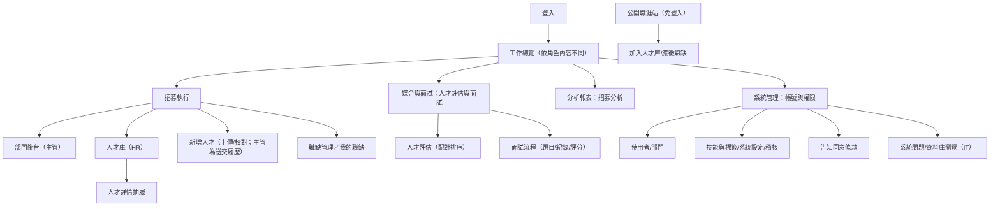

# 06. 前端頁面與後台規劃

**文件版本**：v1.3（2026-08-27）｜**技術**：Vue 3 + TypeScript + Vite（HR 工作台為單一 SPA，依角色顯示選單；另有獨立公開職涯站 `career-frontend`，免登入）

---

## 1. 資訊架構（Sitemap）



## 2. 角色 × 頁面權限矩陣

實際角色為四種：**IT（資訊管理員）**、**相容管理員（admin）**、**HR**、**部門主管**。

| 頁面 | IT | Admin | HR | 主管 |
|---|---|---|---|---|
| 工作總覽 | ✔（系統入口） | ✔ | ✔（四關路線導覽） | ✔ |
| 部門後台 | ✖ | ✖ | ✖ | ✔（本部門職缺與實際應徵者） |
| 人才庫（搜尋/詳情/編輯） | ✖ | ✔ | ✔ | ✖（於部門後台/媒合頁看應徵者，聯絡資訊遮罩） |
| 新增人才（匯入與校對） | ✖ | ✔ | ✔ | 僅「送交履歷並指派職缺」（無佇列與校對區） |
| 職缺管理 | ✖ | ✔（建立/編輯/核准） | ✔（同左） | 唯讀「我的職缺」清單 |
| 人才評估與面試 | ✖ | ✔ | ✔ | ✔ 本部門（回饋＋主管階段面試） |
| 招募分析 | ✖ | ✔ 全公司 | ✔ 全公司 | ✔ 本部門（後端自動限定） |
| 帳號與權限 | ✔ 全部分頁 | ✔ 全部分頁 | 僅使用者（限 hr/manager 帳號）＋告知同意條款 | ✖ |

## 3. HR 端頁面規格

### 3.1 工作總覽（登入首頁）
- HR／相容管理員：**HR 招募四關路線**互動導覽（①建立人才基本資料 → ②帶入履歷與經歷（可略過）→ ③指定應徵部門與職缺 → ④確認建檔並送交主管），點路標直達對應頁
- 主管：歡迎橫幅＋「招募中職缺」指標卡＋「檢視推薦人才」入口
- IT：歡迎橫幅＋「開啟管理中心」入口（不顯示招募數據）
- 側欄「新增人才」項目帶待校對數徽章

### 3.2 人才庫列表
- 指標卡：人才總數、活躍人才、優先／面試中、平均年資；**保存政策面板**（公司預設年限、逐人覆寫、到期清理）
- 關鍵字搜尋（姓名/Email/電話/職稱/來源）＋**技能搜尋**（後端以正規化技能鍵比對）＋狀態下拉
- 清單一人一列：人才（照片/姓名/編號）、目前職務、來源／更新時間、保存期限、應徵狀態（含目標職缺）、人才狀態；點列開詳情抽屜
- 規劃中：進階篩選抽屜（年資/縣市/學歷/薪資/標籤）、批次貼標與匯出、儲存搜尋

### 3.3 人才詳情（抽屜）
- 三個分頁：**基本資料**（聯絡資訊、期望條件、技能、經歷/學歷）／**履歷與去識別化**（原始履歷檔清單與 PDF 內嵌預覽（僅 HR）、去識別化版本上傳→自動驗證→預覽→核准；驗證阻擋項（含 pypdf 無法開啟的 PDF）未清除前「核准」停用；核准後開放職位推薦與單一職缺適配分析）／**應徵與紀錄**（應徵清單＋HR 與主管共享的留言/聯繫時間軸，可新增）
- 動作列：進入面試（銜接「人才評估與面試」）、新增留言／聯繫、編輯人才、封存、刪除（仍有進行中應徵時擋刪）
- 主管視角：聯絡資訊遮罩、僅見本部門應徵、只看得到已核准的去識別化文件
- 規劃中：疑似重複警示與合併、黑名單標示

### 3.4 履歷匯入（新增人才 → 上傳履歷）
- 三步驟版面：①上傳履歷（拖放多檔，PDF/DOC/DOCX、單檔 10 MB，**不支援 ZIP**）→ ②解析佇列（狀態篩選＋更新進度；僅列未入庫檔案）→ ③人工校對
- 逐檔狀態：等待上傳／上傳中／等待解析／需人工確認／可入庫／**重複檔案**（相同位元組不重複建檔）／失敗
- **校對介面**（本系統關鍵畫面）：

```
┌──────────────────────────────────────────────────────────────┐
│ 3. 人工校對 ｜檔名.pdf ｜狀態:需人工確認 ｜ [重新解析]         │
├──────────────────────────────────────────────────────────────┤
│ 指定應徵職缺：R2026-0012 資深後端工程師（確認後自動建應徵）     │
│ 逐檔來源判別：疑似 104 匯出格式 · 62%（依據：版面簽章…）        │
│   來源待確認 → [104] [1111] [自製] [無法驗證]（人工指定）       │
│ 姓名* [王小明]  Email [ming@x.com]  電話 [0912345678]          │
│ 居住地 [台北市] 目前職稱 [後端工程師] 總年資 [6]               │
│ 技能（逗號分隔）[Python, FastAPI, PostgreSQL]                  │
│ 解析原文（唯讀，供對照）┆ 解析錯誤訊息（如有）                  │
├──────────────────────────────────────────────────────────────┤
│            [儲存校對]        [確認並寫入人才庫]                │
└──────────────────────────────────────────────────────────────┘
```
- 低信心欄位標示提醒；來源待確認時「確認並寫入人才庫」停用；入庫結果顯示「已建立人才／已更新人才」（email/電話命中既有人才時自動改為更新）
- 主管沒有佇列與校對區：僅「送交履歷並指派職缺」（先選本部門職缺再上傳，由 HR 校對入庫）

### 3.5 職缺管理與人才評估（配對）
- 職缺管理為**精簡清單**（`.job-list-row` 一列一職缺）：職缺/編號/發布狀態、部門與技能、地點與需求人數、狀態；HR/相容管理員可「編輯」，草稿與待審核列有「核准」鈕；主管視角標題為「我的職缺」且唯讀（附「查看人才」捷徑）。建立/編輯表單內建反歧視用語即時檢查（僅警示）、盲評開關與綜合分權重（HR 限定，規則見 05 §5.1／§5.2）
- **人才評估**（「人才評估與面試」頁的第一個分頁）：

```
┌─ 職缺選單：資深後端工程師 (R2026-0012)｜ [重新配對] ────────────┐
│ 來源切換：實際應徵者 ｜ 人才庫推薦        進階設定（權重/必要條件）│
├────────────────────────────────────────────────────────────────┤
│ ▸ 92.5 王○明｜ABC 後端｜排名 #1｜通過必要條件｜[安排面試]        │
│ ▸ 87.0 林○華｜XYZ 全端｜排名 #2｜未過門檻（可例外覆核）          │
│   …點列展開：六面向 breakdown（技能命中/缺少、年資、薪資…）、     │
│   near-miss 標示、人工婉拒／例外覆核紀錄、按需 AI 分析…          │
└────────────────────────────────────────────────────────────────┘
```
- 未計算配對的人才也會列出（總覽含已計算/未計算計數）；「加入此職缺並安排面試」會建立正式應徵紀錄後跳到面試流程
- 規劃中：勾選批次操作、寄送名單、匯出、漏斗小結

### 3.6 結構化面試評分工作區

- 入口位於「人才評估與面試」工作區的「面試流程」分頁，依應徵紀錄切換 HR 初談／主管複試。
- 每題直接顯示原生 radio 語意的 1–5 分量表；若未詢問，改選「未詢問」並填寫原因。
- 顯示已評題數、略過題數、總題數與實際評分題平均；未詢問題不當成 0 分。
- 面試官可先存不完整草稿；正式提交前檢查所有題目、**0–100 面試總分**、錄用建議與非空總評（舊紀錄可沿用 1–5 整體評分）。
- 完成後整筆唯讀；合法階段面試官輸入原因後才能重開，畫面顯示提交者、提交時間、題目版本及修訂編號。
- 卡片提供**雙方共識帶（consensus strip）與六分數總覽**：①履歷匹配、②HR 題目分、③HR 總結、④主管題目分、⑤主管總結、⑥綜合參考分（權重見 05 §5.2，雙方提交後才出現）；缺項一律標示原因、不以 0 分計，資料載入前以「—」顯示。
- 評分顯示（共識帶、六分數列、盲評釋出徽章）一律跟隨**各階段最新一筆紀錄**，與題目版本無關：重新產生題目不會讓已提交的評分看起來未提交。
- HR／主管最新紀錄都完成前，另一方只看共享問答，不顯示分數、未詢問原因、觀察、總評與建議；任一方重開即恢復遮罩。
- 取消／未到場只顯示「儲存狀態」，不要求評分，也不誤導為正式提交。
- 量表平均與錄用建議只供人類決策參考，不自動改變應徵狀態。

完整操作與 UAT 契約見 [13-結構化面試評分與盲評操作規格](13-結構化面試評分與盲評操作規格.md)。

### 3.7 報表（招募分析）
- 招募漏斗（部門/期間篩選）、time-to-fill 排行、來源成效、人才庫組成（技能 Top 20、年資/地區/學歷分佈、月增量）；所有指標由資料庫即時聚合
- 圖表為輕量 HTML/CSS 呈現（無第三方圖表庫）；主管開啟時後端自動限縮為本部門
- 規劃中：PNG/CSV 匯出

## 4. 主管端頁面規格

### 4.1 建立部門職缺（部門後台）
- 單一表單對話框（非多步精靈）：職缺名稱、人數、性質、地點、技能、年資、學歷、薪資區間、JD／摘要
- 部門由系統自動鎖定；**送出即為送審（`submitted`）**、職缺編號自動產生、薪資區間檢核
- 尚無應徵者的職缺可編輯與刪除（已有應徵者刪除回 409）；核准由 HR／相容管理員在職缺管理執行
- 規劃中：JD 範本、期望到職日／緊急度欄位、簽核進度視覺化

### 4.2 我的職缺與部門後台
- 「職缺管理」主管視角＝唯讀「我的職缺」清單（狀態、部門送交註記、發布時間，附「查看人才」捷徑）
- 「部門後台」工作區：左欄本部門職缺清單（含各職缺應徵數），主區顯示職缺細節與**實際應徵者卡**（配對分數、應徵時間、狀態），並可開啟去識別化「職位分析」抽屜

### 4.3 推薦人選檢視（人才評估與面試）
- 與 HR 共用「人才評估」清單：分數、遮罩後基本資料（電話 `*******678`、Email 首字元）、技能命中/缺少、必要條件結果
- 操作：安排面試（實際應徵者可直接進面試流程；人才庫人選須先由 HR 加入職缺）／婉拒（下拉結構化原因：技能不足/相關經驗不足/薪資期待不符/地點通勤不符/學歷條件不符/職務方向不符/到職時間不符/職缺暫停關閉/其他＋備註）
- 回饋即時回寫配對紀錄供 HR 檢視；主管**不可**下載或預覽履歷原檔（僅能檢視 HR 已核准的去識別化文件）

### 4.4 主管面試評分

- 主管只能維護自己部門實際應徵者的主管階段紀錄，不能修改 HR 階段。
- 使用與 HR 相同的 1–5 分量表、草稿／提交／重開流程及題目版本提示。
- 雙方完成前看不到 HR 評分結論；HR 私人備註即使釋出後仍不可見。

## 5. 系統後台（帳號與權限）

IT 與相容管理員看得到全部分頁；HR 只有「使用者」（限 hr/manager 帳號）與「告知同意條款」。

| 頁面 | 功能 |
|---|---|
| 使用者管理 | 建立/停用帳號（不刪除）、指派角色（it/admin/hr/manager）與部門、重設密碼（產生 24 碼臨時密碼並強制首登改密） |
| 部門管理 | 部門維護（上層部門、啟用狀態） |
| 技能與標籤 | 技能字典與標籤的新增/刪除（合併別名與待審新技能核可為規劃項） |
| 系統設定 | 鍵值系統參數（機密值遮罩顯示） |
| 稽核查詢 | 依動作/資源類型篩選，時間倒序（期間篩選與匯出為規劃項） |
| 告知同意條款 | 個資告知條款版本管理與啟用（公開站送出表單須引用現行版本） |
| 系統問題 | 追蹤功能、缺陷、維運進度、預計完成日與處理說明；不得存候選人內容 |
| 資料庫瀏覽 | 僅供診斷；面試題目、總評、建議、分數、私人備註與重開原因等招募內容遮罩；揭示個資欄位須填 5–200 字理由（`X-PII-Access-Reason`）並寫入稽核，且僅限白名單資料表 |

## 6. 全站 UX 原則

- 空狀態頁附「下一步指引」；重開已完成的面試紀錄需填原因（表格欄位排序、欄寬記憶、虛擬捲動為目標，尚未全面實作）
- 破壞性操作（刪除人才、封存、清理到期資料）二次確認；刪除受進行中應徵保護（後端 409）
- 錯誤訊息顯示在使用者當下所在的層級：對話框或抽屜開啟時，儲存失敗的訊息顯示在該視窗內（置於送出按鈕上方），不留在被遮罩蓋住的頁面本體。同一則訊息只渲染一處，關閉鈕不得觸發表單送出，且錯誤不得阻擋關閉或影響鍵盤操作。表單驗證與後端回傳的 `409`／`403` 等阻擋原因都適用此規則——否則使用者只會看到「按了沒反應」，尤其成功提示（toast）本來就顯示在遮罩之上，成敗回饋會不對稱。
- 登入工作階段具韌性：token 換發若只是網路中斷或後端 5xx／重啟，**不會**把使用者登出（沿用既有 refresh token 重試）；只有後端明確回 4xx 判定時才清除工作階段
- 規劃中：清單 URL 帶參數（把「篩選好的視圖」貼給同事）、站內通知鈴鐺＋Email 雙通道與深連結
- 介面繁體中文；日期時間以 zh-TW 本地化格式顯示（依使用者電腦時區）
