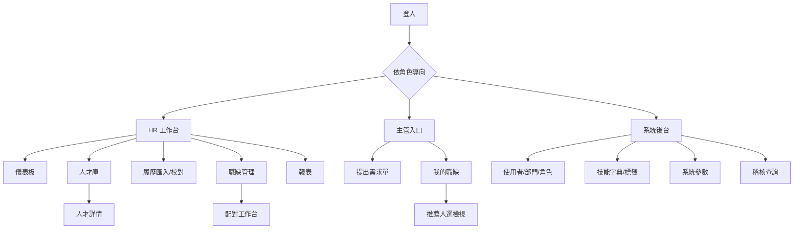

# 06. 前端頁面與後台規劃

**文件版本**：v1.0（2026-07-13）｜**技術**：Vue 3 + TypeScript + Element Plus（單一 SPA，依角色顯示選單）

---

## 1. 資訊架構（Sitemap）



## 2. 角色 × 頁面權限矩陣

| 頁面 | Admin | HR | 主管 |
|---|---|---|---|
| HR 儀表板 | ✔ | ✔ | ✖ |
| 人才庫（搜尋/詳情/編輯） | ✔ | ✔ | ✖（僅能看推薦名單內的人選卡，聯絡資訊遮罩） |
| 履歷匯入與校對 | ✔ | ✔ | ✖ |
| 職缺管理（全部） | ✔ | ✔ | 僅自己/本部門，唯讀進度 |
| 需求單填寫 | ✔ | ✔（代填） | ✔ |
| 配對工作台 | ✔ | ✔ | 僅檢視+回饋 |
| 報表 | ✔ | ✔ | 本部門摘要（Phase 2） |
| 系統後台 | ✔ | 技能字典/標籤 | ✖ |

## 3. HR 端頁面規格

### 3.1 儀表板（登入首頁）
- 數字卡：待校對履歷、招募中職缺、今日新入庫、逾期未聯繫、保存期限將至
- 待辦清單：待審核需求單、待校對佇列（點擊直達）
- 近 30 天匯入趨勢小圖、最新主管回饋動態

### 3.2 人才庫列表
- 頂部關鍵字搜尋（姓名/職稱/自傳模糊）＋「進階篩選」抽屜：技能（多選自動完成）、年資區間、縣市、學歷、期望薪資、狀態、來源、標籤、更新日期
- 結果表格：編號、姓名、最近職稱/公司、年資、期望地點/薪資、技能標籤（前 5）、狀態、更新時間；虛擬捲動支援萬筆等級
- 批次操作：貼標、變更狀態、匯出（稽核）；「儲存此搜尋」→ 常用搜尋下拉

### 3.3 人才詳情
- 左欄：基本資料卡（聯絡資訊、期望條件）、狀態流轉按鈕、標籤、主責 HR
- 主區 Tabs：**經歷時間軸**（工作+學歷合併排序）／**技能與證照**／**聯繫紀錄**（可新增，倒序）／**原始履歷檔**（PDF 內嵌預覽、多版本）／**相關職缺**（此人出現在哪些推薦名單與分數）
- 頂部警示列：疑似重複（含合併按鈕）、保存期限倒數、黑名單

### 3.4 履歷匯入
- 步驟一：拖曳上傳多檔/ZIP（或提示監控資料夾路徑）；步驟二：解析進度清單（成功✓ / 待校對⚠ / 失敗✕）
- **校對介面**（本系統關鍵畫面）：

```
┌──────────────────────────────────────────────────────────────┐
│ 履歷校對 #RF-000123 ｜來源:104｜整體信心 0.78｜ [重新解析]     │
├──────────────────────────┬───────────────────────────────────┤
│                          │ 姓名   [王小明        ] ✓ 0.99    │
│                          │ 電話   [0912345678    ] ✓ 0.97    │
│     PDF 原檔預覽          │ Email  [ming@x.com    ] ⚠ 0.62    │
│     （捲動/縮放，         │ 期望薪資 [45000–55000 ] ⚠ 0.55    │
│  點欄位跳至對應原文位置）  │ ─── 工作經歷 (3) ─── [＋新增]     │
│                          │ ▸ ABC公司 / 後端工程師 / 2021–至今 │
│                          │ ─── 學歷 (2) ／ 技能 (8) ───      │
│                          │ ⚠ 疑似重複：T2025-0042 王小明     │
│                          │   [檢視比對] [更新既有] [仍建新檔] │
├──────────────────────────┴───────────────────────────────────┤
│   [略過此份]        [存為草稿]        [確認入庫 →下一份]       │
└──────────────────────────────────────────────────────────────┘
```
- 低信心欄位黃底標示；`Enter` 確認、`→` 下一份，支援純鍵盤大量處理

### 3.5 職缺管理與配對工作台
- 職缺看板：依狀態分欄（待審/招募中/面試中/已補齊），卡片顯示緊急度、天數、推薦數
- **配對工作台**：

```
┌─ 職缺：資深後端工程師 (R2026-0012)｜招募中｜ [重新配對] ────────┐
│ 條件摘要：Python/FastAPI 必備 ・5年+ ・台北 ・60–90K ・碩士佳    │
├────────────────────────────────────────────────────────────────┤
│ ☑│分數│姓名  │現職        │年資│技能命中 │狀態      │操作      │
│ ☑│ 92 │王○明│ABC 後端    │6.0│ 5/5    │已推薦    │[詳情][聯繫]│
│ ☐│ 87 │林○華│XYZ 全端    │4.5│ 4/5    │主管:面試 │[詳情][聯繫]│
│  …點擊分數展開 breakdown（命中/缺少技能、各面向得分）…          │
├────────────────────────────────────────────────────────────────┤
│ [加入候選清單] [寄送名單給主管] [匯出]     漏斗:推薦20→聯繫8→面試3│
└────────────────────────────────────────────────────────────────┘
```

### 3.6 報表
- 招募漏斗（部門/期間篩選）、time-to-fill 排行、來源成效、人才庫組成（技能 Top 20、年資/地區分佈、月增量）
- 全部圖表可匯出 PNG/CSV（ECharts）

## 4. 主管端頁面規格

### 4.1 需求單精靈（4 步，5 分鐘完成）
1. **基本**：職缺名稱、部門（自動帶入）、人數、性質、地點、期望到職日、緊急度
2. **條件**：必備技能（字典自動完成，可加權）、加分技能、最低年資、學歷、語言、薪資區間
3. **說明**：工作內容 JD（提供範本）、備註
4. **確認**：摘要預覽 → 存草稿或送審；送審後顯示簽核進度

### 4.2 我的職缺
- 清單：狀態、天數、推薦/面試中人數、最新動態；點入看時間軸（送審→核准→首批名單→面試…）

### 4.3 推薦人選檢視
- 卡片式：分數、遮罩後基本資料（`0912***678`）、經歷摘要、技能命中/缺少
- 操作：👍 安排面試 ／ 👎 不合適（下拉原因：年資不符/技能不符/薪資期望過高/產業不合/其他+備註）
- 回饋即時回寫 HR 看板；主管**不可**下載履歷原檔（防個資外流，需求時由 HR 提供）

## 5. 系統後台（Admin）

| 頁面 | 功能 |
|---|---|
| 使用者管理 | 建立/停用帳號、指派角色與部門、重設密碼（首登強制改密） |
| 部門管理 | 樹狀維護、指定部門主管 |
| 技能字典 | 新增/合併技能、別名管理、待審新技能（解析器對不到的字串）核可 |
| 標籤管理 | 名稱/顏色/使用數 |
| 系統參數 | 配對權重預設、推薦名單長度、信心門檻、保存期限月數、遮罩開關 |
| 稽核查詢 | 依人/動作/對象/期間查詢，匯出 |

## 6. 全站 UX 原則

- 表格全面支援欄位排序、欄寬記憶、虛擬捲動；空狀態頁附「下一步指引」
- 破壞性操作（刪除/匿名化/黑名單）二次確認 + 需填原因
- 所有清單提供 URL 帶參數（可把「篩選好的視圖」直接貼給同事）
- 通知鈴鐺 + Email 雙通道；Email 內深連結直達對應頁面
- 介面繁體中文；日期顯示 `YYYY/MM/DD`；薪資千分位
