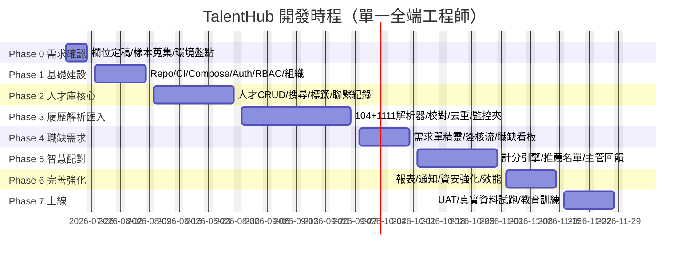

# 07. 開發時程與里程碑

**文件版本**：v1.5（2026-08-05，結構化面試評分／盲評修訂／IT 追蹤同步版）
**前提假設**：1 名全端工程師全職投入（搭配 AI 輔助開發）＋ HR 窗口 0.2 人力（需求確認/UAT）。
若配置 2 名工程師（前後端分工），總時程可壓縮約 30–35%（詳 §5）。

---

## 0-D. 2026/08/05 結構化面試評分交付線

| 工作流 | 狀態 | 完成定義／下一關 |
|---|---|---|
| 逐題 1–5 分與未詢問原因 | 🟢 程式完成 | HR／該部門主管可用單選量表評分；每題在正式提交時必須「評分」或「未詢問＋原因」二擇一 |
| 整體總評 | 🟢 程式完成 | 正式提交必填整體 1–5 分、錄用建議與非空總評；分數不自動改變應徵狀態 |
| 草稿、鎖定與修訂 | 🟢 程式完成 | 草稿可不完整；完成後一般修改回 409；帶原因重開後再次提交會遞增修訂編號並保存提交者／時間 |
| HR／主管雙方盲評 | 🟢 自動驗收完成 | 雙方最新紀錄都完成前遮罩評分結論；任一方重開即恢復遮罩；HR 私人備註始終不釋出 |
| 題目版本與資料庫 migration | 🟢 自動驗收完成 | 面試紀錄維持原題目版本；歷史完成紀錄回填第一版提交中繼資料；SQLite upgrade／downgrade 測試通過 |
| 瀏覽器 UAT 與正式發布 | 🟡 待公司驗收 | 08/06 由 HR／主管走查桌機與手機流程；08/07 完成 PostgreSQL migration 演練、PR／CI 與內網發布簽核 |

> 本列的「程式完成」代表功能與自動化契約已交付，不代表正式環境已部署。正式 UAT 應使用虛構或已授權且去識別資料，並依 [docs/13](13-結構化面試評分與盲評操作規格.md) 的阻擋項逐項簽核。

---

## 0-C. 2026/08/04 最新進度與交付線

| 工作流 | 狀態 | 完成定義／下一關 |
|---|---|---|
| 人才、履歷、職缺、可解釋媒合、報表 | 🟢 MVP 已完成 | 以取得授權且去識別化的樣本做解析與媒合 UAT |
| 面試優先流程 | 🟢 已實作 | HR／主管分階段權限、依實際應徵職位產題、逐題重新產生與版本追蹤 |
| 公開本人填寫與版本化同意 | 🟢 本輪完成 | 顯示目前生效告知內容；投遞綁定版本；撤回即同步停止正式媒合 |
| 主管最小權限 | 🟢 本輪完成 | 只見所屬部門實際應徵者；聯絡資訊遮罩；原始履歷下載／預覽限 HR／管理員 |
| 認證與 Gemini 最小揭露 | 🟢 本輪完成 | 前端登出同步撤銷 refresh token；Gemini 預設關閉，輸入只採結構化工作證據白名單 |
| 保存期限清理 | 🟡 程式已具備 | worker、批次清理及 durable outbox 已完成；待 HR／法務確認政策後由 IT dry-run 並啟用排程 |
| 功能分支發布 | 🟡 待閘門 | 2026/08/05 目標：PR、PostgreSQL migration、全量 CI、內網三角色 UAT、主線合併 |
| 正式環境 | 🔴 待公司 IT | HTTPS、正式 PostgreSQL／檔案儲存、ClamAV、加密備份／還原演練、集中監控與告警 |

> 進度判讀：程式「已實作」不等於「已正式上線」。必須通過 PR／CI、UAT、法務政策確認及正式環境檢核後，才能承載真實個資。

---

## 0-A. 2026/07/14 實作進度更新

| 工作流 | 狀態 | 本次交付與驗收重點 |
|---|---|---|
| 多角色權限 | 已完成 MVP | IT 可管理系統與權限；HR 可管理全部職缺與人才；主管僅能存取所屬部門／被指派職缺與其人才；前後端同時限制 |
| 104／1111 OCR 匯入 | 已完成 MVP | PDF／圖片文字擷取後依來源模板映射固定欄位，保存原始文字、解析結果、來源與信心分數；低信心欄位進人工校對 |
| 人才職缺配對 | 已完成 MVP | 以必要條件、技能、經驗、地點等面向產生可解釋分數與排序，不以敏感個資作評分特徵 |
| 後台互動介面 | 已完成 MVP | 依角色顯示可用功能與資料範圍，強化首頁任務導引、狀態回饋、人才／職缺／配對工作台 |
| 公司官網整合 | 已完成介面基線 | 採可嵌入品牌導覽與公開職缺入口的響應式版型；正式上線前仍需提供公司 Logo、色票與官網導覽規格 |

> 「已完成 MVP」指程式、資料模型與自動測試可供內部展示／試用；正式處理真實個資前，仍需以取得授權且去識別化的 104／1111 履歷樣本做欄位校準、資安檢核與 UAT。

### 更新後近期驗收線

| 日期 | 驗收項目 | 完成定義 |
|---|---|---|
| 07/14 | RBAC、OCR 固定欄位、可解釋配對、角色化 UI | 單元測試與前端 build 通過；越權請求回傳 403；履歷解析結果可校對後入庫 |
| 07/15–07/17 | 真實樣本校準與品牌套版 | 各來源至少 10 份去識別樣本；欄位準確率報告；確認 Logo、色票、官網導覽與 SSO／反向代理方式 |
| 07/20–07/24 | 整合 UAT 與缺陷修正 | IT、HR、主管三角色走完主要流程；高風險缺陷清零 |
| 07/27–07/31 | MVP 封版 | 操作文件、稽核紀錄、備份與部署檢查完成，使用去識別資料驗收 |

---

## 0-B. 2026/07/16 實作進度更新（依實際完成度）

AI 輔助開發使功能建置大幅提前：**Phase 1–5 的功能範圍已大致完成，Phase 6 的報表與資安強化亦完成大半**，並已完成受控**公司內網（LAN）試用部署**。實際進度遠早於下方原甘特圖（原訂 M4 於 10/30、M5 於 11/27）。剩餘主要是**正式上線等級的維運與資安**（需公司 IT／決策），非功能開發本身。

### 各階段完成度

| 階段 | 狀態 | 說明 |
|---|---|---|
| Phase 1 基礎建設 | 🟢 完成 | Auth/JWT/RBAC、使用者/部門；並加固帳號級自動過期鎖定、強制首登改密、密碼重設令 token 失效、refresh 重用偵測 |
| Phase 2 人才庫核心 | 🟢 完成 | 人才 CRUD、經歷/學歷/技能、搜尋/標籤/聯繫紀錄、種子資料 |
| Phase 3 履歷解析匯入 | 🟢 大致完成 | 104／1111／通用解析、OCR、去重、並排校對、確認入庫、THR1 範本 PDF。**未做**：監控資料夾 Watcher、大量批次／效能承諾 |
| Phase 4 職缺需求管理 | 🟢 完成 | 需求單、簽核狀態機（合法轉換＋`filled_at`/`closed_at` 寫入）、部門工作台。**未做**：Email／SMTP 通知 |
| Phase 5 智慧配對 | 🟢 完成並強化 | 硬門檻＋加權計分、可解釋 breakdown、人工回饋；**本次強化**：技能同義詞＋模糊比對、門檻軟化（`required_skill_ratio`／鄰近城市／`near_miss`）、雙語職稱、**媒合評估報表（Precision／Recall／Gate 誤殺／校準）** |
| Phase 6 完善強化 | 🟡 大致完成 | ✅ 招募／媒合評估報表；✅ 版本化同意、撤回 gate、主管遮罩、登出撤權、Gemini 工作證據白名單；✅ 保存期限清理 worker＋durable outbox；✅ 登入限流、掃毒 fail-closed、上傳限流／threadpool、nginx 安全標頭、容器非 root、API loopback、pip-audit CI。**待完成**：政策簽核後啟用 retention worker、通知完善、10 萬筆壓測、備份還原演練、TLS |
| Phase 7 UAT 與上線 | 🟡 部分 | ✅ 公司內網（LAN）試用部署、開機自啟、防火牆限網段。**待完成**：最新分支 PR／CI／主線合併、三角色 UAT、教育訓練、HTTPS／反向代理／WAF、每日加密備份與還原演練、監控／log 平台 |

### 本輪新增（07/15–07/16）

- 招募與行政工作流、面試兩關協作、LAN 部署與稽核。
- 兩輪資安／資料完整性／部署強化（詳 docs/08）：履歷確認資料清空修復、匿名投遞覆蓋防護、軟刪除 PII 一致性、狀態機守衛、認證強化、上傳安全、CSP／容器／CI 等。
- 媒合準確率強化＋媒合評估報表；文件同步（docs/02、05、08、10、11）。

### 剩餘（需維運／決策，非功能開發）

PR／全量 CI／主線合併、HTTPS／反向代理／WAF、每日加密備份與異地保存＋還原演練、監控／log rotation／磁碟告警、MFA、refresh token 改 httpOnly cookie、保存期限政策簽核與正式排程啟用、Email 通知、監控資料夾 Watcher、效能壓測、取得授權且去識別資料 UAT 與教育訓練。

---

## 0. 2026/07/31 壓縮交付方案

### 交付目標

在 2026/07/31 前交付可登入、可管理人才、可匯入測試履歷、可建立職缺並產生規則式推薦的
**內部展示／試用 MVP**。此版本供虛構或去識別資料驗收，不視為已符合正式個資上線條件。

### 時程

| 日期 | 工作內容 | 當日驗收 |
|---|---|---|
| 07/13 | Repo 骨架、前後端建置、DB schema、migration、健康檢查 | 測試與前端 build 通過；核心資料表可建立 |
| 07/14–07/15 | 登入、JWT、Admin/HR/主管 RBAC、使用者與部門 | 三種角色可登入，未授權 API 回傳 403 |
| 07/16–07/17 | 人才 CRUD、經歷/學歷/技能、種子資料 | 可建立、編輯、檢視 10 位虛構人才 |
| 07/20–07/21 | 人才搜尋、篩選、標籤、聯繫紀錄 | 可依技能、年資、地區查詢 |
| 07/22–07/23 | PDF 上傳、文字擷取、通用規則解析、校對 | 測試 PDF 可上傳並產生待確認欄位 |
| 07/24 | 去重基礎版、確認入庫 | Email/電話相同會提示重複 |
| 07/27–07/28 | 職缺 CRUD、條件設定、規則式配對 | 職缺可產生排序推薦名單與原因 |
| 07/29 | 前端主流程串接 | 登入→人才→匯入→職缺→推薦可操作 |
| 07/30 | 整合測試、權限與錯誤修正 | 關鍵 API/E2E smoke test 通過 |
| 07/31 | UAT、操作文件、展示版封版 | HR 以去識別資料完成主流程 |

### 7 月底明確不納入

- 104／1111 真實版型 95% 準確率承諾（需真實去識別樣本校準）
- Celery 大量批次處理、監控資料夾與 30 份／3 分鐘效能承諾
- SMTP、完整報表、保存期限自動匿名化、ClamAV、備份還原演練
- 可直接承載正式個資的 production hardening

上述項目保留在原 Phase 3、6、7，於 MVP 驗收後排入正式上線階段。

### 今日 07/13 完成線

1. 前後端可建置骨架、環境範本、開發啟動文件。
2. SQLAlchemy 2 與 Alembic 初始化。
3. 第一版核心 schema migration（組織、帳號、人才及主要子表）。
4. DB model 基礎測試與既有 API／前端建置驗證。

---

## 1. 甘特圖（2026-07-20 啟動）

## 2. 各階段內容與驗收條件

### Phase 0：需求確認（1 週）
- 與 HR 逐欄確認 `candidates` 欄位清單（以 docs/03 為底稿）
- 蒐集 104 / 1111 下載履歷樣本各 ≥ 10 份、Email 履歷 ≥ 10 份
- 確認部署環境（主機/Docker 可用性）、SMTP 帳號、監控資料夾位置
- 抽樣計時現況建檔時間（KPI 基準值）
- **產出**：欄位清單定稿、樣本庫（去識別化）、部署決策紀錄

### Phase 1：基礎建設（2 週）
- Git repo + 目錄結構（README §預計程式碼結構）、CI（lint + test）、Docker Compose（dev）
- DB migration 框架（Alembic）+ 全部資料表建立
- 登入/JWT/RBAC、使用者/部門/角色管理（Admin 頁）
- **驗收**：三種角色可登入，權限選單正確；`docker compose up` 一鍵起環境

### Phase 2：人才庫核心（3 週）→ **M1**
- 人才 CRUD + 子表（經歷/學歷/技能/語言/證照）、手動建檔表單
- 複合搜尋（含 pg_trgm 模糊）、儲存常用搜尋、標籤、狀態機、聯繫紀錄
- 技能字典管理 + 初始資料匯入
- **M1 驗收**：HR 可手動建檔並以「技能+年資+地區」2 秒內搜得；聯繫紀錄可追蹤

### Phase 3：履歷解析匯入（4 週）→ **M2（MVP）**
- W1：解析框架 + `Parser104`（樣本準確率 ≥ 95%）
- W2：`Parser1111` + `GenericParser`（regex 基礎版）+ 正規化驗證器
- W3：批次上傳、佇列與進度、校對介面（PDF 並排）、去重與合併
- W4：監控資料夾 Watcher、失敗處理、樣本回歸測試進 CI
- **M2 驗收**：30 份 104 履歷拖入 → 3 分鐘內解析完成、自動入庫率 ≥ 70%、重複自動標示 → **開始試營運，人才庫每天累積**

### Phase 4：職缺需求管理（2 週）→ **M3**
- 需求單精靈（4 步）、簽核流（送審/核准/退回）、職缺看板、通知（站內+Email）
- **M3 驗收**：主管 5 分鐘完成需求單；HR 即刻收到通知並可核准

### Phase 5：智慧配對（3 週）→ **M4**
- W1：硬條件過濾 + 六面向計分引擎（單元測試含邊界案例）
- W2：推薦名單 API + 配對工作台 UI（breakdown 展開）、觸發機制（核准/入庫/夜間）
- W3：主管推薦檢視 + 回饋、遮罩邏輯、名單寄送
- **M4 驗收**：需求單核准 1 分鐘內產出 Top 20 附原因；主管回饋即時回寫；HR 抽查推薦合理性認可 ≥ 80%

### Phase 6：完善強化（2 週）
- 四張報表、通知完善、保存期限排程與匿名化、稽核查詢頁
- 資安強化：速率限制、上傳防毒（ClamAV）、TLS、備份排程與還原演練
- 效能：灌 10 萬筆假資料壓測搜尋與配對
- **驗收**：docs/02 §7 非功能需求全數達標

### Phase 7：UAT 與上線（2 週）
- HR + 2 位種子主管 UAT（真實流程走一輪）、缺陷修復
- 歷史履歷回灌（既有存量 PDF 批次匯入）
- 教育訓練（HR 90 分鐘、主管 30 分鐘 + 操作手冊）
- **M5 驗收**：正式環境上線、備份還原演練通過、KPI 追蹤儀表板啟用

## 3. 里程碑總表

| 里程碑 | 預計日期 | 內容 | 對 HR 的意義 | 實際狀態（2026-08-04）|
|---|---|---|---|---|
| M0 | 2026-07-24 | Kickoff、需求定稿 | 欄位與流程共識 | 🟢 已達 |
| M1 | 2026-08-28 | 人才庫可用 | 可開始集中管理人才 | 🟢 已達（提前）|
| **M2** | **2026-09-25** | **履歷自動匯入（MVP 試營運）** | **縮短結構化建檔時間（待 UAT 量測）** | 🟢 已達（提前，內網試用）|
| M3 | 2026-10-09 | 需求單上線 | 主管需求數位化 | 🟢 已達（提前）|
| M4 | 2026-10-30 | 智慧配對上線 | 產出附原因的候選名單（成效待 UAT 校準） | 🟢 已達（提前，且已強化＋評估報表）|
| M5 | 2026-11-27 | 全功能正式上線 | 完整生態圈運作 | 🟡 功能大致齊備；尚缺正式上線硬化（HTTPS／備份還原／監控／MFA／真實資料 UAT）|

## 4. 開發節奏與品質守則

- **每週五 30 分鐘 Demo** 給 HR 窗口：以可操作畫面確認方向，避免最後才發現不合用
- 需求變更走「變更清單」：小改當週吸收，大改列入 Phase 順延並同步時程
- 測試策略：解析器樣本回歸（CI 必跑）、計分引擎單元測試、關鍵 API 整合測試；前端以 E2E 煙霧測試涵蓋主流程
- 每階段結束：更新本文件實際進度、風險燈號（🟢🟡🔴）

## 5. 資源方案比較

| 方案 | 人力 | 全功能上線 | 適用 |
|---|---|---|---|
| A（本文件基準） | 1 全端 | 約 19 週（4.5 個月），MVP 第 10 週 | 預算有限、可接受漸進上線 |
| B | 2 工程師（前/後端） | 約 12–13 週，MVP 第 7 週 | 希望年底前完整運轉 |
| C | 1 全端 + 分包前端 | 約 14–15 週 | 內部僅一名後端時 |

## 6. 成本概估（量級參考）

| 項目 | 估算 |
|---|---|
| 主機 | 內網 VM 4 vCPU / 8 GB / 200 GB（利用既有虛擬化平台則近乎零增支） |
| 軟體授權 | 全開源（Postgres/Redis/MinIO/FastAPI/Vue），$0 |
| LLM API（選配） | 僅自由格式履歷使用，每份約 NT$0.3–2；月匯入 500 份估 NT$1,000 內 |
| 104/1111 企業會員 | 既有支出，不新增（系統反而透過留庫再利用**降低**重複開履歷費用） |
| 人力 | 依 §5 方案；Phase 2 之後維運約 0.2 人力/月 |
