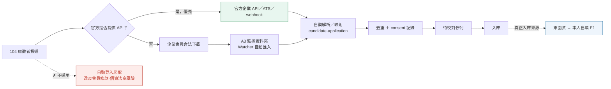
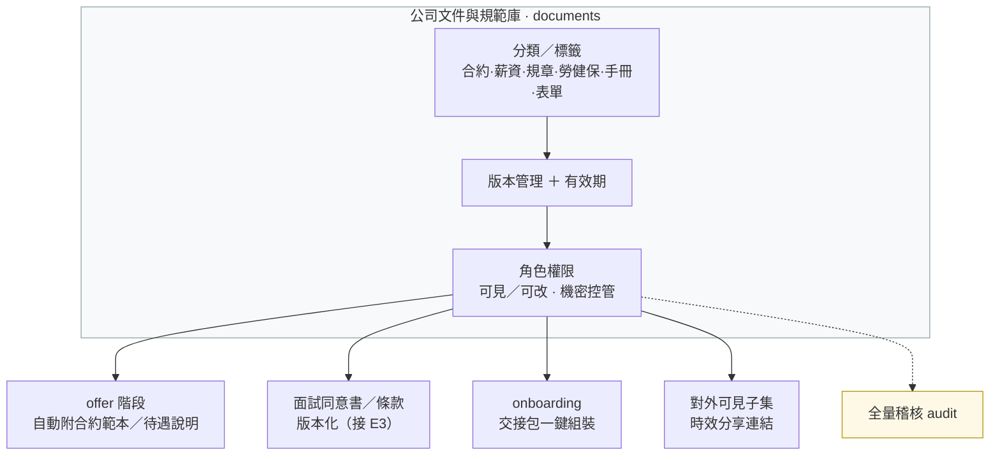
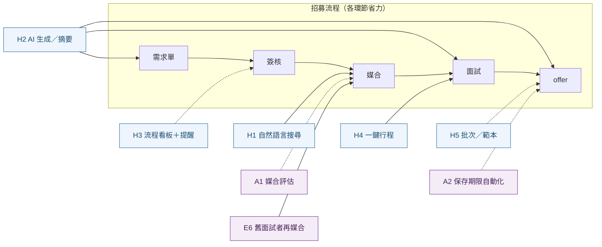

# 12. 後續工作與延伸建議（Backlog / Roadmap）

**文件版本**：v1.0（2026-07-16）
**用途**：盤點目前尚未完成的項目與可延伸方向，供排優先序與發想延伸。完成度基準見 [docs/07](07-開發時程與里程碑.md)；**各項的詳細做法、製作順序、估時、驗收與風險見 [docs/13 實作規劃與製作順序](13-實作規劃與製作順序.md)**。

分類：**A** 可直接做（自包含、無外部相依）｜**B** 可做但需設定或決策｜**C** 需公司 IT／維運（非寫程式）｜**D** 媒合準確率的下一批。規模：**S** 小 / **M** 中 / **L** 大。

---

## A. 可直接做（自包含、無外部相依）

### A1. 媒合評估報表前端頁　`S`（前端）
- **說明**：把後端已完成的 `GET /reports/matching-evaluation` 指標做成 HR 可看的儀表頁（Precision@K、Recall@K、Gate 誤殺率、分數分桶校準、排名有效性）。
- **價值**：讓「媒合準不準」看得見、可追蹤每次調權重/門檻後有沒有變好。
- **前置**：無（後端端點已上線）。
- **延伸**：時間趨勢圖；per-職缺下鑽；匯出 CSV；與 `required_skill_ratio` 調整前後的 A/B 對照；小樣本警示與「還差幾筆才能自動調權重」提示。

### A2. 保存期限自動匿名化　`M`（後端＋排程）
- **說明**：排程作業，將超過 `candidates.retention_until` 的人才自動去識別化（清 PII、保留去識別統計）。
- **價值**：個資法遵循、降低外洩面（目前 `retention_until` 有存但沒有自動處理）。
- **前置**：確認匿名化規則（清哪些欄位、是否保留統計）、排程機制（Windows 排程 / cron）。
- **延伸**：到期前通知 HR；各來源可設不同保存期；匿名化 audit 與可還原窗口；「同意撤回」即時匿名化。

### A3. 監控資料夾 Watcher　`M`（後端服務）
- **說明**：監看指定資料夾，HR 下載的 104／1111／一般履歷零手動、自動匯入解析入待校對佇列。
- **價值**：實現規劃書的「下載後零手動操作」。
- **前置**：資料夾位置、失敗/重複處理策略。
- **延伸**：多來源資料夾並依夾別自動標記來源；批次進度儀表；與背景 worker（B4）串接。

### A4. 完整分頁 UI ＋長列表虛擬化　`M`（前端）
- **說明**：前端清單接上後端已完成的 `limit`/`offset` + `X-Total-Count`，加「分頁／載入更多」與長列表虛擬化（audit log、應徵清單、部門工作台、人才/履歷）。
- **價值**：大資料量下不卡、不漏（目前前端是抓全部頁、無虛擬化）。
- **前置**：無（後端已支援分頁與總數）。
- **延伸**：欄位排序、儲存常用篩選、無限捲動、伺服器端搜尋。

---

## B. 可做但需設定或決策

### B1. Email／站內通知（SMTP）　`M`（後端＋樣板）
- **說明**：需求單核准、媒合完成、面試安排等事件寄信 + 站內通知中心。
- **前置**：SMTP 主機／帳密／寄件人；決定哪些事件要通知。
- **延伸**：可訂閱/退訂；Email 模板管理；寄送失敗重試與 audit；摘要式每日通知。

### B2. MFA（TOTP 二階段驗證）　`M–L`
- **說明**：對 admin／it／hr 等高權角色加 TOTP。
- **前置**：決定強制範圍與備援碼流程。
- **延伸**：WebAuthn／passkey；信任裝置；登入異常告警。

### B3. refresh token 改 httpOnly cookie　`M–L`（跨前後端）
- **說明**：把 refresh token 從 `sessionStorage` 改為 httpOnly + Secure + SameSite cookie，access token 只留記憶體。
- **前置**：需 HTTPS（cookie Secure）＋ CSRF 對策決定。
- **延伸**：縮短 access token TTL；同源部署簡化。

### B4. 上傳解析背景 worker queue　`L`（新增服務）
- **說明**：把履歷解析／OCR 從請求執行緒移到 Celery/RQ + Redis 背景處理（目前已用 threadpool 緩解阻塞，但仍在同一進程）。
- **前置**：Redis（compose 已有）；決定 worker 佈署方式。
- **延伸**：批次進度即時回報；失敗重試與死信；優先佇列；與 A3 監控資料夾串接。

---

## C. 需公司 IT／維運（非寫程式，正式上公網前必備）

- **HTTPS／反向代理／WAF／Zero-Trust**：對外服務前必備（目前僅內網 HTTP）。
- **每日加密備份 ＋ 異地保存 ＋ 還原演練**：DB 與履歷儲存（resume/photo/MinIO）都要，並定期抽驗還原。
- **監控／log rotation／磁碟告警／資料保留政策**：服務可用性與容量。
- **負載測試（k6/locust）＋ 依賴與容器映像弱點掃描（Trivy/Dependabot；`pip-audit` 已在 CI）**。
- **移除主機 `.env` 內 bootstrap 憑證並輪替所有共用密碼**。

---

## D. 媒合準確率的下一批（多需累積回饋資料）

### D1. 從回饋學權重（learning-to-rank／分數校準）　`M`
- **前置**：累積約 **30 筆標記結果**（媒合被人工標為 interview/offered/hired 或 rejected/withdrawn；靠實際使用累積，非新增履歷）。
- **延伸**：per-職務家族權重預設；把分數校準成「實際錄取機率」；線上再學習。

### D2. 語意 embeddings（技能／職稱）　`M–L`
- **說明**：以向量相似度補字典抓不到的同義／相關概念；務必**先影子計分**、在標記資料上贏過現行再切換。
- **前置**：embedding 模型/套件選型（本地模型 or API）。
- **延伸**：hybrid rank fusion；技能關聯圖（React⇒JavaScript 給部分分）。

### D3. 上游技能抽取改善　`M`
- **說明**：從履歷全文與工作經歷推斷技能（非只讀「技能」段），直接餵給媒合。
- **延伸**：熟練度／與該技能相關的年資；證照對應。

### D4. 相關年資與熟練度建模　`M`
- **說明**：以「相關職務/技能的年資」與近期性加權，而非只看總年資。

### D5. 量測套件擴充　`S–M`
- **說明**：`recall@K` 評估、shadow/A-B 對照框架、快速人工標記工具，讓每次演算法調整都有客觀比較。

---

## E. 面試優先（Interview-first）方向

> **主管討論中的方向**：改為「**來面試的人才才進入人才庫，並由本人自填**」，而非廣撒式下載履歷入庫。以下多為**加法**（不移除既有公開投遞／批次匯入），且會**放大**已完成的媒合/評估價值——本人自填讓資料更準、每個入庫者都面試過（標記結果累積快，餵給評估報表與 D1 學權重），邀請制也順帶根治「知道 email 就能覆寫他人資料」的風險並讓 consent 明確。

### E1. 邀約式自填連結（tokenized self-fill）　`M`　⭐建議優先
- **說明**：HR 排面試 → 系統發**一次性連結** → 候選人自填基本資料/經歷/技能＋電子同意 → 入庫並連到該應徵。
- **價值**：取代 OCR 解析、資料更準；consent 明確；解決匿名覆寫風險。
- **前置**：決定表單欄位與必填、連結有效期/一次性策略。
- **延伸**：面試前預填、面試後補件、多語表單。

### E2. 現場報到（QR／連結）＋到場確認/補填　`S–M`
- **說明**：報到時掃碼填/確認資料，當場入庫。**前置**：報到點裝置/流程。**延伸**：報到看板、簽到時間統計。

### E3. 電子同意書　`S–M`
- **說明**：面試當下取得明確個資同意並存證。**價值**：法遵（對應 docs/08）。**延伸**：版本化條款、撤回即匿名化（接 A2）。

### E4. 面試排程＋邀約通知　`M`
- **說明**：時間/地點/地圖/聯絡人、提醒信、候選人可確認/改期。**前置**：通知管道（接 B1 SMTP）。**延伸**：面試官行事曆、衝突偵測。

### E5. 結構化面試評分表（scorecard）　`M`　⭐建議優先
- **說明**：能力面向評分、多位面試官、自動彙整推薦；擴充現有兩關面試（目前只有 result/notes）。**延伸**：評分校準、面試官一致性分析。

### E6. 舊面試者再媒合　`S–M`　⭐建議優先
- **說明**：新職缺開缺時，從「**曾面試過的人**」找適配並提醒 HR 回頭聯繫（用既有媒合引擎）。**延伸**：自動再聯繫、冷卻期規則。

### E7. 人才培育／再聯繫　`M`
- **說明**：標記「強但當時無缺」、追蹤提醒、有適配缺自動提醒；用既有 tags/activities。**延伸**：培育名單、定期回訪。

### E8. 候選人狀態頁　`M`
- **說明**：候選人可看自己的進度/下一步。**延伸**：面試準備資訊、offer 線上接受。

**本方向優先建議**：**E1＋E5＋E6**——自填讓資料準、評分表產生標記、再媒合讓庫被回收，三者互相加乘。

---

## F. 104／人力銀行資料介接（合規建議）

> ⚠️ **專案紅線**：**不做自動登入爬取** 104／1111 履歷——違反平台會員條款、帳號有停權風險，且以個資法角度屬高風險蒐集手段（見 [README](../README.md)、[docs/08](08-個資保護與資訊安全.md)、[docs/04](04-履歷解析與匯入流程.md)）。以下為**合規前提**下的分層建議：優先走官方管道、其次沿用現行合法下載，並以「面試優先自填」為真正入庫來源。

### F1. 官方介接分層方案（合規優先）　`M`（後端＋外部協商）
- **說明**：以三層優先序處理外部人力銀行資料，全程**不繞過平台機制**：
  - **(1) 現況（已做且合規）**：HR 以企業會員在 104 後台合法**下載**應徵者履歷 → 系統對「已下載檔」自動解析入庫；搭配 **A3 監控資料夾 Watcher** 達成「下載後零手動」。
  - **(2) 官方 API／介接（優先探詢）**：若 104 提供官方企業 API／ATS 整合／webhook，一律走官方管道——需與 104 業務確認**方案、授權範圍、費用、資料使用與個資合約**。最合規、最穩定。
  - **(3) 面試優先脈絡**：104 僅作**初步接觸來源**，真正入庫由「來面試 → 本人自填（E1）」完成，降低對外部平台資料的依賴與個資風險。
- **價值**：守住紅線的同時把外部管道價值最大化——官方 API 若可行則資料最完整穩定，面試自填則資料最準、consent 最明確。
- **前置**：**先確認 104 官方是否有 API／介接方案**（有 → 評估授權與費用走官方；無 → 維持現行合法下載＋Watcher）。
- **技術（若走官方 API）**：授權（OAuth／API 金鑰）→ 拉取應徵者資料 → 映射 `candidate`／`application` → 去重 → `consent` 記錄 → rate limit → 錯誤／重試 → 全量審計。
- **延伸**：多平台（1111／CakeResume 等）統一介接層；官方 webhook 即時進待校對；授權到期與額度告警。

---

## G. 公司文件與規範庫

### G1. 公司文件與規範庫　`M`（後端＋前端）
- **說明**：集中存放並管理公司內部 HR 文件——勞工合約（範本／簽署本）、薪資／待遇說明、公司規章制度、勞健保與福利說明、員工手冊、各式 HR 表單範本。
- **功能**：分類／標籤、版本管理、有效期、角色權限（可見／可改）、對外可見子集（作為 offer 附件）、機密控管與全量稽核。
- **價值**：文件不再散落個人電腦——版本一致、權責清楚、法遵可稽核；offer／onboarding 能自動取用正確版本。
- **串接**：offer 階段自動附上合約範本／待遇說明；面試同意書／條款版本化（接 E3）；onboarding 交接包一鍵組裝。
- **技術**：新增 `documents` 表（類別、版本、`storage_key`、權限、有效期）＋重用既有檔案儲存（resume／photo／MinIO）＋audit log。
- **前置**：文件分類架構與權限矩陣、機密等級定義。
- **延伸**：到期／改版提醒、電子簽署串接、範本變數自動帶入（姓名／職稱／待遇）、對外分享連結時效控管。

---

## H. HR 大幅提效（高價值功能群）

> 把「讓 HR 一天省很多時間」的高價值功能集合於此；多為**加法**且會**放大**既有媒合／評估價值。交叉引用既有項目：舊面試者再媒合（**E6**）、保存期限自動化（**A2**）、媒合評估報表（**A1**）。各子項標規模。

### H1. 自然語言人才搜尋　`M–L`（前端＋後端）
- **說明**：HR 用白話下條件即可搜尋，例「找 3 年以上、會 Go 的後端」→ 解析成結構化查詢（技能／年資／職務）打既有媒合／搜尋引擎。
- **價值**：免記欄位與篩選操作，找人像對話一樣快。
- **延伸**：語意 embeddings（接 D2）補同義詞；儲存常用查詢；一鍵轉「舊面試者再媒合（E6）」。

### H2. AI 輔助（生成與摘要）　`L`（後端＋前端）
- **說明**：JD 生成、面試題建議、履歷／面試紀錄摘要、候選人比較表自動生成。
- **價值**：把反覆的撰寫／整理交給 AI，HR 專注在判斷與溝通。
- **延伸**：摘要接面試評分表（E5）；比較表接媒合評估（A1）；產出留痕與人工覆核。

### H3. 招募流程看板＋自動化提醒　`M`（前端＋後端）
- **說明**：需求單 → 簽核 → 媒合 → 面試 → offer 全程看板追蹤，逾時／待辦自動提醒，減少人工盯進度。
- **價值**：流程一眼可視、卡關自動催辦，不再靠記憶與試算表。
- **延伸**：SLA 與瓶頸分析；提醒接 B1 通知。

### H4. 一鍵行程（排程＋行事曆＋邀約信）　`M`（後端＋整合）
- **說明**：一鍵完成面試排程、寫入行事曆、寄出邀約信（接 E4 面試排程、B1 SMTP）。
- **價值**：把「喬時間 → 建行事曆 → 發信」三步併成一步。
- **延伸**：面試官行事曆整合與衝突偵測；候選人可自助改期。

### H5. 批次／範本作業　`S–M`（前端＋後端）
- **說明**：Email 模板、批次通知與批次操作（如批次轉狀態、批次寄拒信／邀約）。
- **價值**：一對多的重複動作一次完成。
- **延伸**：模板變數帶入；批次結果報表與失敗重試。

---

## 建議起手順序

1. **A1（評估報表前端頁）＋ A2（保存期限自動匿名化）**：立即價值高、自包含、無外部相依——A1 讓媒合成效看得見、A2 補個資法遵循缺口。
2. 接著看營運需要：要對外→先推 **C（HTTPS/備份/監控，IT）**；要減人工→**A3 Watcher／B1 通知**；要更準→邊用邊累積回饋，資料夠了做 **D1**。
3. 較大的架構項（B2 MFA、B3 cookie、B4 worker）依風險與時程另約。

> 更新方式：每完成一項，於此表標記並同步 docs/07 完成度與相關文件（05 API／08 資安／10 手冊）。
