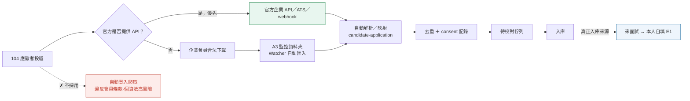
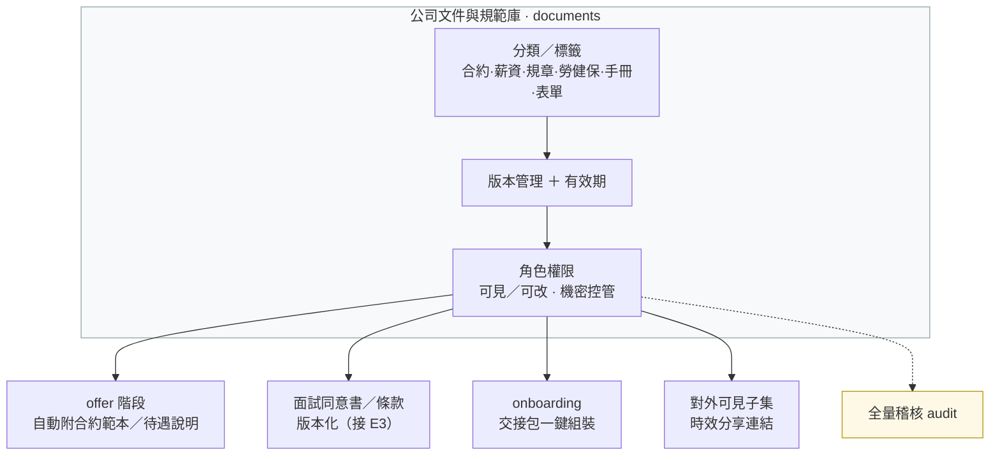
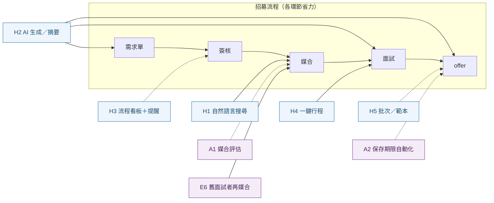

# 12. 後續規劃：待辦、做法與製作順序（Backlog + Plan）

**文件版本**：v2.0（2026-07-16）
**用途**：盤點目前尚未完成的項目與可延伸方向，並把每項展開成**可跟主管討論、可交接延續**的實作規劃——每項含說明／價值、做法與製作順序、觸及程式、估時、完成定義、相依、風險與延伸，讀者無需再跨文件對照。完成度基準見 [docs/07](07-開發時程與里程碑.md)。給主管看的白話版另見 [`TalentHub_後續規劃_主管報告.docx`](TalentHub_後續規劃_主管報告.docx)（本文件為工程／規劃完整版）。

估時以「1 名工程師＋AI 輔助」的**人天**概估，實際依範圍調整。

分類：**A** 可直接做（自包含、無外部相依）｜**B** 可做但需設定或決策｜**C** 需公司 IT／維運（非寫程式）｜**D** 媒合準確率的下一批｜**E** 面試優先（Interview-first）方向｜**F** 104／人力銀行資料介接（合規建議）｜**G** 公司文件與規範庫｜**H** HR 大幅提效。規模：**S** 小 / **M** 中 / **L** 大。

---

## 0. 整體製作順序（建議波次）

| 波次 | 內容 | 為何這個順序 |
|---|---|---|
| **Wave 0**（即刻，無外部相依） | A1 評估報表前端頁、A2 保存期限匿名化（先軟標記）、D5 量測 harness | 立即價值、自包含、不卡任何人；A1/D5 讓「準不準」看得見，A2 補法遵缺口 |
| **Wave 1**（減人工/通知，需少量設定） | A3 監控資料夾 Watcher、B1 Email 通知（需 SMTP）、A4 分頁 UI | 降低 HR 手動、改善大資料量體驗；B1 需你提供 SMTP |
| **Wave 2**（對外/正式化，需 IT＋決策） | C 系列（HTTPS／備份／監控）、B3 httpOnly cookie（需 HTTPS）、B2 MFA | 對外上線的前置；cookie 需先有 HTTPS |
| **Wave 3**（進階/需資料） | B4 背景 worker、D1 學權重（回饋夠後）、D2 embeddings、D3/D4 | 需累積回饋或較大架構改動 |

> 原則：**先做「看得見成效」與「法遵」**（Wave 0），再做「減人工」（Wave 1），對外前補「正式化硬化」（Wave 2），最後才是需資料/大改的進階（Wave 3）。

---

## A. 可直接做（自包含、無外部相依）

### A1. 媒合評估報表前端頁　`S`（前端）｜`估時 1–2 人天`
- **說明**：把後端已完成的 `GET /reports/matching-evaluation` 指標做成 HR 可看的儀表頁（Precision@K、Recall@K、Gate 誤殺率、分數分桶校準、排名有效性）。
- **價值**：讓「媒合準不準」看得見、可追蹤每次調權重/門檻後有沒有變好。
- **目標**：把後端 `GET /reports/matching-evaluation` 的指標做成 HR 儀表頁，讓每次調權重/門檻後能看出有沒有變準。
- **做法與製作順序**
  1. 前端 API：於 `frontend/src/services/matchingReportsApi.ts` 加 `getMatchingEvaluation(requisitionId?)`，讀回應 JSON。
  2. 型別：於 `frontend/src/types.ts`（或對應 DTO 檔）定義 `MatchingEvaluation`（對齊後端 schema 欄位）。
  3. 元件：新增 `MatchingEvaluationView.vue`（或在既有 `ReportsView.vue` 加分頁）——呈現 Precision@K/Recall@K 卡片、Gate 誤殺清單、分數分桶校準（簡單長條或表）、排名有效性、`notes`（小樣本提示）。
  4. 入口：報表區加連結；提供職缺下拉切換 `requisition_id`（全公司 / 單一職缺）。
  5. 狀態：loading／error／空狀態；小樣本時顯示「還差 N 筆標記才足以自動調權重」。
- **觸及程式**：`frontend/src/services/`、`frontend/src/components/ReportsView.vue`（或新元件）、`types.ts`。
- **完成定義**：選職缺→看到指標；無資料友善提示；`npm run build`（含 vue-tsc）過。
- **前置**：無（後端端點已上線）。
- **相依**：無（後端端點已上線）。
- **風險**：低。呈現要一眼看懂（先用表/長條，勿過度視覺化）。
- **延伸**：時間趨勢圖；per-職缺下鑽；匯出 CSV；與 `required_skill_ratio` 調整前後的 A/B 對照；小樣本警示與「還差幾筆才能自動調權重」提示。

### A2. 保存期限自動匿名化　`M`（後端＋排程）｜`估時 2–3 人天`
- **說明**：排程作業，將超過 `candidates.retention_until` 的人才自動去識別化（清 PII、保留去識別統計）。
- **價值**：個資法遵循、降低外洩面（目前 `retention_until` 有存但沒有自動處理）。
- **目標**：將超過 `candidates.retention_until` 的人才自動去識別化，符合個資法保存期限。
- **做法與製作順序**
  1. **先定規則（跟 HR/法遵確認）**：清哪些欄位（`name`→「（已匿名）」、`email`/`phone`/`email_norm`/`phone_norm`→NULL、履歷檔刪除或去識別）、保留哪些去識別統計（source、status、粗粒度城市）。
  2. Schema：加 `candidates.anonymized_at`（可空）標記已匿名 → 一個 migration。
  3. 服務：`services` 加 `anonymize_expired_candidates(db, now)`——找 `retention_until < now 且 anonymized_at IS NULL`，清 PII、設 `anonymized_at`，並處理其 `resume_files`／照片。
  4. **緩衝機制（強烈建議）**：先「軟標記待匿名」，實際清除延後 N 天，避免誤清不可逆。
  5. 入口：`backend/scripts/anonymize_retention.py`（供排程）＋ 可選 admin 手動觸發端點。
  6. 排程：Windows 排程工作／cron 每日執行。
  7. Audit：寫匿名化紀錄（不含明文）。
- **觸及程式**：`models/candidate.py`（+migration）、`services/`、`backend/scripts/`、`services/storage.py`。
- **完成定義**：造一筆過期人才→跑作業→PII 清空、`anonymized_at` 設定、audit 有紀錄、統計仍在；未過期不受影響；測試涵蓋。
- **前置**：確認匿名化規則（清哪些欄位、是否保留統計）、排程機制（Windows 排程 / cron）。
- **相依**：**匿名化規則需 HR/法遵拍板**。
- **風險**：**不可逆**——上線前務必：先每日備份、用緩衝延遲、先在測試資料驗證。
- **延伸**：到期前通知 HR；各來源可設不同保存期；匿名化 audit 與可還原窗口；「同意撤回」即時匿名化。

### A3. 監控資料夾 Watcher　`M`（後端服務）｜`估時 2–3 人天`
- **說明**：監看指定資料夾，HR 下載的 104／1111／一般履歷零手動、自動匯入解析入待校對佇列。
- **價值**：實現規劃書的「下載後零手動操作」。
- **目標**：監看資料夾，HR 下載的履歷零手動自動匯入解析（規劃書的「下載後零手動」）。
- **做法與製作順序**
  1. 機制選擇：**先做「定時掃描」**（簡單穩定）而非即時 watchdog；穩定後再考慮 watchdog。
  2. 服務：`backend/scripts/watch_intake.py`——掃描 intake 夾、對「已穩定（size 不再變）」的新檔呼叫**既有解析/入待校對流程**，處理後移到 `processed/`，失敗移到 `failed/`。
  3. 去重：用既有 `file_hash` 避免重複匯入。
  4. 執行：Windows 排程／常駐；記錄匯入結果。
- **觸及程式**：`backend/scripts/`，重用 `services/resume_parser.py`＋`services/storage.py`＋既有履歷入庫邏輯。
- **完成定義**：丟檔進資料夾→自動進待校對佇列、原檔移 `processed/`；重複檔不重覆；失敗進 `failed/`。
- **前置**：資料夾位置、失敗/重複處理策略。
- **相依**：資料夾位置。與 B4（背景 worker）可日後整合。
- **風險**：下載中的半寫入檔——用「size 連續數秒不變」判定穩定再處理。
- **延伸**：多來源資料夾並依夾別自動標記來源；批次進度儀表；與背景 worker（B4）串接。

### A4. 完整分頁 UI ＋長列表虛擬化　`M`（前端）｜`估時 3–4 人天`
- **說明**：前端清單接上後端已完成的 `limit`/`offset` + `X-Total-Count`，加「分頁／載入更多」與長列表虛擬化（audit log、應徵清單、部門工作台、人才/履歷）。
- **價值**：大資料量下不卡、不漏（目前前端是抓全部頁、無虛擬化）。
- **目標**：前端清單接上後端已完成的 `limit`/`offset` + `X-Total-Count`，加分頁與虛擬化。
- **做法與製作順序**
  1. API：各清單 service 帶 `limit`/`offset`，讀 `X-Total-Count`。
  2. 元件：加「分頁／載入更多」＋顯示總數；長列表導入虛擬捲動。
  3. 逐頁改：audit log → 應徵清單 → 部門工作台 → 人才/履歷。
- **觸及程式**：`frontend/src/services/`、各清單元件（`AdminView`、`DepartmentWorkspace`、`InterviewManagement`、`App.vue` 人才/履歷）。
- **完成定義**：大量資料下順暢、總數正確、不漏；build 過。
- **前置**：無（後端已支援分頁與總數）。
- **相依**：無（後端已支援）。
- **風險**：虛擬化與現有表格樣式整合需微調。
- **延伸**：欄位排序、儲存常用篩選、無限捲動、伺服器端搜尋。

---

## B. 可做但需設定或決策

### B1. Email／站內通知（SMTP）　`M`（後端＋樣板）｜`估時 2–4 人天`
- **說明**：需求單核准、媒合完成、面試安排等事件寄信 + 站內通知中心。
- **目標**：需求單核准、媒合完成、面試安排等事件通知。
- **做法與製作順序**
  1. 設定：`config` 加 `SMTP_HOST/PORT/USER/PASS/FROM/TLS`；決定事件清單。
  2. 服務：`services/notifications.py` 的 `send_email(...)`（`smtplib` 或 `aiosmtplib`），**走背景/threadpool 避免阻塞請求**。
  3. 觸發點：於需求單核准、媒合完成等處呼叫。
  4. 站內通知（選配）：加 `notifications` 表＋端點＋前端通知中心 → migration。
  5. 樣板＋失敗處理：簡單模板；寄送失敗記 log/audit、可重試。
- **觸及程式**：`config`、新 `services/notifications.py`、若干 route 觸發點、（站內通知）新表+migration+前端。
- **完成定義**：觸發事件→收到信（以 mailhog/測試 SMTP 驗）；失敗有紀錄。純 Email 約 2 天；含站內通知約 4 天。
- **前置**：SMTP 主機／帳密／寄件人；決定哪些事件要通知。
- **相依**：**SMTP 主機/帳密由你/IT 提供**。
- **風險**：寄信阻塞→務必背景化。
- **延伸**：可訂閱/退訂；Email 模板管理；寄送失敗重試與 audit；摘要式每日通知。

> **B2–B4（較大／需決策）**：這三項建議先各花 **0.5–1 天做「設計 spike」**（產出關鍵決策 + 影響評估），再排入實作。

### B2. MFA（TOTP 二階段驗證）　`M–L`
- **說明**：對 admin／it／hr 等高權角色加 TOTP。
- **決策**：哪些角色強制、備援碼、綁定流程。
- **做法**：`users` 加 TOTP secret（加密存）＋ 綁定/驗證端點＋登入流程插入第二步＋前端 QR 綁定頁。
- **前置**：決定強制範圍與備援碼流程。
- **相依**：無外部。
- **風險**：備援與帳號救援流程。
- **延伸**：WebAuthn／passkey；信任裝置；登入異常告警。

### B3. refresh token 改 httpOnly cookie　`M–L`（跨前後端）
- **說明**：把 refresh token 從 `sessionStorage` 改為 httpOnly + Secure + SameSite cookie，access token 只留記憶體。
- **決策**：CSRF 對策（SameSite=strict / double-submit token）。
- **做法**：後端登入改 Set-Cookie（httpOnly+Secure+SameSite）、refresh 讀 cookie、前端移除 sessionStorage refresh、access token 只留記憶體。
- **前置**：**需 HTTPS**（cookie Secure）＋ CSRF 對策決定。
- **風險**：跨站/跨埠 cookie 行為、部署拓撲。
- **延伸**：縮短 access token TTL；同源部署簡化。

### B4. 上傳解析背景 worker queue　`L`（新增服務）
- **說明**：把履歷解析／OCR 從請求執行緒移到 Celery/RQ + Redis 背景處理（目前已用 threadpool 緩解阻塞，但仍在同一進程）。
- **決策**：Celery vs RQ、worker 佈署。
- **做法**：Redis（compose 已有）為 broker、把解析/OCR 任務丟 queue、前端輪詢/推播進度。
- **前置**：Redis（compose 已有）；決定 worker 佈署方式。
- **相依**：與 A3 Watcher 整合佳。
- **風險**：多一個要顧的服務與監控。
- **延伸**：批次進度即時回報；失敗重試與死信；優先佇列；與 A3 監控資料夾串接。

---

## C. 需公司 IT／維運（非寫程式，正式上公網前必備）

> **性質**：非寫程式，列為**對外上線前置**。這些需由**公司 IT 規劃建置**；工程端能配合的是提供部署設定與健康檢查（多已完成）。

- **HTTPS／反向代理／WAF／Zero-Trust**：對外服務前必備（目前僅內網 HTTP）。
- **每日加密備份 ＋ 異地保存 ＋ 還原演練**：DB 與履歷儲存（resume/photo/MinIO）都要，並定期抽驗還原。
- **監控／log rotation／磁碟告警／資料保留政策**：服務可用性與容量。
- **負載測試（k6/locust）＋ 依賴與容器映像弱點掃描（Trivy/Dependabot；`pip-audit` 已在 CI）**。
- **移除主機 `.env` 內 bootstrap 憑證並輪替所有共用密碼**。

---

## D. 媒合準確率的下一批（多需累積回饋資料）

> **順序**：**先做 D5 量測 harness**（可即刻），讓之後每次演算法調整都有客觀比較；**D1** 待累積約 30 筆標記結果後再做；D2/D3/D4 詳見 [docs/11](11-人才職缺媒合試行方案.md)「下一步」與 [docs/02](02-系統架構設計.md) §5。

### D1. 從回饋學權重（learning-to-rank／分數校準）　`M`
- **前置**：累積約 **30 筆標記結果**（媒合被人工標為 interview/offered/hired 或 rejected/withdrawn；靠實際使用累積，非新增履歷）。
- **做法**：達量後以 learning-to-rank／邏輯迴歸擬合權重、分數校準成錄取機率。
- **延伸**：per-職務家族權重預設；把分數校準成「實際錄取機率」；線上再學習。

### D2. 語意 embeddings（技能／職稱）　`M–L`
- **說明**：以向量相似度補字典抓不到的同義／相關概念；務必**先影子計分**、在標記資料上贏過現行再切換。
- **前置**：embedding 模型/套件選型（本地模型 or API）。
- **風險/備註**：**先影子計分**，在標記資料上贏過現行版本後才切換。
- **延伸**：hybrid rank fusion；技能關聯圖（React⇒JavaScript 給部分分）。

### D3. 上游技能抽取改善　`M`
- **說明**：從履歷全文與工作經歷推斷技能（非只讀「技能」段），直接餵給媒合。
- **延伸**：熟練度／與該技能相關的年資；證照對應。

### D4. 相關年資與熟練度建模　`M`
- **說明**：以「相關職務/技能的年資」與近期性加權，而非只看總年資。

### D5. 量測套件擴充　`S–M`
- **說明**：`recall@K` 評估、shadow/A-B 對照框架、快速人工標記工具，讓每次演算法調整都有客觀比較。
- **順序建議**：**先做這個**（可即刻）——之後每次演算法調整都有客觀比較，是 D1／D2 的前置基礎。

---

## E. 面試優先（Interview-first）方向

> **主管討論中的方向**：改為「**來面試的人才才進入人才庫，並由本人自填**」，而非廣撒式下載履歷入庫。這是一條可與 **Wave 0/1 並行**的**加法**支線（不移除既有公開投遞／批次匯入），且會**放大**已完成的媒合/評估價值——本人自填讓資料更準；每個入庫者都面試過（標記結果累積快，餵給評估報表與 D1 學權重）；邀請制也順帶根治「知道 email 就能覆寫他人資料」的匿名覆寫風險並讓 consent 明確。**建議優先做 E1＋E5＋E6。**

### E1. 邀約式自填連結（tokenized self-fill）　`M`　⭐建議優先｜`估時 3–5 人天`
- **說明**：HR 排面試 → 系統發**一次性連結** → 候選人自填基本資料/經歷/技能＋電子同意 → 入庫並連到該應徵。
- **價值**：取代 OCR 解析、資料更準；consent 明確；解決匿名覆寫風險。
- **目標**：HR 排面試 → 發一次性連結 → 候選人自填＋電子同意 → 入庫並連到該應徵。
- **做法與製作順序**
  1. Schema：新增 `interview_invites`（或在 application 加 token 欄位）——存 token 的 **hash**、綁定的 application/candidate、用途、有效期、使用狀態 → migration。
  2. 後端：`（HR）產生邀約連結` 端點（回一次性 URL）；公開 `GET /public/invite/{token}`（驗 token→回表單定義）；公開 `POST /public/invite/{token}`（收自填＋consent，**只更新該 token 綁定的 candidate**，寫入後 token 作廢）。重用既有 candidate 更新邏輯，但以 token 綁定取代「用 email 找人」→ 安全。
  3. 前端：`career-frontend` 加自填頁（表單＋同意勾選＋送出成功）。
  4. 通知：產生連結後可寄給候選人（接 B1）。
- **觸及程式**：`models`（新表/欄位＋migration）、`api/routes/public.py`＋產生端點（admin 或 requisitions/interview 相關）、`career-frontend/`、`schemas`。
- **完成定義**：HR 產連結→候選人開→填→入庫連到應徵→token 一次性、過期即拒；測試涵蓋。
- **前置**：決定表單欄位與必填、連結有效期/一次性策略。
- **相依**：通知可接 B1；其餘無。
- **風險**：token 安全（一次性、時效、hash 存、不可枚舉）；表單欄位與現有 `candidates` 對齊。
- **延伸**：面試前預填、面試後補件、多語表單。

### E2. 現場報到（QR／連結）＋到場確認/補填　`S–M`
- **說明**：報到時掃碼填/確認資料，當場入庫。
- **做法**：報到掃碼填/確認；重用 E1 表單，加報到入口與時間戳。
- **前置**：報到點裝置/流程。
- **延伸**：報到看板、簽到時間統計。

### E3. 電子同意書　`S–M`
- **說明**：面試當下取得明確個資同意並存證。
- **價值**：法遵（對應 docs/08）。
- **做法**：面試當下取得並存證版本化同意；與 A2（撤回即匿名化）串接。
- **延伸**：版本化條款、撤回即匿名化（接 A2）。

### E4. 面試排程＋邀約通知　`M`
- **說明**：時間/地點/地圖/聯絡人、提醒信、候選人可確認/改期。
- **做法**：時間/地點/提醒/改期；**接 B1（SMTP）**；擴充現有面試管理。
- **前置**：通知管道（接 B1 SMTP）。
- **延伸**：面試官行事曆、衝突偵測。

### E5. 結構化面試評分表（scorecard）　`M`　⭐建議優先｜`估時 3–4 人天`
- **說明**：能力面向評分、多位面試官、自動彙整推薦；擴充現有兩關面試（目前只有 result/notes）。
- **目標**：面試官依能力面向評分，多人彙整成建議，取代/補強目前只有 result/notes。
- **做法與製作順序**
  1. Schema：`interview_scorecards`（application_id、interviewer、面向評分 JSON、總評、建議）→ migration。
  2. 後端：scorecard CRUD 端點，權限比照面試（HR／該部門主管）。
  3. 前端：`InterviewManagement.vue` 加評分表 UI ＋彙整顯示。
  4. 彙整：多面試官平均/建議聚合。
- **觸及程式**：`models`（＋migration）、`api/routes/applications.py`（或新 route）、`frontend/src/components/InterviewManagement.vue`、`schemas`。
- **完成定義**：面試官填→彙整顯示→權限正確；測試。
- **相依**：無。
- **風險**：評分面向需與 HR 定義；**不得存敏感/歧視性欄位**（延續 docs/11 排除清單）。
- **延伸**：評分校準、面試官一致性分析。

### E6. 舊面試者再媒合　`S–M`　⭐建議優先｜`估時 2–3 人天`
- **說明**：新職缺開缺時，從「**曾面試過的人**」找適配並提醒 HR 回頭聯繫（用既有媒合引擎）。
- **目標**：新職缺開缺時，從「曾面試過的人」找適配並提醒 HR 回頭聯繫（回收人才庫價值）。
- **做法與製作順序**
  1. 定義「曾面試過」：有 application 且面試有結果（或曾進面試狀態）的 candidates。
  2. 後端：配對加一個視角/filter——對某 requisition，僅對「曾面試過」的人跑 `score_candidate` 排序（重用引擎），標示 `past_interviewee`。
  3. 前端：`MatchingView.vue` 加「僅看曾面試過」切換＋「再聯繫」動作（記 activity）。
  4. 提醒（選配）：開缺時若有高分曾面試者，提醒 HR。
- **觸及程式**：`services/matching.py`（重用）、`api/routes/matches.py`、`frontend/src/components/MatchingView.vue`。
- **完成定義**：對某職缺可只看曾面試過的適配名單、可觸發再聯繫紀錄；測試。
- **相依**：媒合引擎（已在）。
- **風險**：低。
- **延伸**：自動再聯繫、冷卻期規則。

### E7. 人才培育／再聯繫　`M`
- **說明**：標記「強但當時無缺」、追蹤提醒、有適配缺自動提醒；用既有 tags/activities。
- **延伸**：培育名單、定期回訪。

### E8. 候選人狀態頁　`M`
- **說明**：候選人可看自己的進度/下一步。
- **做法**：候選人看進度/下一步；需一個候選人端輕量入口（可用 E1 的 token 機制延伸）。
- **延伸**：面試準備資訊、offer 線上接受。

> **本方向優先建議**：**E1＋E5＋E6**——自填讓資料準、評分表產生標記、再媒合讓庫被回收，三者互相加乘。
> **支線建議順序**：E1（入庫入口）→ E5（面試結構化、產生標記）→ E6（回收再媒合）；之後 E4/E3（通知＋同意）、E2（現場）、E7/E8（培育＋體驗）。E1/E4 的通知接 B1，故若要寄邀約信需先備妥 SMTP。

---

## F. 104／人力銀行資料介接（合規建議）

> ⚠️ **專案紅線**：**不做自動登入爬取** 104／1111 履歷——違反平台會員條款、帳號有停權風險，且以個資法角度屬高風險蒐集手段（見 [README](../README.md)、[docs/08](08-個資保護與資訊安全.md)、[docs/04](04-履歷解析與匯入流程.md)）。以下為**合規前提**下的分層建議：優先走官方管道、其次沿用現行合法下載，並以「面試優先自填」為真正入庫來源。

### F1. 官方介接分層方案（合規優先）　`M`（後端＋外部協商）｜`估時：探詢 0.5–1 人天＋（若走官方 API）3–5 人天`
- **說明**：以三層優先序處理外部人力銀行資料，全程**不繞過平台機制**：
  - **(1) 現況（已做且合規）**：HR 以企業會員在 104 後台合法**下載**應徵者履歷 → 系統對「已下載檔」自動解析入庫；搭配 **A3 監控資料夾 Watcher** 達成「下載後零手動」。
  - **(2) 官方 API／介接（優先探詢）**：若 104 提供官方企業 API／ATS 整合／webhook，一律走官方管道——需與 104 業務確認**方案、授權範圍、費用、資料使用與個資合約**。最合規、最穩定。
  - **(3) 面試優先脈絡**：104 僅作**初步接觸來源**，真正入庫由「來面試 → 本人自填（E1）」完成，降低對外部平台資料的依賴與個資風險。
- **價值**：守住紅線的同時把外部管道價值最大化——官方 API 若可行則資料最完整穩定，面試自填則資料最準、consent 最明確。
- **目標**：合規地把 104 應徵資料帶進系統，**絕不自動爬取**（專案紅線，見 [docs/08](08-個資保護與資訊安全.md)）——104/1111 會員條款限「下載之履歷僅得用於本次招募目的」，長期留存須以 `consent_status` 告知/同意補強。
- **做法與製作順序**
  1. **先探詢（決策點）**：確認 104 是否提供官方企業 API／ATS 介接／webhook。此步驟決定後續走哪條路徑，務必先做。
  2. **路徑 2a——若有官方管道**：走官方授權介接——拉應徵者資料 → 映射到 `candidate`／`application` → 以 `file_hash`／email 去重 → 記錄 `consent`（來源、範圍、時間）→ 寫入審計軌跡。
  3. **路徑 2b——若無官方管道**：維持現況——「HR 合法下載履歷 → 自動解析入庫＋監控資料夾 Watcher（見 A3）」，不新增任何自動抓取。
  4. **面試優先銜接**：104 僅作**初步來源**；正式入庫仍以 E1 邀約式**本人自填**為準（資料更準、consent 更明確）。
- **技術（若走官方 API）**：授權（OAuth／API 金鑰）→ 拉取應徵者資料 → 映射 `candidate`／`application` → 去重 → `consent` 記錄 → rate limit → 錯誤／重試 → 全量審計。
- **觸及程式**：（官方 API 路徑）新增 `services` 介接模組、映射至 `repositories/recruitment`、`public/candidates` 入庫邏輯、`config`（API 憑證/金鑰）。（下載路徑）沿用 A3 既有解析入庫，無需新程式。
- **完成定義**：走官方管道時——一次拉取可正確映射、去重、記 consent 與審計；走下載路徑時——維持 A3 行為不變；**任一路徑皆無自動爬取程式碼**。
- **前置**：**先確認 104 官方是否有 API／介接方案**（有 → 評估授權與費用走官方；無 → 維持現行合法下載＋Watcher）。
- **相依**：**104 是否開放官方介接為決策前提**；通知可接 B1。
- **風險**：ToS／個資合約、資料使用範圍——務必走官方管道並確認授權範圍，避免逾越「本次招募目的」而未補告知/同意。
- **延伸**：多平台（1111／CakeResume 等）統一介接層；官方 webhook 即時進待校對；授權到期與額度告警。

---

## G. 公司文件與規範庫

### G1. 公司文件與規範庫　`M`（後端＋前端）｜`估時 M（3–5 人天）`
- **說明**：集中存放並管理公司內部 HR 文件——勞工合約（範本／簽署本）、薪資／待遇說明、公司規章制度、勞健保與福利說明、員工手冊、各式 HR 表單範本。
- **功能**：分類／標籤、版本管理、有效期、角色權限（可見／可改）、對外可見子集（作為 offer 附件）、機密控管與全量稽核。
- **價值**：文件不再散落個人電腦——版本一致、權責清楚、法遵可稽核；offer／onboarding 能自動取用正確版本。
- **目標**：集中管理勞工合約、待遇說明、規章、員工手冊、HR 表單，供 offer／onboarding／同意書取用，並版本化留存。
- **做法與製作順序**
  1. **定分類與權限模型**：先與 HR 確認文件類別（合約/待遇/規章/手冊/表單）與各類別的可見角色（僅 HR、含主管、對外可見子集）。
  2. **Schema**：新增 `documents` 表（類別、標題、版本、`storage_key`、可見角色、有效期、上傳者、時間）→ migration。
  3. **後端**：CRUD ＋版本控制＋權限檢查＋稽核，重用既有檔案儲存（`services/storage.py`／MinIO）。
  4. **前端**：文件管理頁（上傳/檢視/換版/權限）＋對外可見子集（如 offer 附件）。
  5. **串接**：與 offer／onboarding／電子同意書（E3）串接，取用時綁定文件**版本**以利存證。
- **串接**：offer 階段自動附上合約範本／待遇說明；面試同意書／條款版本化（接 E3）；onboarding 交接包一鍵組裝。
- **技術**：新增 `documents` 表（類別、版本、`storage_key`、權限、有效期）＋重用既有檔案儲存（resume／photo／MinIO）＋audit log。
- **觸及程式**：`models`（＋migration）、`services/storage.py`、新 `api/routes`、`frontend`、`schemas`。
- **完成定義**：上傳/版本/權限/稽核皆可用；**機密文件不外流**（對外僅見授權子集）；測試涵蓋權限邊界。
- **前置**：文件分類架構與權限矩陣、機密等級定義。
- **相依**：可與 E3 電子同意書、offer 管理串接。
- **風險**：機密與權限控管、保存期限——須明確定義各類別可見角色與到期處置。
- **延伸**：到期／改版提醒、電子簽署串接、範本變數自動帶入（姓名／職稱／待遇）、對外分享連結時效控管。

---

## H. HR 大幅提效（高價值功能群）

> 把「讓 HR 一天省很多時間」的高價值功能集合於此；多為**加法**、可分批導入，且會**放大**既有媒合／評估價值。逐項給說明、做法概要與規模（沿用 `S/M/L`）。交叉引用既有項目：舊面試者再媒合（**E6**）、保存期限自動化（**A2**）、媒合評估報表（**A1**）。

### H1. 自然語言人才搜尋　`M–L`（前端＋後端）
- **說明**：HR 用白話下條件即可搜尋，例「找 3 年以上、會 Go 的後端」→ 解析成結構化查詢（技能／年資／職務）打既有媒合／搜尋引擎。
- **價值**：免記欄位與篩選操作，找人像對話一樣快。
- **做法**：把自然語言查詢轉成結構化過濾＋（可選）語意 embeddings（接 D2）查人才庫——解析查詢 → 轉 `filter`／向量 → 排序 → 前端搜尋框。
- **延伸**：語意 embeddings（接 D2）補同義詞；儲存常用查詢；一鍵轉「舊面試者再媒合（E6）」。

### H2. AI 輔助（生成與摘要）　`L`（後端＋前端）
- **說明**：JD 生成、面試題建議、履歷／面試紀錄摘要、候選人比較表自動生成。
- **價值**：把反覆的撰寫／整理交給 AI，HR 專注在判斷與溝通。
- **做法**：以 Claude API 對**結構化資料**生成（各子功能約 `M`，可分批導入）；**須避免敏感/歧視性內容**（延續 [docs/11](11-人才職缺媒合試行方案.md) 排除清單：年齡、性別、照片、宗教、婚姻、身心狀況不得進入）。
- **延伸**：摘要接面試評分表（E5）；比較表接媒合評估（A1）；產出留痕與人工覆核。

### H3. 招募流程看板＋自動化提醒　`M`（前端＋後端）
- **說明**：需求單 → 簽核 → 媒合 → 面試 → offer 全程看板追蹤，逾時／待辦自動提醒，減少人工盯進度。
- **價值**：流程一眼可視、卡關自動催辦，不再靠記憶與試算表。
- **做法**：需求單 → 簽核 → 媒合 → 面試 → offer 全程 Kanban ＋到期/待辦提醒（接 B1 通知）。
- **延伸**：SLA 與瓶頸分析；提醒接 B1 通知。

### H4. 一鍵行程（排程＋行事曆＋邀約信）　`M`（後端＋整合）
- **說明**：一鍵完成面試排程、寫入行事曆、寄出邀約信（接 E4 面試排程、B1 SMTP）。
- **價值**：把「喬時間 → 建行事曆 → 發信」三步併成一步。
- **做法**：面試排程＋行事曆整合＋邀約信（接 E4／B1）。
- **延伸**：面試官行事曆整合與衝突偵測；候選人可自助改期。

### H5. 批次／範本作業　`S–M`（前端＋後端）
- **說明**：Email 模板、批次通知與批次操作（如批次轉狀態、批次寄拒信／邀約）。
- **價值**：一對多的重複動作一次完成。
- **做法**：Email 模板、批次通知/操作。
- **延伸**：模板變數帶入；批次結果報表與失敗重試。

---

## 建議起手順序

對應頂部「整體製作順序（建議波次）」，落到執行的起手建議：

1. **先做「看得見成效」與「法遵」（Wave 0）**：**A1（評估報表前端頁）＋ A2（保存期限自動匿名化）＋ D5（量測 harness）**——立即價值高、自包含、無外部相依；A1/D5 讓媒合成效看得見、A2 補個資法遵循缺口。
2. **再減人工（Wave 1）／看營運需要**：要減人工→**A3 Watcher／B1 通知（需 SMTP）／A4 分頁**；要對外→先推 **C（HTTPS/備份/監控，IT）**；要更準→邊用邊累積回饋，資料夠了（約 30 筆標記）做 **D1**。
3. **面試優先支線可並行**：**E1＋E5＋E6** 可與 Wave 0/1 並行，讓資料更準、標記累積更快，**放大**媒合/評估價值。
4. **較大的架構項另約**：B2 MFA、B3 cookie、B4 worker 依風險與時程排（建議先各做 0.5–1 天設計 spike）。

> 更新方式：每完成一項，於本文件標記並同步 docs/07 完成度與相關文件（05 API／08 資安／10 手冊）。

---

## 給主管討論的一頁摘要

- **現況**：功能面（人才庫→履歷匯入→需求單→智慧配對＋準確率強化＋評估報表）已完成並內網試用；正式上公網卡在 **C 系列（IT）**。
- **建議先做**：Wave 0（A1 看成效、A2 法遵、D5 量測）——皆自包含、約 1–2 週內可見成果。
- **策略方向（討論中）**：**面試優先（interview-first）**——來面試才入庫、由本人自填（見 §E）。建議支線 **E1＋E5＋E6**，可與 Wave 0/1 並行；會讓資料更準、標記累積更快，**放大**媒合/評估的價值。多為加法、不動既有流程。
- **需公司決定/提供**：SMTP（B1，也供 E1/E4 邀約信）、對外時程與 HTTPS/備份/監控（C）、是否上 MFA（B2）、以及**面試優先是否定案**。
- **追蹤**：每完成一項，更新 docs/07 完成度、本 backlog（docs/12），並同步相關文件（05/08/10）。
