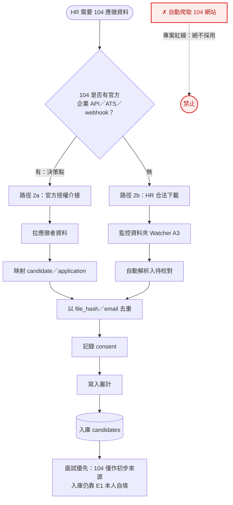
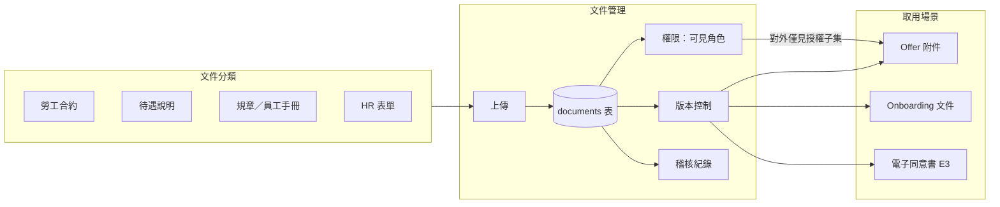
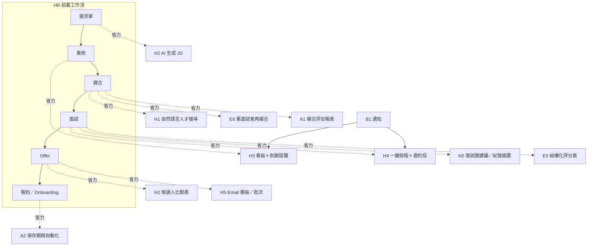

# 13. 實作規劃與製作順序（Implementation Plan）

**文件版本**：v1.0（2026-07-16）
**用途**：把 [docs/12 backlog](12-後續工作與延伸建議.md) 的項目展開成**可跟主管討論、可交接延續**的實作規劃——每項含「目標／做法與製作順序／觸及程式／估時／完成定義／相依／風險」。估時以「1 名工程師＋AI 輔助」的**人天**概估，實際依範圍調整。

---

## 0. 整體製作順序（建議波次）

| 波次 | 內容 | 為何這個順序 |
|---|---|---|
| **Wave 0**（即刻，無外部相依） | A1 評估報表前端頁、A2 保存期限匿名化（先軟標記）、D5 量測 harness | 立即價值、自包含、不卡任何人；A1/D5 讓「準不準」看得見，A2 補法遵缺口 |
| **Wave 1**（減人工/通知，需少量設定） | A3 監控資料夾 Watcher、B1 Email 通知（需 SMTP）、A4 分頁 UI | 降低 HR 手動、改善大資料量體驗；B1 需你提供 SMTP |
| **Wave 2**（對外/正式化，需 IT＋決策） | C 系列（HTTPS／備份／監控）、B3 httpOnly cookie（需 HTTPS）、B2 MFA | 對外上線的前置；cookie 需先有 HTTPS |
| **Wave 3**（進階/需資料） | B4 背景 worker、D1 學權重（回饋夠後）、D2 embeddings、D3/D4 | 需累積回饋或較大架構改動 |

> 原則：**先做「看得見成效」與「法遵」**（Wave 0），再做「減人工」（Wave 1），對外前補「正式化硬化」（Wave 2），最後才是需資料/大改的進階（Wave 3）。

---

## A1. 媒合評估報表前端頁　`估時 1–2 人天`

- **目標**：把後端 `GET /reports/matching-evaluation` 的指標做成 HR 儀表頁，讓每次調權重/門檻後能看出有沒有變準。
- **做法與製作順序**
  1. 前端 API：於 `frontend/src/services/matchingReportsApi.ts` 加 `getMatchingEvaluation(requisitionId?)`，讀回應 JSON。
  2. 型別：於 `frontend/src/types.ts`（或對應 DTO 檔）定義 `MatchingEvaluation`（對齊後端 schema 欄位）。
  3. 元件：新增 `MatchingEvaluationView.vue`（或在既有 `ReportsView.vue` 加分頁）——呈現 Precision@K/Recall@K 卡片、Gate 誤殺清單、分數分桶校準（簡單長條或表）、排名有效性、`notes`（小樣本提示）。
  4. 入口：報表區加連結；提供職缺下拉切換 `requisition_id`（全公司 / 單一職缺）。
  5. 狀態：loading／error／空狀態；小樣本時顯示「還差 N 筆標記才足以自動調權重」。
- **觸及程式**：`frontend/src/services/`、`frontend/src/components/ReportsView.vue`（或新元件）、`types.ts`。
- **完成定義**：選職缺→看到指標；無資料友善提示；`npm run build`（含 vue-tsc）過。
- **相依**：無（後端端點已上線）。
- **風險**：低。呈現要一眼看懂（先用表/長條，勿過度視覺化）。

## A2. 保存期限自動匿名化　`估時 2–3 人天`

- **目標**：將超過 `candidates.retention_until` 的人才自動去識別化，符合個資法保存期限。
- **做法與製作順序**
  1. **先定規則（跟 HR/法遵確認）**：清哪些欄位（`name`→「（已匿名）」、`email`/`phone`/`email_norm`/`phone_norm`→NULL、履歷檔刪除或去識別）、保留哪些去識別統計（source、status、粗粒度城市）。
  2. Schema：加 `candidates.anonymized_at`（可空）標記已匿名 → 一個 migration。
  3. 服務：`services` 加 `anonymize_expired_candidates(db, now)`——找 `retention_until < now 且 anonymized_at IS NULL`，清 PII、設 `anonymized_at`，並處理其 `resume_files`／照片。
  4. **緩衝機制（強烈建議）**：先「軟標記待匿名」，實際清除延後 N 天，避免誤清不可逆。
  5. 入口：`backend/scripts/anonymize_retention.py`（供排程）＋ 可選 admin 手動觸發端點。
  6. 排程：Windows 排程工作／cron 每日執行。
  7. Audit：寫匿名化紀錄（不含明文）。
- **觸及程式**：`models/candidate.py`（+migration）、`services/`、`backend/scripts/`、`services/storage.py`。
- **完成定義**：造一筆過期人才→跑作業→PII 清空、`anonymized_at` 設定、audit 有紀錄、統計仍在；未過期不受影響；測試涵蓋。
- **相依**：**匿名化規則需 HR/法遵拍板**。
- **風險**：**不可逆**——上線前務必：先每日備份、用緩衝延遲、先在測試資料驗證。

## A3. 監控資料夾 Watcher　`估時 2–3 人天`

- **目標**：監看資料夾，HR 下載的履歷零手動自動匯入解析（規劃書的「下載後零手動」）。
- **做法與製作順序**
  1. 機制選擇：**先做「定時掃描」**（簡單穩定）而非即時 watchdog；穩定後再考慮 watchdog。
  2. 服務：`backend/scripts/watch_intake.py`——掃描 intake 夾、對「已穩定（size 不再變）」的新檔呼叫**既有解析/入待校對流程**，處理後移到 `processed/`，失敗移到 `failed/`。
  3. 去重：用既有 `file_hash` 避免重複匯入。
  4. 執行：Windows 排程／常駐；記錄匯入結果。
- **觸及程式**：`backend/scripts/`，重用 `services/resume_parser.py`＋`services/storage.py`＋既有履歷入庫邏輯。
- **完成定義**：丟檔進資料夾→自動進待校對佇列、原檔移 `processed/`；重複檔不重覆；失敗進 `failed/`。
- **相依**：資料夾位置。與 B4（背景 worker）可日後整合。
- **風險**：下載中的半寫入檔——用「size 連續數秒不變」判定穩定再處理。

## A4. 完整分頁 UI ＋長列表虛擬化　`估時 3–4 人天`

- **目標**：前端清單接上後端已完成的 `limit`/`offset` + `X-Total-Count`，加分頁與虛擬化。
- **做法與製作順序**
  1. API：各清單 service 帶 `limit`/`offset`，讀 `X-Total-Count`。
  2. 元件：加「分頁／載入更多」＋顯示總數；長列表導入虛擬捲動。
  3. 逐頁改：audit log → 應徵清單 → 部門工作台 → 人才/履歷。
- **觸及程式**：`frontend/src/services/`、各清單元件（`AdminView`、`DepartmentWorkspace`、`InterviewManagement`、`App.vue` 人才/履歷）。
- **完成定義**：大量資料下順暢、總數正確、不漏；build 過。
- **相依**：無（後端已支援）。
- **風險**：虛擬化與現有表格樣式整合需微調。

## B1. Email／站內通知　`估時 2–4 人天`

- **目標**：需求單核准、媒合完成、面試安排等事件通知。
- **做法與製作順序**
  1. 設定：`config` 加 `SMTP_HOST/PORT/USER/PASS/FROM/TLS`；決定事件清單。
  2. 服務：`services/notifications.py` 的 `send_email(...)`（`smtplib` 或 `aiosmtplib`），**走背景/threadpool 避免阻塞請求**。
  3. 觸發點：於需求單核准、媒合完成等處呼叫。
  4. 站內通知（選配）：加 `notifications` 表＋端點＋前端通知中心 → migration。
  5. 樣板＋失敗處理：簡單模板；寄送失敗記 log/audit、可重試。
- **觸及程式**：`config`、新 `services/notifications.py`、若干 route 觸發點、（站內通知）新表+migration+前端。
- **完成定義**：觸發事件→收到信（以 mailhog/測試 SMTP 驗）；失敗有紀錄。純 Email 約 2 天；含站內通知約 4 天。
- **相依**：**SMTP 主機/帳密由你/IT 提供**。
- **風險**：寄信阻塞→務必背景化。

---

## B2–B4（較大／需決策）——先做「設計 spike」再排

> 這三項建議先各花 0.5–1 天做**設計 spike**（產出關鍵決策 + 影響評估），再排入實作。

- **B2 MFA（TOTP）** `M–L`：決策——哪些角色強制、備援碼、綁定流程。做法——`users` 加 TOTP secret（加密存）＋ 綁定/驗證端點＋登入流程插入第二步＋前端 QR 綁定頁。相依——無外部；風險——備援與帳號救援流程。
- **B3 refresh token 改 httpOnly cookie** `M–L`：**前置需 HTTPS**。決策——CSRF 對策（SameSite=strict / double-submit token）。做法——後端登入改 Set-Cookie（httpOnly+Secure+SameSite）、refresh 讀 cookie、前端移除 sessionStorage refresh、access token 只留記憶體。風險——跨站/跨埠 cookie 行為、部署拓撲。
- **B4 上傳背景 worker queue** `L`：決策——Celery vs RQ、worker 佈署。做法——Redis（compose 已有）為 broker、把解析/OCR 任務丟 queue、前端輪詢/推播進度。相依——與 A3 Watcher 整合佳。風險——多一個要顧的服務與監控。

---

## C 系列（需公司 IT／維運）——非寫程式，列為對外上線前置

HTTPS／反向代理／WAF、每日加密備份＋異地＋還原演練、監控/log/磁碟告警/保留政策、負載測試、弱點/映像掃描、輪替 bootstrap 憑證。**這些需由公司 IT 規劃建置**；工程端能配合的是提供部署設定與健康檢查（多已完成）。

---

## D 系列（媒合準確率下一批）——多需累積回饋

- **D5 量測 harness**（可即刻）`S–M`：`recall@K` 評估、shadow/A-B 對照、快速人工標記工具——**先做這個**，之後每次演算法調整都有客觀比較。
- **D1 從回饋學權重**（需 ~30 筆標記結果）`M`：達量後以 learning-to-rank/邏輯迴歸擬合權重、分數校準成錄取機率。
- **D2 語意 embeddings**（先影子計分）`M–L`、**D3 技能抽取改善** `M`、**D4 相關年資/熟練度** `M`：詳見 docs/11「下一步」與 docs/02 §5。

---

## E. 面試優先（Interview-first）方向——實作規劃

> 主管討論中的方向：**來面試的人才才入庫、且由本人自填**。這是一條可與 Wave 0/1 並行的**加法**支線（不移除既有公開投遞/批次匯入），且會放大媒合/評估價值（本人自填→資料準；每人都面試過→標記快，餵 D1/評估報表；邀請制→consent 明確且根治匿名覆寫）。**建議優先做 E1＋E5＋E6。**

### E1. 邀約式自填連結（tokenized self-fill）　`估時 3–5 人天`　⭐
- **目標**：HR 排面試 → 發一次性連結 → 候選人自填＋電子同意 → 入庫並連到該應徵。
- **做法與製作順序**
  1. Schema：新增 `interview_invites`（或在 application 加 token 欄位）——存 token 的 **hash**、綁定的 application/candidate、用途、有效期、使用狀態 → migration。
  2. 後端：`（HR）產生邀約連結` 端點（回一次性 URL）；公開 `GET /public/invite/{token}`（驗 token→回表單定義）；公開 `POST /public/invite/{token}`（收自填＋consent，**只更新該 token 綁定的 candidate**，寫入後 token 作廢）。重用既有 candidate 更新邏輯，但以 token 綁定取代「用 email 找人」→ 安全。
  3. 前端：`career-frontend` 加自填頁（表單＋同意勾選＋送出成功）。
  4. 通知：產生連結後可寄給候選人（接 B1）。
- **觸及程式**：`models`（新表/欄位＋migration）、`api/routes/public.py`＋產生端點（admin 或 requisitions/interview 相關）、`career-frontend/`、`schemas`。
- **完成定義**：HR 產連結→候選人開→填→入庫連到應徵→token 一次性、過期即拒；測試涵蓋。
- **相依**：通知可接 B1；其餘無。
- **風險**：token 安全（一次性、時效、hash 存、不可枚舉）；表單欄位與現有 `candidates` 對齊。

### E5. 結構化面試評分表（scorecard）　`估時 3–4 人天`　⭐
- **目標**：面試官依能力面向評分，多人彙整成建議，取代/補強目前只有 result/notes。
- **做法與製作順序**
  1. Schema：`interview_scorecards`（application_id、interviewer、面向評分 JSON、總評、建議）→ migration。
  2. 後端：scorecard CRUD 端點，權限比照面試（HR／該部門主管）。
  3. 前端：`InterviewManagement.vue` 加評分表 UI ＋彙整顯示。
  4. 彙整：多面試官平均/建議聚合。
- **觸及程式**：`models`（＋migration）、`api/routes/applications.py`（或新 route）、`frontend/src/components/InterviewManagement.vue`、`schemas`。
- **完成定義**：面試官填→彙整顯示→權限正確；測試。
- **相依**：無。
- **風險**：評分面向需與 HR 定義；**不得存敏感/歧視性欄位**（延續 docs/11 排除清單）。

### E6. 舊面試者再媒合　`估時 2–3 人天`　⭐
- **目標**：新職缺開缺時，從「曾面試過的人」找適配並提醒 HR 回頭聯繫（回收人才庫價值）。
- **做法與製作順序**
  1. 定義「曾面試過」：有 application 且面試有結果（或曾進面試狀態）的 candidates。
  2. 後端：配對加一個視角/filter——對某 requisition，僅對「曾面試過」的人跑 `score_candidate` 排序（重用引擎），標示 `past_interviewee`。
  3. 前端：`MatchingView.vue` 加「僅看曾面試過」切換＋「再聯繫」動作（記 activity）。
  4. 提醒（選配）：開缺時若有高分曾面試者，提醒 HR。
- **觸及程式**：`services/matching.py`（重用）、`api/routes/matches.py`、`frontend/src/components/MatchingView.vue`。
- **完成定義**：對某職缺可只看曾面試過的適配名單、可觸發再聯繫紀錄；測試。
- **相依**：媒合引擎（已在）。
- **風險**：低。

### E2／E3／E4／E7／E8（精簡）
- **E2 現場報到 QR/連結** `S–M`：報到掃碼填/確認；重用 E1 表單，加報到入口與時間戳。
- **E3 電子同意書** `S–M`：面試當下取得並存證版本化同意；與 A2（撤回即匿名化）串接。
- **E4 面試排程＋邀約通知** `M`：時間/地點/提醒/改期；**接 B1（SMTP）**；擴充現有面試管理。
- **E7 人才培育/再聯繫** `M`：標記「強但當時無缺」、追蹤提醒、有缺自動提醒；用既有 tags/activities。
- **E8 候選人狀態頁** `M`：候選人看進度/下一步；需一個候選人端輕量入口（可用 E1 的 token 機制延伸）。

> **面試優先支線建議順序**：E1（入庫入口）→ E5（面試結構化、產生標記）→ E6（回收再媒合）；之後 E4/E3（通知＋同意）、E2（現場）、E7/E8（培育＋體驗）。E1/E4 的通知接 B1，故若要寄邀約信需先備妥 SMTP。

---

## F. 104／人力銀行資料介接（合規建議）　`估時：探詢 0.5–1 人天＋（若走官方 API）3–5 人天`

- **目標**：合規地把 104 應徵資料帶進系統，**絕不自動爬取**（專案紅線，見 [docs/08](08-個資保護與資訊安全.md)）——104/1111 會員條款限「下載之履歷僅得用於本次招募目的」，長期留存須以 `consent_status` 告知/同意補強。
- **做法與製作順序**
  1. **先探詢（決策點）**：確認 104 是否提供官方企業 API／ATS 介接／webhook。此步驟決定後續走哪條路徑，務必先做。
  2. **路徑 2a——若有官方管道**：走官方授權介接——拉應徵者資料 → 映射到 `candidate`／`application` → 以 `file_hash`／email 去重 → 記錄 `consent`（來源、範圍、時間）→ 寫入審計軌跡。
  3. **路徑 2b——若無官方管道**：維持現況——「HR 合法下載履歷 → 自動解析入庫＋監控資料夾 Watcher（見 A3）」，不新增任何自動抓取。
  4. **面試優先銜接**：104 僅作**初步來源**；正式入庫仍以 E1 邀約式**本人自填**為準（資料更準、consent 更明確）。
- **觸及程式**：（官方 API 路徑）新增 `services` 介接模組、映射至 `repositories/recruitment`、`public/candidates` 入庫邏輯、`config`（API 憑證/金鑰）。（下載路徑）沿用 A3 既有解析入庫，無需新程式。
- **完成定義**：走官方管道時——一次拉取可正確映射、去重、記 consent 與審計；走下載路徑時——維持 A3 行為不變；**任一路徑皆無自動爬取程式碼**。
- **相依**：**104 是否開放官方介接為決策前提**；通知可接 B1。
- **風險**：ToS／個資合約、資料使用範圍——務必走官方管道並確認授權範圍，避免逾越「本次招募目的」而未補告知/同意。

---

## G. 公司文件與規範庫　`估時 M（3–5 人天）`

- **目標**：集中管理勞工合約、待遇說明、規章、員工手冊、HR 表單，供 offer／onboarding／同意書取用，並版本化留存。
- **做法與製作順序**
  1. **定分類與權限模型**：先與 HR 確認文件類別（合約/待遇/規章/手冊/表單）與各類別的可見角色（僅 HR、含主管、對外可見子集）。
  2. **Schema**：新增 `documents` 表（類別、標題、版本、`storage_key`、可見角色、有效期、上傳者、時間）→ migration。
  3. **後端**：CRUD ＋版本控制＋權限檢查＋稽核，重用既有檔案儲存（`services/storage.py`／MinIO）。
  4. **前端**：文件管理頁（上傳/檢視/換版/權限）＋對外可見子集（如 offer 附件）。
  5. **串接**：與 offer／onboarding／電子同意書（E3）串接，取用時綁定文件**版本**以利存證。
- **觸及程式**：`models`（＋migration）、`services/storage.py`、新 `api/routes`、`frontend`、`schemas`。
- **完成定義**：上傳/版本/權限/稽核皆可用；**機密文件不外流**（對外僅見授權子集）；測試涵蓋權限邊界。
- **相依**：可與 E3 電子同意書、offer 管理串接。
- **風險**：機密與權限控管、保存期限——須明確定義各類別可見角色與到期處置。

---

## H. HR 大幅提效（高價值功能群）

> 一組**放大既有平台價值**的高價值功能；多為加法、可分批導入。逐項給做法概要與估時（沿用相對規模 `S/M/L`）。

- **H1 自然語言人才搜尋** `M–L`：把自然語言查詢轉成結構化過濾＋（可選）語意 embeddings（接 D2）查人才庫。做法——解析查詢 → 轉 `filter`／向量 → 排序 → 前端搜尋框。
- **H2 AI 輔助** `M each`：JD 生成、面試題建議、履歷/面試紀錄摘要、候選人比較表。做法——以 Claude API 對**結構化資料**生成；**須避免敏感/歧視性內容**（延續 [docs/11](11-人才職缺媒合試行方案.md) 排除清單：年齡、性別、照片、宗教、婚姻、身心狀況不得進入）。
- **H3 招募流程看板＋自動化提醒** `M`：需求單 → 簽核 → 媒合 → 面試 → offer 全程 Kanban ＋到期/待辦提醒（接 B1 通知）。
- **H4 一鍵行程** `M`：面試排程＋行事曆整合＋邀約信（接 E4／B1）。
- **H5 批次/範本** `S–M`：Email 模板、批次通知/操作。
- **交叉引用**：E6 舊面試者再媒合、A2 保存期限自動化、A1 媒合評估報表。

## 給主管討論的一頁摘要

- **現況**：功能面（人才庫→履歷匯入→需求單→智慧配對＋準確率強化＋評估報表）已完成並內網試用；正式上公網卡在 **C 系列（IT）**。
- **建議先做**：Wave 0（A1 看成效、A2 法遵、D5 量測）——皆自包含、約 1–2 週內可見成果。
- **策略方向（討論中）**：**面試優先（interview-first）**——來面試才入庫、由本人自填（見 §E）。建議支線 **E1＋E5＋E6**，可與 Wave 0/1 並行；會讓資料更準、標記累積更快，**放大**媒合/評估的價值。多為加法、不動既有流程。
- **需公司決定/提供**：SMTP（B1，也供 E1/E4 邀約信）、對外時程與 HTTPS/備份/監控（C）、是否上 MFA（B2）、以及**面試優先是否定案**。
- **追蹤**：每完成一項，更新 docs/07 完成度、docs/12 backlog，並同步相關文件（05/08/10）。
