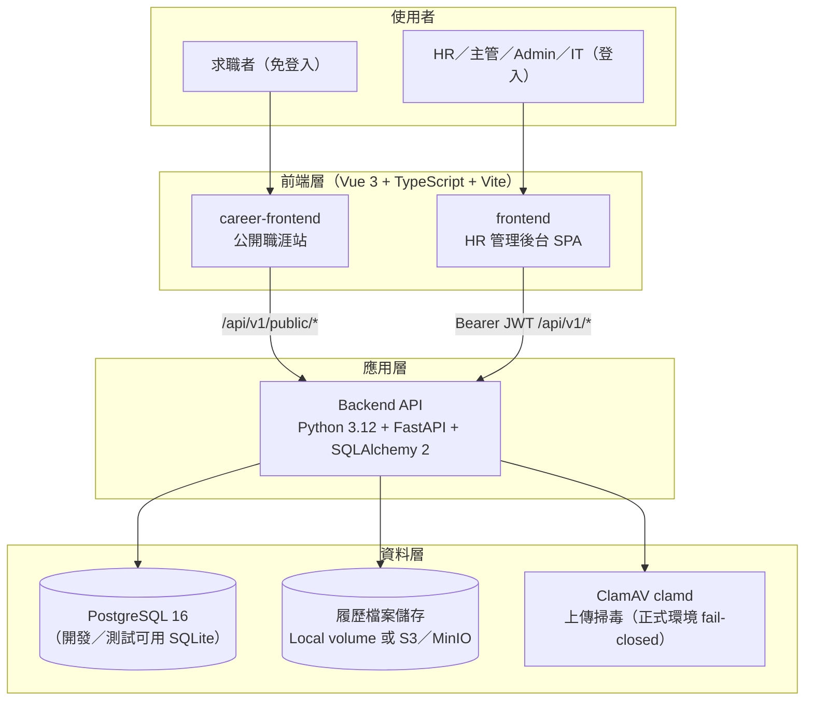
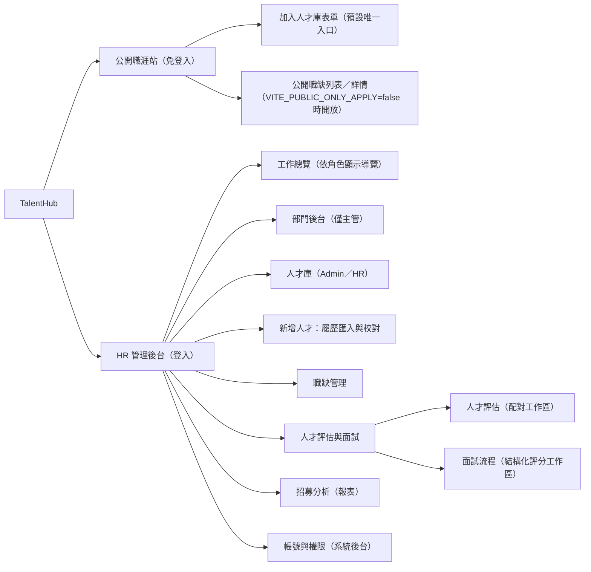
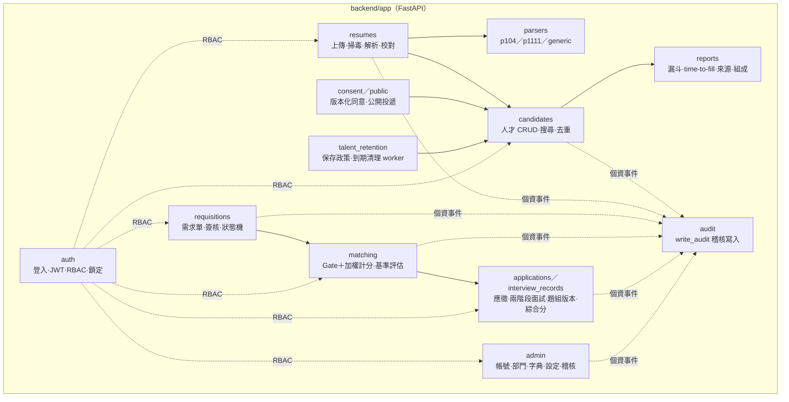
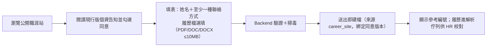
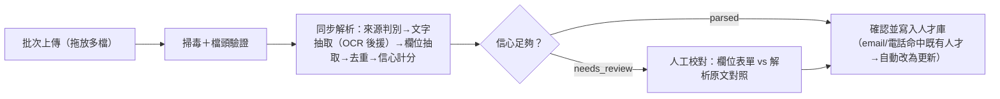
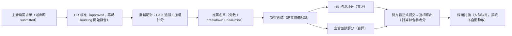
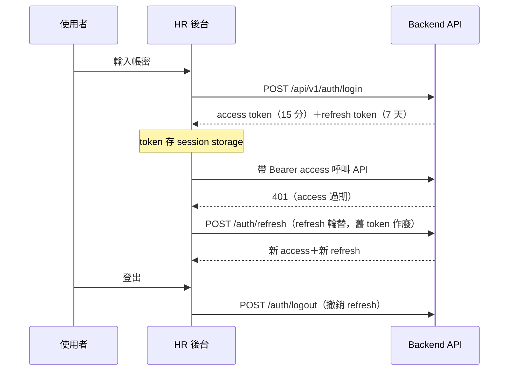
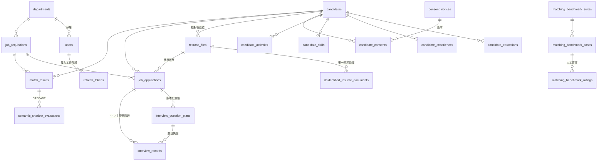
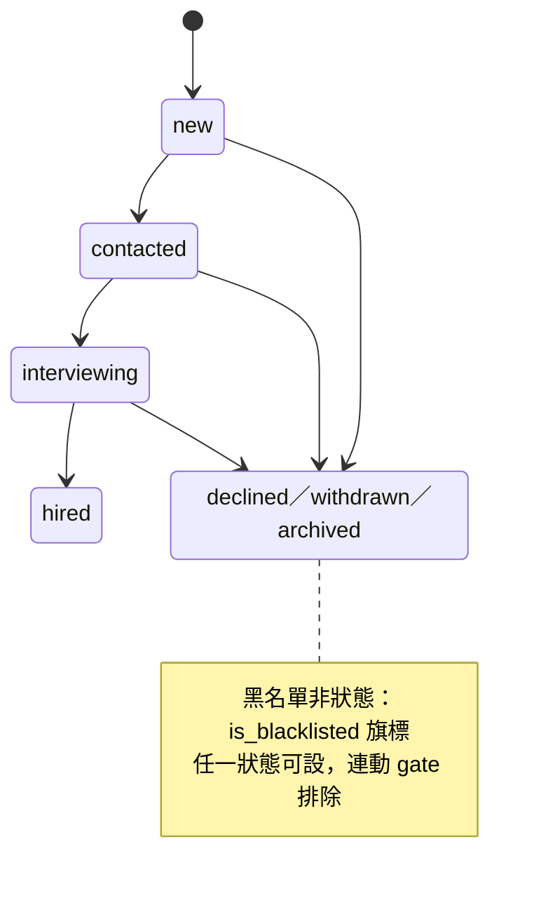

# TalentHub 軟體系統規格書（SDD）

| 項目 | 內容 |
|---|---|
| 專案名稱 | TalentHub — 企業人才庫與智慧媒合系統 |
| 文件名稱 | 軟體系統規格書（Software Design Document, SDD） |
| 文件版本 | v1.0（定稿） |
| 文件日期 | 2026-09-01 |

> 標記說明：⚪【現況註記】＝已查證的設計與實作落差，保留即可。

[TOC]

---

## 1. 簡介

### 1.1 文件目的

本文件為 TalentHub 系統之軟體系統規格書（SDD），涵蓋系統之初步設計與細部設計，使系統開發者、維護者與交接者得以確認系統的實際需求與設計決策，並作為後續開發與維運時遵循的準繩。本文件內容整理自《TalentHub 系統文件與交接手冊》（docs/TalentHub_系統文件與交接手冊.docx，2026-08-27 定版）並與 2026-09-01 之程式碼現況核對。

### 1.2 文件範圍

本文件範圍包含：系統目標與範圍、系統架構、前後端模組設計、資料庫類別設計、核心流程（履歷解析、智慧配對、結構化面試評分）、需求至設計之追溯方式。**不含**：操作手冊等級的維運指令（見交接手冊第 10 章）、個資法遵細節（見交接手冊第 08 章）、逐端點 API 契約（以 FastAPI OpenAPI 為準）。

---

## 2. 系統概述

### 2.1 系統目標

TalentHub 是公司內網的人才庫與招募系統，把招募從收履歷到錄用討論做成一條線上作業：

1. **建立公司自有人才資料庫**：所有接觸過的求職者集中管理，可搜尋、可標籤、可追蹤狀態。
2. **履歷匯入自動化**：104／1111 下載的履歷檔自動解析欄位入庫，免人工重複輸入。
3. **職缺需求數位化**：主管線上填寫需求單，簽核與招募進度全程可追蹤。
4. **智慧配對**：職缺成立即自動從人才庫產生可解釋的推薦名單，並持續累積主管回饋。
5. **結構化面試與綜合評分**：HR／主管兩關獨立盲評，雙方交卷後彙整六個分數輔助錄用討論。

效益指標（KPI）：

| 指標 | 現況（估） | 目標 |
|---|---|---|
| 單份履歷建檔時間 | 10–15 分鐘/份 | < 30 秒/份（自動解析＋快速校對） |
| 開缺到取得首批候選名單 | 3–7 天 | < 1 小時（人才庫即時配對） |
| 人才庫累積筆數 | 0（分散各處） | 上線第一年 ≥ 5,000 筆 |
| 庫內人才再聯繫比例 | — | ≥ 15% |
| 主管需求單線上化率 | 0% | 100%（需求單為開缺唯一入口） |

KPI 現況欄為立項時的估計值；依交接手冊第 01 章之程序，正式驗收（UAT）時由 HR 抽 10 份履歷實測計時校正基準，再據以追蹤各指標達成率。

### 2.2 系統範圍

**本期範圍（In Scope）**：人才資料庫（建檔、複合搜尋、標籤、狀態機、聯繫紀錄）；履歷匯入（104／1111／一般 PDF／DOCX，批次上傳）；解析校對介面與去重；職缺需求單＋簽核流；配對引擎（硬條件過濾＋加權計分）；RBAC 角色權限與欄位遮罩；稽核日誌；基礎報表（招募漏斗、time-to-fill、來源成效、人才庫組成）；公開職涯站本人投遞＋版本化告知同意；HR／主管兩階段結構化面試評分與盲評；保存期限到期清理。

**本期不做（Out of Scope）**：自動登入 104／1111 爬取履歷（違反平台條款、個資法高風險——採企業會員合法下載後上傳）；面試排程／行事曆整合；Offer／薪資核定流程；與現有 eHR／薪資系統介接。

> ⚪【現況註記】原規劃列為範圍內但**尚未實作**：監控資料夾自動匯入（Watcher）、站內通知＋Email 通知（SMTP）。原列 Phase 2／範圍外但**已提前交付**：求職者自助入口（career-frontend）、面試官評語回填（結構化面試評分）。

### 2.3 系統架構



**元件一覽**：

| 元件 | 目錄／服務 | 用途 |
|---|---|---|
| 公開人才前端 | `career-frontend/` | 求職者查看公開職缺、應徵或直接留下履歷；免註冊登入 |
| HR 管理後台 | `frontend/` | HR、主管、Admin、IT 登入後的工作台 |
| Backend API | `backend/` | 驗證、權限、履歷處理、配對、報表與資料庫存取 |
| 資料庫 | PostgreSQL 16 | 結構化人才、職缺、流程、權限與稽核資料 |
| 檔案儲存 | Local volume／S3·MinIO | 履歷原始檔與大頭照；DB 只存 key、hash 與解析結果 |
| 掃毒 | ClamAV（clamd） | 所有上傳先隔離掃描；正式環境掃不出結果即拒收 |

**程式碼目錄結構**：

```
Human-resources/
├── backend/                 # FastAPI 應用
│   ├── app/
│   │   ├── api/             # 路由（依模組分檔，統一掛載於 /api/v1）
│   │   ├── models/          # SQLAlchemy 資料模型
│   │   ├── schemas/         # Pydantic 請求/回應
│   │   ├── services/        # 商業邏輯（matching、interview_scoring、resume_parser…）
│   │   ├── parsers/         # Parser104 / Parser1111 / GenericParser（策略模式）
│   │   └── dependencies/    # 認證與 RBAC 依賴
│   ├── tests/               # 自動測試（含解析器 golden tests）
│   ├── scripts/             # postgres_schema_smoke、seed 腳本
│   └── alembic/             # DB migration（head：a9e3d51c7b82）
├── frontend/                # HR 管理後台（Vue 3 SPA，dev port 5173）
├── career-frontend/         # 公開職涯站（Vue 3 SPA，dev port 5174）
├── e2e/                     # Playwright 端對端測試
├── deploy/                  # docker-compose.yml、compose.storage.yml、windows-lan/
├── docs/                    # 交接手冊 docx、SETUP-macOS.md、本文件
└── samples/                 # 虛構種子資料（db-seed/）
```

### 2.4 軟體需求概述

| 模組 | 功能需求摘要 |
|---|---|
| 人才資料庫 | 集中管理求職者：搜尋、標籤、狀態追蹤、聯繫紀錄、原始履歷檔 |
| 履歷自動匯入 | 104／1111／一般履歷自動解析欄位，低信心欄位進人工校對 |
| 職缺需求管理 | 主管填寫需求單 → 簽核 → 職缺看板全程追蹤 |
| 智慧配對引擎 | 硬條件過濾＋加權計分（0–100 分附原因），自動產生推薦名單 |
| 公開投遞與同意 | 候選人本人填寫，綁定版本化告知／同意；撤回後停止正式媒合 |
| 面試協作 | HR 初談與主管面談分權盲評；依職位與核准工作證據產生可追溯題目 |

核心使用情境（User Stories，驗收條件見交接手冊第 01 章 §5）：

| # | 身分 | 情境 |
|---|---|---|
| US-01 | HR | 批次拖入 104 下載的履歷 PDF，自動解析並標示重複人才 |
| US-02 | HR | 以「技能＋年資＋地點＋期望薪資」複合搜尋人才庫 |
| US-03 | 主管 | 線上填寫職缺需求單並送審 |
| US-04 | HR | 需求單核准後自動取得 Top N 推薦名單（附各面向得分原因） |
| US-05 | 主管 | 對推薦人選標記「安排面試／不合適（結構化原因）」 |
| US-06 | HR | 保存期限到期資料 dry-run 覆核後完整清除 |
| US-07 | Admin | 建帳號、指派角色，權限即刻生效並留稽核 |
| US-08 | HR | 同一人二次投遞時自動比對並提示「更新既有檔案」 |

### 2.5 軟體環境需求

**開發／執行環境**：

| 項目 | 需求 |
|---|---|
| 後端 | Python 3.12+、FastAPI、SQLAlchemy 2、Alembic、pypdf／PyMuPDF、Tesseract OCR（掃描 PDF 用） |
| 前端 | Node.js＋npm（Vue 3、TypeScript、Vite；vite preview 供 LAN 正式服務） |
| 資料庫 | PostgreSQL 16（正式）；SQLite（單元測試與本機驗證） |
| 掃毒 | ClamAV 1.5.x（clamd，loopback 3310） |
| 容器化 | Docker Compose（deploy/docker-compose.yml；選配 compose.storage.yml 疊加 MinIO＋ClamAV） |
| 作業系統 | Windows Server（現行內網 LAN 主機）／macOS（開發，見 docs/SETUP-macOS.md）／Linux（建議正式部署） |
| 瀏覽器支援 | Chrome／Edge 最新兩個版本 |

Node.js 版本現況：`frontend`、`career-frontend`、`e2e` 三個 package.json 均未以 `engines` 鎖定；實測相容版本為 **Node 22**（CI 的 e2e workflow 指定 `node-version: "22"`）與 **Node 24**（內網 LAN 主機實測 v24.14.1、npm 11）。交接後建議以 Node 22 LTS 為開發基準。

**連接埠規劃**：

| 情境 | 服務與埠 |
|---|---|
| 本機開發 | API `127.0.0.1:8010`（run_backend.py）、HR 後台 `5173`、公開站 `5174`（兩者 dev proxy 預設指向 8010） |
| Docker Compose | API `127.0.0.1:8000`（僅 loopback）、HR 後台 `8080`、公開站 `8081` |
| Windows LAN 部署 | 同本機開發埠；防火牆僅對內網段開 5173／5174，8010 與 clamd 3310 維持 loopback；另有獨立去識別工具 `8765` |

**組態管理**：所有設定走 `.env` 環境變數（範本 `.env.example`）；機密（DB 密碼、`AUTH_SECRET_KEY`、`GEMINI_API_KEY`）不進版控。`APP_ENV` 非 development 時自動停用 `/docs`；production／staging 拒絕 demo seeding；掃毒政策依環境切換——正式環境一律 fail-closed，僅 development／test／local 且明確設定 `RESUME_SCAN_POLICY=allow_unavailable` 時放行未掃描檔。

### 2.6 設計限制

1. **法遵限制**：不自動登入 104／1111 爬取履歷（平台條款＋個資法風險）；履歷僅由候選人本人投遞或 HR 以企業會員身分合法下載後上傳。
2. **個資保護**：版本化告知同意（撤回即停止正式媒合）、保存期限 1–20 年到期完整清除、主管僅見遮罩聯絡資訊與核准後的去識別化履歷、個資讀取全量稽核。
3. **安全**：scrypt 密碼雜湊；JWT access 15 分鐘＋refresh 7 天輪替（登出撤銷）；連續失敗登入鎖定（429）；上傳一律掃毒、掃描器不可用回 503 拒收（環境政策見 §2.5）；API 綁 loopback、僅前端對外。
4. **AI 使用限制**：Gemini 產題預設關閉；輸入僅採去識別的結構化工作證據白名單；每人每日產題配額；AI 僅輔助不做錄取決策。
5. **非功能需求**：人才庫 10 萬筆規模複合查詢 < 2 秒；批次解析 ≥ 10 份/分鐘；上班時間可用性 99.5%（LAN 部署有 5 分鐘 watchdog 自動復活）；每日備份 RPO ≤ 24h、RTO ≤ 4h。

> ⚪【現況註記】全站 TLS 為正式上線目標；LAN 試行階段仍為內網 HTTP。正式承載真實個資前須完成：PR／CI／合併主線、三角色 UAT、法務定稿告知文字與保存政策、HTTPS／正式 PostgreSQL／加密備份／集中監控。

---

## 3. 系統初步設計（UML）

### 3.1 使用者介面結構層次圖



角色 × 頁面權限矩陣（權限由後端強制，前端僅隱藏入口）：

| 頁面 | IT | Admin | HR | 主管 |
|---|---|---|---|---|
| 工作總覽 | ✔ | ✔ | ✔ | ✔ |
| 部門後台 | ✖ | ✖ | ✖ | ✔（本部門） |
| 人才庫 | ✖ | ✔ | ✔ | ✖（於媒合頁看遮罩後應徵者） |
| 新增人才（匯入校對） | ✖ | ✔ | ✔ | 僅「送交履歷並指派職缺」 |
| 職缺管理 | ✖ | ✔ | ✔ | 唯讀「我的職缺」 |
| 人才評估與面試 | ✖ | ✔ | ✔ | ✔（本部門） |
| 招募分析 | ✖ | ✔ 全公司 | ✔ 全公司 | ✔ 本部門（後端自動限縮） |
| 帳號與權限 | ✔ 全部 | ✔ 全部 | 僅使用者＋告知同意條款 | ✖ |

**關鍵畫面版面示意**（取自交接手冊第 06 章；欄位值皆為虛構樣本）：

校對介面（履歷匯入第三步，本系統關鍵畫面）——

```text
┌──────────────────────────────────────────────────────────────┐
│ 3. 人工校對 ｜檔名.pdf ｜狀態:需人工確認 ｜ [重新解析]       │
├──────────────────────────────────────────────────────────────┤
│ 指定應徵職缺：R2026-0012 資深後端工程師（確認後自動建應徵）  │
│ 逐檔來源判別：疑似 104 匯出格式 · 62%（依據：版面簽章…）     │
│   來源待確認 → [104] [1111] [自製] [無法驗證]（人工指定）    │
│ 姓名* [王小明]  Email [ming@x.com]  電話 [0912345678]        │
│ 居住地 [台北市] 目前職稱 [後端工程師] 總年資 [6]             │
│ 技能（逗號分隔）[Python, FastAPI, PostgreSQL]                │
│ 解析原文（唯讀，供對照）┆ 解析錯誤訊息（如有）               │
├──────────────────────────────────────────────────────────────┤
│            [儲存校對]        [確認並寫入人才庫]              │
└──────────────────────────────────────────────────────────────┘
```

人才評估（配對工作區）——

```text
┌─ 職缺選單：資深後端工程師 (R2026-0012)｜ [重新配對] ──────────┐
│ 來源切換：實際應徵者｜人才庫推薦    進階設定（權重/必要條件） │
├──────────────────────────────────────────────────────────────┤
│ ▸ 92.5 王○明｜ABC 後端｜排名 #1｜通過必要條件｜[安排面試]    │
│ ▸ 87.0 林○華｜XYZ 全端｜排名 #2｜未過門檻（可例外覆核）      │
│   …點列展開：六面向 breakdown（技能命中/缺少、年資、薪資…）  │
│   near-miss 標示、人工婉拒／例外覆核紀錄、按需 AI 分析…       │
└──────────────────────────────────────────────────────────────┘
```

### 3.2 模組功能架構圖



> ⚪【現況註記】背景工作（解析、保存期限 worker）於 API 程序內執行，無 Redis／Celery 佇列；通知模組未實作（見 §2.2 註記）。

### 3.3 類別初步描述

系統共 27 張應用資料表（SQLAlchemy models，另有 Alembic 自管的 `alembic_version`），依領域分四群：

| 群組 | 類別（資料表） | 描述 |
|---|---|---|
| 組織與帳號 | `departments`、`users`、`refresh_tokens` | 部門階層；四種角色（admin/it/hr/manager）帳號與安全欄位；refresh token 輪替（只存 jti 雜湊） |
| 人才資料 | `candidates`、`candidate_educations`、`candidate_experiences`、`candidate_skills`、`candidate_activities`、`consent_notices`、`candidate_consents` | 人才主檔＋學經歷技能子表＋聯繫歷程；版本化告知條款與不可變同意存證 |
| 招募、履歷與配對 | `job_requisitions`、`resume_files`、`job_applications`、`match_results`、`deidentified_resume_documents`、`interview_question_plans`、`interview_records`、`matching_benchmark_suites`、`matching_benchmark_cases`、`matching_benchmark_ratings`、`semantic_shadow_evaluations` | 職缺需求與狀態機；履歷檔 metadata 與解析結果；應徵（含綜合評分快照）；可重算配對結果；去識別履歷衍生檔；版本化面試題組與面試紀錄；媒合小樣本基準與語意影子評估 |
| 管理與稽核 | `skill_catalog`、`tags`、`system_settings`、`audit_logs`、`system_issues`、`retention_storage_deletions` | 技能／標籤字典；系統參數；全量稽核；IT 問題追蹤；到期清檔失敗重試 outbox |

> ⚪【現況註記】規劃保留、**尚未建表**：`candidate_languages`、`candidate_certifications`、`candidate_tags`、`requisition_skills`、`saved_searches`、`notifications`。技能字典 `skill_catalog` 與 `candidate_skills` 間目前無 FK。

---

## 4. 系統細部設計（UML）

### 4.1 使用者介面流程

**流程一：公開投遞 → 建檔（求職者）**



**流程二：HR 履歷匯入 → 校對 → 入庫**



（管線各步驟的完整細節見 §4.2.1。）

**流程三：開缺 → 配對 → 面試 → 綜合分（主管＋HR）**



**認證序列**：



### 4.2 模組功能

**4.2.1 履歷解析管線（resumes＋parsers）**

四種入口——公開職涯站投遞（免登入）、HR／管理員批次上傳、部門主管送交（必選本部門職缺）、手動建檔（無檔案，不經解析管線）。前三種共用：掃毒與簽章驗證 → 同步解析（threadpool）→ ①來源/版型判別（文字特徵簽章計分 p104/p1111/generic，分數不足標 `source_review_required` 由 HR 人工指定）→ ②文字抽取（pypdf 文字層；空則 PyMuPDF 渲染＋本地 Tesseract OCR，45 秒／20 頁上限，不外送雲端；.docx 用 python-docx）→ ③欄位抽取（標籤錨點＋regex＋啟發式；現行 adapters-2.2 自動帶入：姓名、Email、電話、居住地、目前職稱、總年資、技能）→ ④去重（file_hash 相同＝重複檔案；email_norm／phone_norm 命中＝更新既有人才不覆蓋）→ ⑤信心計分（OCR 欄位一律 ×0.78 並強制人工校對）。HR 上傳一律人工確認才入庫；公開站例外（送出即建檔）。解析器版本化＋golden tests（backend/tests/test_parser_calibration.py）。

**4.2.2 配對引擎（matching）**

兩階段計算：

- **階段一 Gate（硬條件過濾）**：地點（含鄰近城市放寬）、最低年資、學歷門檻、必備技能（`required_skill_ratio` 可軟化）、狀態排除（黑名單／已刪除／撤回同意／hired 等）。各 gate 可逐張需求單開關；些微未達者標 `near_miss` 保留於名單供 HR 判讀。
- **階段二 加權計分（0–100）**：

| 面向 | 預設權重 | 計分方式 |
|---|---|---|
| 技能符合度 | 40% | 必備 2 倍加權；字典正規化＋同義詞＋保守模糊比對 |
| 職務相關性 | 20% | 雙語職稱 role-token 比對，無詞元退回字串相似度 |
| 年資契合 | 15% | 達下限滿分、不足按比例；未提供給中性分 0.5 |
| 期望薪資重疊 | 10% | 區間重疊比例；未填中性分 0.5 |
| 學歷 | 10% | 達門檻滿分；不明中性分 0.5 |
| 地點通勤 | 5% | 同縣市 1.0／鄰近 0.6／其餘 0.2 |

每筆結果保留 `score_breakdown` JSON（逐面向證據＋near_miss＋資料完整度），前端可展開「為什麼是這個分數」。權重可逐需求單覆寫（`match_weights`），變更入稽核並自動重算；重算不覆蓋人工操作過的名單狀態。配對品質有兩套量測：**媒合評估報表**以 match_results 的人工標記回饋計算 Precision@K／Recall@K／Gate 誤殺率／分數校準／排名有效性（需累積約 30 筆標記結果）；另有 **50 案例合成盲評基準**——HR／主管先人工盲評再對照系統排序（Top-5 overlap／Top-5 false negative／Gate miss／角色一致率／資料完整度），屬小樣本流程基準、不是錄取預測模型。

**4.2.3 結構化面試評分與綜合分（applications／interview_records＋interview_scoring）**

HR 初談與主管面談兩階段分權：每題 1–5 分或「未詢問＋原因」；正式提交必填 0–100 總分、錄用建議與非空總評；完成後鎖定（一般修改回 409），帶原因重開則遞增修訂編號。雙方盲評：兩邊最新紀錄都完成前互看不到評分結論，任一方重開即恢復遮罩；HR 私人備註永不釋出。題組版本化（Gemini 或規則式產生，逐題重產建新版本不覆蓋；每題出處上限 200 字元）。**綜合參考分**＝履歷媒合分＋HR 逐題平均＋HR 總分＋主管逐題平均＋主管總分五分量加權（預設 20/15/25/15/25，需求單層級 `composite_score_weights` 可由 HR 覆寫，讀取時正規化為總和 1）；兩階段皆提交才有值、缺項不以 0 分計；調權重或重新配對即同交易重算整張職缺。

**4.2.4 同意與保存期限（consent／talent_retention）**

告知條款版本化（同一時間僅一版生效）；公開投遞必須綁定所見版本（版本過期回 409 要求重新同意）；撤回即停止正式媒合並使保存期限改為當日到期。保存期限預設 2 年（1–20 年可調、可逐人覆寫），到期由 worker（預設停用，PostgreSQL advisory lock 防重複）完整刪除人才、關聯資料與實體檔案（檔案刪除失敗進 `retention_storage_deletions` outbox 重試），只留不含個資的稽核；HR 後台可先 dry-run 覆核。

**4.2.5 稽核與 RBAC（audit＋dependencies/auth）**

四種角色：admin（相容管理員，跨部門）、it（僅系統維運與診斷，不觸招募個資）、hr（全公司招募）、manager（僅本部門實際應徵者，聯絡資訊遮罩、不可讀原始履歷）。權限由後端依賴鏈強制（`require_recruiting_user`、`enforce_candidate_scope` 等）。稽核 `write_audit` 記錄登入、管理異動與 PII 讀取（履歷下載／預覽、資料庫瀏覽揭示個資需填理由）；來源 IP 一律經 proxy-aware `client_ip()` 解析 X-Forwarded-For。

### 4.3 類別細部描述

以下為核心類別（資料表）的欄位級設計；完整 27 表以 `backend/app/models/` 與 Alembic migrations 為準。

**candidates（人才主檔）**

| 欄位群 | 主要欄位 | 說明 |
|---|---|---|
| 識別 | `id`、`code` UNIQUE、`name` | 人才編號如 T2026-00001 |
| 聯絡（去重鍵） | `email`／`email_norm`、`phone`／`phone_norm` | 正規化欄位供去重與索引 |
| 條件 | `city`、`highest_education`、`total_years`、`current_title`、`expected_*`（職稱/類別 JSON/城市 JSON/薪資區間）、`availability`、`job_type` | 配對引擎輸入 |
| 來源與狀態 | `source`（manual/hr_upload/manager_upload/career_site/demo）、`status`（狀態機見 4.4）、`owner_id`→users | |
| 個資治理 | `consent_status`、`consent_at`、`retention_until`、`retention_years_override`、`is_blacklisted`＋`blacklist_reason` | 撤回／黑名單連動 gate 排除 |
| 生命週期 | `dedup_hash`、`created_at`／`updated_at`／`deleted_at` | `deleted_at`＝軟刪除 |

**job_requisitions（職缺需求單）**：`req_no` UNIQUE、`title`、`department_id`、`requested_by`、`headcount`、工作地點／薪資區間、`min_years`、`education_req`、`jd`、`skills` JSON（技能快照）、`match_weights` JSONB（見 §4.4）、`composite_score_weights` JSONB（NULL＝用內建預設，見 §4.2.3；僅 HR 可改）、`blind_review_enabled`（任一面試正式提交後鎖定）、`status`＋簽核時間欄位。

**resume_files（履歷檔案）**：`candidate_id` NULL（校對前可空）、`target_requisition_id`、`storage_key`、`file_hash` sha256 UNIQUE（重複檔不建新列）、`source_platform`（direct/p104/p1111/generic）＋自動判定信心與人工覆核欄位、`parse_status`（pending/parsed/needs_review/confirmed/failed）、`parsed_payload`／`field_confidence` JSONB（見 §4.4）、`overall_confidence`、`parser_version`、`resume_text`（含 OCR 全文）。不存檔案 binary。

**match_results（配對結果）**：(`requisition_id`,`candidate_id`) UNIQUE、`gate_passed`、`total_score`、`score_breakdown` JSONB、`rank`、`status`（人工階段不被重算覆蓋）、`manual_override_*`（gate 誤殺放行覆核）、`feedback_*`（主管不合適原因）、`computed_at`。

**job_applications（應徵）**：requisition＋candidate 必填且組合唯一、resume 可空、流程狀態、來源；綜合分快照 `composite_score` Numeric(5,2)＋`composite_score_breakdown` JSONB（見 §4.4）。

**interview_question_plans（面試題組）**：(`application_id`,`stage`,`version`) 唯一；`context_hash`（去識別產題輸入雜湊）；`questions`／`personalization_basis` JSON（每題 source ≤ 200 字元）；`generation_mode`／`provider`／token 用量稽核。重產一律建新版本。

**interview_records（面試紀錄）**：application＋stage；綁定題組版本（不可換綁）；逐題 `rating`／`not_asked_reason`；`summary`／`recommendation`／`overall_rating`／`overall_score`；`private_notes`（HR 限定）；`submitted_at`／`submitted_by_*`／`revision_number`／`last_reopen_reason`。盲評遮罩由 API 層執行，資料庫保存完整內容（備份與 DB 權限須同等受控）。

**users**：`username`／`email` UNIQUE、`password_hash`（scrypt）、`role`（admin/it/hr/manager 單一角色欄位）、`department_id`；帳號安全欄位 `tokens_valid_after`、`must_change_password`、`failed_login_count`、`locked_until`。

**consent_notices／candidate_consents**：版本化告知內容與生效狀態；同意存證含管道、時間與撤回；同意當下版本由 `candidate_consents.notice_version` 冗餘保存以供追溯。

**deidentified_resume_documents**：去識別履歷衍生檔的版本、儲存、驗證與核准狀態；FK 僅 `source_resume_id`→resume_files 與建立／核准者——**刻意不存 candidate 參照**，僅能經 source resume 回溯。

### 4.4 資料結構

**核心 ER 關聯**：



**人才狀態機**：



**需求單狀態機**：`draft → submitted → approved → sourcing ⇄ interviewing → filled → closed`；submitted 可退回 `returned`（修改後重送）；任一狀態可 `closed` 結案。合法轉換由後端 `ALLOWED_REQUISITION_TRANSITIONS` 統一檢核，不合法轉換回 409；轉入 filled／closed 時寫入 `filled_at`／`closed_at`（time-to-fill 報表基礎）。

**關鍵 JSON 結構**：

| 結構 | 所在欄位 | 內容 |
|---|---|---|
| `score_breakdown` | match_results | `{"skill":{"score":0.8,"hit":["Python"],"miss":["K8s"]},"years":…}` 逐面向證據＋near_miss＋信心 |
| `composite_score_breakdown` | job_applications | 五分項分數、實際套用權重、缺項原因 |
| `parsed_payload` | resume_files | 解析完整結構化結果（校對與回溯用原始快照） |
| `field_confidence` | resume_files | `{"name":0.99,"email":0.62,…}` 逐欄位信心 |
| `match_weights` | job_requisitions | required/preferred_skills、required_skill_ratio、require_* gate 開關 |

**主要索引**（candidates）：`email_norm`、`phone_norm`、`status`、`city`、`retention_until`、`dedup_hash`。模糊搜尋以 ILIKE 複合查詢實作，量級成長後再評估 pg_trgm。

### 4.5 成員函數（關鍵服務函式與公開介面）

**API 公開介面（摘要）**——完整契約以開發環境 `/docs`（OpenAPI）為準，導覽見交接手冊第 05 章：

| 路由群組 | 用途 | 權限 |
|---|---|---|
| `/auth/*` | 登入、refresh 輪替、登出撤銷、改密、`/auth/me` | 公開／登入者 |
| `/public/*` | 公開職缺、現行告知條款、應徵／加入人才庫（multipart） | 免認證 |
| `/candidates*` | 人才 CRUD、活動、照片、同意紀錄、軟刪除 | A H（部分 M 範圍內） |
| `/resumes*` | 批次上傳、解析佇列、校對、重解析、確認入庫、原檔串流 | A H（上傳另開放 M，限本部門職缺） |
| `/requisitions*`、`/department/*` | 職缺 CRUD、狀態機轉換、主管部門端點 | A H／M 本部門 |
| `/matches*` | 配對重算、名單、狀態、主管回饋、例外覆核 | A H M(自己職缺) |
| `/applications*` | 應徵、兩階段面試紀錄、題組產生與逐題重產 | A H／M 各自階段 |
| `/reports/*` | 漏斗、time-to-fill、來源、人才庫組成（DB 即時聚合） | A H／M 自動限縮 |
| `/talent-retention/*` | 保存政策、逐人覆寫、dry-run 與清理 | A H |
| `/admin/*` | 使用者、部門、字典、設定、稽核、系統問題、DB 瀏覽 | IT A（部分開放 HR） |

**逐模組服務函式一覽**（`backend/app/services/`；2026-09-01 自程式碼逐字抽取，僅列公開函式與核心機制、私有輔助函式略過，完整簽章以程式碼為準）：

**matching.py** — 履歷—職缺媒合計分引擎：技能／相關性／年資／薪資／學歷／地點六維加權評分、批次重算與成效評估。

| 函式 | 職責 |
|---|---|
| `ScoreResult`（dataclass） | 單筆計分結果：`gate_passed`、`total_score`、`breakdown` 三欄凍結資料類別 |
| `resolve_weights(overrides)` | 將職缺自訂權重併入 `DEFAULT_WEIGHTS` 並正規化為總和 1；非數值／負值／總和非正時回退預設 |
| `score_candidate(requisition, candidate, candidate_skills)` | 核心計分：比對必備／加分技能、學歷、年資、薪資、地點，產出門檻判定與完整 breakdown |
| `rematch_requisition(db, requisition)` | 對單一職缺重跑全體未刪除人選，更新／新建 `MatchResult`、重排名次並連動重算綜合分數 |
| `assess_matching_readiness(results)` | 彙整目前結果是否具備「技能優先」試辦條件（前五名精確率、資料完整度、平均分等） |
| `evaluate_matching(results)` | 以人工 `status` 標註為 ground truth 評估精確率／召回率／校準度；資料不足回 None 而非 0 |

**resume_parser.py** — 履歷檔案文字擷取與結構化解析：PDF／DOCX 取文、OCR 雜訊正規化、平台版型辨識與信心度評級。

| 函式 | 職責 |
|---|---|
| `normalize_ocr_text(text)` | 整理 OCR 文字：還原異體標點、移除中文字間被插入的空白 |
| `ParserResult`（dataclass） | 解析輸出：平台、狀態、原文、payload、逐欄位信心度、來源信心與是否需人工複核 |
| `extract_text(path)` | 依副檔名取文：PDF 走 OCR 管線、DOCX 取段落與表格；`.doc` 與其他格式拋錯要求人工處理 |
| `parse_text(text, requested_platform="generic")` | 選 adapter 解析純文字；僅以有值欄位平均計算 overall 信心，判定 `parsed`／`needs_review` |
| `parse_resume(path, requested_platform)` | 端到端解析：先試簽章式結構化 PDF payload，否則取文後走 `parse_text` |
| `_structured_pdf_payload(path)` | 偵測並解出 PDF 內嵌的 THR1 結構化 payload，回傳 `(payload, verified)` |
| `_verify_structured_signature(...)` | HMAC 驗章；偽造的 THR1 前綴不得繞過複核，未驗過僅給 0.75 信心並強制人工審 |

**interview_scoring.py** — 由履歷媒合分與兩階段面談的五項分數推導加權「綜合分數」並存回應徵；嚴禁碰觸 `JobApplication.status`。

| 函式 | 職責 |
|---|---|
| `resolve_composite_weights(overrides)` | 權重正規化為總和 1；未知鍵／非數值／負值忽略，總和非正回退預設 20/15/25/15/25 |
| `question_score(questions)` | 逐題評分換算 0–100：評分總和 ÷（已評題數×5）×100；未詢問題排除於分母，全無有效評分回 None |
| `latest_records_by_stage(records)` | 從新到舊的紀錄中挑出每階段的當前紀錄 |
| `both_stages_submitted(records)` | 判定 HR 與主管兩階段當前紀錄是否皆已提交（盲評解鎖條件） |
| `application_interview_records(db, application_id)` | 取單一應徵的面談紀錄（新到舊） |
| `_apply_missing_component_rules(values, weights)` | 重新分配缺值分項的權重，使同階段另一載體吸收其比重（缺項不以 0 分計的機制） |
| `compute_composite_score(...)` | 五分數加權合成並產出解釋用 breakdown；兩階段未齊或無可計分回 `(None, breakdown)` |
| `recompute_application_composite_score(db, application, requisition)` | 重算並寫回單筆應徵的綜合分與 breakdown，不動其他欄位 |
| `recompute_requisition_composite_scores(db, requisition)` | 權重變更或重新媒合後以現行權重重推整張職缺，確保同一名單同尺規 |

**storage.py（含 file_scanning.py）** — 履歷檔案儲存抽象層與上傳安全管線：路徑防穿越、檔案魔數驗證、掃毒政策與隔離區暫存；掃描實作在 file_scanning.py。

| 函式 | 職責 |
|---|---|
| `validate_storage_key(key)` | 拒絕反斜線、絕對路徑與 `.`／`..` 片段，回傳正規化 POSIX 儲存鍵 |
| `StorageProvider`（ABC） | 儲存後端契約：`put_file`／`delete`／`exists`／`materialize` 四個抽象方法 |
| `LocalStorageProvider`／`.path_for(key)` | 本機檔案系統實作；解析後檢查未逸出設定根目錄，否則拋 `ValueError` |
| `S3StorageProvider(...)` | S3 相容物件儲存實作；`materialize` 下載至隔離暫存目錄後產出本機路徑 |
| `PreparedResumeUpload.promote()`／`.finish()`／`.discard()` | 隔離區檔案正式推入儲存（失敗回滾）／成功收尾清理／放棄上傳並清除 |
| `validate_file_signature(path, suffix)` | 魔數驗證：PDF 檢 `%PDF-`、`.doc` 檢 OLE2＋WordDocument 串流、`.docx` 檢 zip 必要條目；不符回 415 |
| `get_storage_provider(settings)`／`get_file_scanner(settings)` | 依設定產生 local／s3 provider 與 ClamAV／Unavailable 掃描器 |
| `enforce_scan_policy(scan_status, detail, settings)` | 掃描放行政策：感染回 422；無法掃描預設 fail-closed，僅開發環境且明確 `allow_unavailable` 才放行 |
| `prepare_resume_upload(upload, ...)`（async） | 上傳主流程：白名單驗證、串流寫入隔離區限制大小、計 SHA-256、驗簽章與掃毒 |
| （file_scanning.py）`ClamAVScanner.scan(path)` | clamd instream 掃描：OK→CLEAN、FOUND→INFECTED、連線錯誤→UNAVAILABLE；`UnavailableScanner` 為開發用空掃描器，另定義 `ScanStatus`／`ScanResult`／`FileScanner` 型別 |

**talent_retention.py** — 保存年限政策、到期資料清除與檔案刪除 outbox。

| 函式 | 職責 |
|---|---|
| `get_retention_policy(db)`／`set_retention_policy(db, years)` | 讀寫公司預設年限（預設 2 年）；變更僅重算「跟隨預設」的人選，個別指定者不動 |
| `set_candidate_retention(db, candidate, years)` | 套用人選專屬年限或還原預設，依同意／建檔日錨點推算 `retention_until` |
| `candidate_retention_until(db, anchor)` | 以指定錨點加公司政策年限回傳到期日 |
| `_try_retention_lock(db)` | PostgreSQL advisory xact lock 防多實例併行清除；非 PG 直接回 True |
| `_queue_storage_deletions(db, ...)` | 履歷鍵與照片路徑去重後寫入 outbox |
| `process_pending_storage_deletions(db, ...)` | 批次消化 outbox 實際刪檔；失敗僅記例外類別名（不外洩 locator）並保留重試 |
| `purge_expired_candidates(db, dry_run=True, ...)` | 不可逆清除到期人選，同一交易內建立檔案刪除任務；支援 dry-run 覆核 |

**security.py** — 認證授權基礎設施：scrypt 密碼雜湊、HS256 JWT 簽發驗證、refresh token 輪替與稽核。

| 函式 | 職責 |
|---|---|
| `hash_password(password)`／`verify_password(...)` | scrypt（N=2^14, r=8, p=1）雜湊與定時比對驗證 |
| `validate_auth_secret(settings)` | 快速失敗守衛：`AUTH_SECRET_KEY` 至少 32 bytes 且不得為範例值 |
| `encode_token(...)`／`decode_token(...)` | HS256 JWT 簽發（sub/type/role/exp/jti）與驗證（失敗一律 401） |
| `authenticate_login(db, username, password)` | 帶帳號級鎖定計數的登入驗證，回傳 ok／invalid／locked 與 retry_after；帳號不存在也跑 dummy 驗證拉平回應時間 |
| `issue_token_pair(db, user)` | 簽發 access/refresh 配對；refresh 的 jti 以 SHA-256 雜湊落庫 |
| `rotate_refresh_token(db, token)` | refresh 輪替；偵測重用即作廢該使用者所有 token、寫 `refresh.reuse` 稽核並拋 401 |
| `revoke_user_refresh_tokens(...)`／`revoke_refresh_token_jti(...)` | 作廢某使用者全部／單一 refresh token |
| `client_ip(request)` | 盡力取出 `X-Forwarded-For` 最左側真實客戶端 IP（proxy-aware） |
| `write_audit(db, actor, action, resource_type, ...)` | 寫入 `AuditLog` 稽核列（僅 add，不 commit） |
| `bootstrap_admin(db)` | 僅依環境設定冪等建立首位管理員；密碼少於 12 字元拋錯 |

**consent.py** — 版本化告知同意的業務規則（個資法 §8／§9），維護「同時僅一份生效告知」不變量。

| 函式 | 職責 |
|---|---|
| `next_version(db)`／`active_notice(db)` | 下一個遞增版本號／目前唯一生效告知 |
| `selected_active_notice(db, notice_id, notice_version)` | 同時比對不可變 id 與抄錄版本，防過期或被竄改的公開表單誤同意到另一份告知 |
| `record_consent(db, candidate, notice, ...)` | 冪等記錄同意並同步人選投影欄位；新版本或撤回後再同意建立新的不可變事件 |
| `record_public_consent(db, candidate, notice, ...)` | 公開表單同意：僅允許新人選首次同意或冪等重用；續簽已撤回或新版須走認證流程 |
| `withdraw_consent(db, consent, ...)` | 撤回所有未結案同意，並把 `retention_until` 設為當日以立即停止下游使用 |
| `activate_notice(db, notice)` | 使指定告知成為唯一生效版本，其餘一律停用 |

**deidentification.py** — 履歷去識別化：允許清單重組安全欄位、產出去識別 PDF、殘留個資掃描驗證與人工上傳／審核流程。

| 函式 | 職責 |
|---|---|
| `build_analysis_payload(candidate, resume)` | 依允許清單組出結構化 payload，回傳遮蔽計數與待掃描敏感值清單 |
| `render_deidentified_pdf(payload)` | 以 CJK 字型將 payload 重排渲染為 A4 PDF，回傳 `(pdf_bytes, text)` |
| `validate_outputs(...)` | 檢查非預期欄位、PDF 可讀性與字數，掃 email／電話／身分證／URL／精確日期，輸出含 `blocker_count` 的驗證摘要 |
| `create_deidentified_document(db, resume, actor, ...)` | 系統產製新版去識別文件：驗來源雜湊、遞增版本、置為 `review_required` |
| `create_manual_deidentified_document(...)`（async） | 收 HR 自行上傳的去識別檔為新版本；套用與原始履歷相同的型別／大小／魔數／掃毒檢查 |
| `scan_uploaded_file_for_leaks(...)` | 人工上傳的安全骨幹：掃出殘留個資即回非零 `blocker_count`，阻擋核准 |
| `approve_deidentified_document(db, document, reviewer)` | 核准為 `analysis_ready`：需 `blocker_count`=0 且 payload 通過驗證；同來源舊版標 `superseded` |
| `reject_deidentified_document(db, document, reviewer)` | 將 `review_required` 版本退回 `failed` 並記錄審核者 |
| `read_verified_deidentified_file(document, storage)` | 僅在大小與 SHA-256 仍符合不可變 metadata 時讀出衍生檔，否則拋完整性錯誤 |

**reports.py** — 招募營運報表查詢：漏斗、補實天數、來源成效與人才庫分布，一致排除示範資料。

| 函式 | 職責 |
|---|---|
| `_formal_candidate_filters()`／`_formal_requisition_filter()` | 排除 demo 來源人選與 `DEMO-` 職缺，使各報表口徑一致 |
| `date_bounds(from_date, to_date)` | 日期區間轉 UTC 半開區間 `[start, end)` |
| `funnel_report(db, ...)` | 依階段統計人數與逐階段轉換率 |
| `time_to_fill_report(db, ...)` | 發布日到 `filled_at` 的補實天數：筆數、平均與逐筆明細 |
| `sources_report(db, ...)` | 依來源統計投遞數、錄取數與錄取率 |
| `talent_pool_report(db, ...)` | 熱門技能、年資級距、城市、學歷分布與逐月新增 |

另註：上表之外的兩個關鍵函式——`services/initial_data.py` 的 `seed_initial_data()`（production／staging 一律拒絕載入種子資料）、`backend/run_backend.py` 的 `reload_enabled()`（依 `BACKEND_RELOAD` 控制 uvicorn 自動重載，服務部署設 0）。

---

## 5. 系統需求至系統設計之追溯

### 5.1 追溯工具（GitHub）

| 項目 | 內容 |
|---|---|
| Repository | `github.com/yunzhenz-chainwin/Human-resources`（origin） |
| 主線分支 | `main`；功能分支 `agent/<feature>`（現行：`agent/role-scoped-interview-questions`） |
| CI | GitHub Actions：`.github/workflows/backend-postgres.yml`（後端＋PostgreSQL）、`.github/workflows/e2e.yml`（Playwright） |
| 自動驗證 | CI 內容：後端 pytest＋ruff（PostgreSQL）、雙前端 build、Playwright e2e；本機驗證另含雙前端 typecheck。2026-09-01 實測：後端 313 項、e2e 13 條、ruff、typecheck＋build 全數通過 |

**Commit 訊息格式**（Conventional Commits）：

格式：

```
<type>: <subject>
```

`type` 使用：`feat`（功能）、`fix`（修正）、`docs`（文件）、`test`（測試）、`ci`（持續整合）、`build`（建置）。

範例（取自實際 git 歷史）：

```
feat: make the project run on macOS as well as the Windows LAN host
fix: keep the anonymized text instead of reading it back out of the PDF
docs: lead the handbook with a one-page executive summary
test: cover the interview scoring arithmetic with unit tests
ci: install the CJK font and OCR toolchain the backend tests need
```

本輪成果已於 2026-09-01 以 fast-forward 直接併入 main（`8170f92..f5a7227`）。未走 PR：單人開發無第二審查者，由 repo 權責者決定直接合併；全量 CI 於 push to main 自動觸發（兩個 workflow 均設 `on: push: branches: [main]`），本機驗證（後端 313 項、e2e 13 條、ruff、雙前端 typecheck＋build）已先行全綠。

### 5.2 需求 ↔ 設計 ↔ 驗證追溯表

| 需求（US／能力） | 設計落點（本文件） | 實作模組 | 驗證 |
|---|---|---|---|
| US-01 批次匯入解析 | §4.2.1 | resumes＋parsers | `test_parser_calibration.py` golden tests；e2e `talent-flow` |
| US-02 複合搜尋 | §4.3 candidates 索引 | candidates | 後端搜尋測試 |
| US-03 需求單線上化 | §4.4 需求單狀態機 | requisitions | e2e「主管開缺→全域招募可見」 |
| US-04 推薦名單 | §4.2.2 | matching | `test_matching.py`；50 案例盲評基準 |
| US-05 主管回饋 | §4.2.2 | matches feedback | `test_matching.py` 主管範圍測試 |
| US-06 保存期限清理 | §4.2.4 | talent_retention | retention 相關測試（dry-run／outbox） |
| US-07 帳號與權限 | §4.2.5 | auth＋admin | RBAC 測試（越權 403） |
| US-08 重複投遞合併 | §4.2.1 去重 | resumes 去重 | 去重測試；重複檔 duplicate=true |
| 公開投遞＋版本化同意 | §4.1 流程一、§4.2.4 | consent／public | e2e「免認證投遞」；後端 `test_public_api.py`（同意版本 409） |
| 兩階段盲評＋綜合分 | §4.2.3 | interview_records＋interview_scoring | 評分算術單元測試；e2e `interview-scoring` 6 條 |

---

## 6. 附錄

### 6.1 參考書目

1. 《TalentHub 系統文件與交接手冊》docs/TalentHub_系統文件與交接手冊.docx（2026-08-27，本文件主要來源；主管摘要＋導讀＋編號章 01–08、10–13（09 刻意從缺）＋附錄 A–D）
2. 《在 macOS 上重建 TalentHub 開發環境》docs/SETUP-macOS.md（2026-09-01）
3. 《TalentHub Windows LAN deployment》deploy/windows-lan/README.md（2026-08-27，內網部署現況）
4. FastAPI 官方文件（fastapi.tiangolo.com）、Vue 3 官方文件（vuejs.org）、SQLAlchemy 2 文件、PostgreSQL 16 文件、Playwright 文件
5. 《個人資料保護法》及其施行細則（全國法規資料庫 law.moj.gov.tw）——個資蒐集、處理、利用、保存與當事人權利之法遵依據；系統對應設計見交接手冊第 08 章

### 6.2 專有名詞解釋

| 名詞 | 意思 |
|---|---|
| 盲評 | HR 與主管評分階段互看不到對方分數與建議；雙方都正式提交才互相公開 |
| 綜合參考分 | 履歷匹配、HR 逐題與總評、主管逐題與總評五個分數的加權平均；權重 HR 可調，僅供排序參考不自動決定錄取 |
| 去識別化 | 移除姓名、聯絡方式、生日等可識別資訊後的履歷版本，供主管評估 |
| Gate（硬門檻） | 配對第一階段的硬條件過濾；不符者不進入計分 |
| near-miss | 僅些微未達 gate 門檻的人選，不淘汰改標旗保留供 HR 判讀 |
| fail-closed 掃毒 | 掃描器無法給出結果就拒收上傳，寧可擋下也不放行未掃描檔案 |
| UAT | User Acceptance Test，使用者實機驗收 |
| PR／CI | Pull Request 送審＋自動測試把關後合併主線的工程流程 |
| Watchdog | 每 5 分鐘檢查服務健康、離線即自動重啟的排程機制 |
| Outbox | 刪除實體檔案失敗時的持久化重試佇列（retention_storage_deletions） |

### 6.3 中英對照

| 中文 | English |
|---|---|
| 人才庫 | Talent Pool |
| 職缺需求單 | Job Requisition |
| 履歷解析 | Resume Parsing |
| 人工校對 | Manual Review / Proofreading |
| 去重 | Deduplication |
| 智慧配對 | Smart Matching |
| 硬條件過濾 | Hard-gate Filtering |
| 加權計分 | Weighted Scoring |
| 結構化面試 | Structured Interview |
| 盲評 | Blind Review |
| 綜合參考分 | Composite Reference Score |
| 版本化同意 | Versioned Consent |
| 保存期限 | Retention Period |
| 軟刪除 | Soft Delete |
| 稽核日誌 | Audit Log |
| 角色權限控管 | Role-Based Access Control (RBAC) |
| 欄位遮罩 | Field Masking |
| 去識別化 | De-identification |
| 端對端測試 | End-to-End (E2E) Testing |
| 發布閘門 | Release Gate |

---

*本文件由交接手冊內容重組而成；與程式碼或手冊不一致時，以程式碼與 OpenAPI 為準，並請回報修正本文件。*
